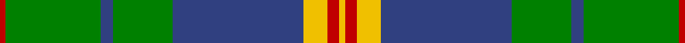

This page is one **sett** — a single exact thread-count. It belongs to the [tartan](/tartans/r1g16db2g10db22ly4r2ly1/)
(the same proportion at any scale), whose colour order is pattern [RGBGBYRY](/stripes/rgbgbyry/).

Sourced from weddslist.  It is a [8 stripe tartan](/stripes/stripes8/).

Original link http://www.weddslist.com/cgi-bin/tartans/pg.pl?source=sts

## Thread count
R/2 G32 B4 G20 B44 Y8 R4 Y/2

## Palette

Palette: <strong>custom</strong>
<table><thead><tr><th>Colour</th><th>Threads</th><th>Shade</th><th>Base</th><th>OKLCh</th></tr></thead><tbody><tr><td>R/</td><td style="text-align:right;font-variant-numeric:tabular-nums">2</td><td><code style="background-color:#C00000;">#C00000</code> <small style="color:#888">#C00000</small></td><td>R <code style="background-color:#CC0000;">#CC0000</code></td><td><small style="color:#888">oklch(50.7% 0.208 29.2)</small></td></tr><tr><td>G</td><td style="text-align:right;font-variant-numeric:tabular-nums">32</td><td><code style="background-color:#008000;">#008000</code> <small style="color:#888">#008000</small></td><td>G <code style="background-color:#006100;">#006100</code></td><td><small style="color:#888">oklch(52.0% 0.177 142.5)</small></td></tr><tr><td>B</td><td style="text-align:right;font-variant-numeric:tabular-nums">4</td><td><code style="background-color:#304080;">#304080</code> <small style="color:#888">#304080</small></td><td>B <code style="background-color:#2A418A;">#2A418A</code></td><td><small style="color:#888">oklch(39.4% 0.109 270.2)</small></td></tr><tr><td>G</td><td style="text-align:right;font-variant-numeric:tabular-nums">20</td><td><code style="background-color:#008000;">#008000</code> <small style="color:#888">#008000</small></td><td>G <code style="background-color:#006100;">#006100</code></td><td><small style="color:#888">oklch(52.0% 0.177 142.5)</small></td></tr><tr><td>B</td><td style="text-align:right;font-variant-numeric:tabular-nums">44</td><td><code style="background-color:#304080;">#304080</code> <small style="color:#888">#304080</small></td><td>B <code style="background-color:#2A418A;">#2A418A</code></td><td><small style="color:#888">oklch(39.4% 0.109 270.2)</small></td></tr><tr><td>Y</td><td style="text-align:right;font-variant-numeric:tabular-nums">8</td><td><code style="background-color:#F0C000;">#F0C000</code> <small style="color:#888">#F0C000</small></td><td>Y <code style="background-color:#F2BF00;">#F2BF00</code></td><td><small style="color:#888">oklch(82.7% 0.169 90.5)</small></td></tr><tr><td>R</td><td style="text-align:right;font-variant-numeric:tabular-nums">4</td><td><code style="background-color:#C00000;">#C00000</code> <small style="color:#888">#C00000</small></td><td>R <code style="background-color:#CC0000;">#CC0000</code></td><td><small style="color:#888">oklch(50.7% 0.208 29.2)</small></td></tr><tr><td>Y/</td><td style="text-align:right;font-variant-numeric:tabular-nums">2</td><td><code style="background-color:#F0C000;">#F0C000</code> <small style="color:#888">#F0C000</small></td><td>Y <code style="background-color:#F2BF00;">#F2BF00</code></td><td><small style="color:#888">oklch(82.7% 0.169 90.5)</small></td></tr></tbody></table>

# Sample pattern

## Nearest tartans

The nearest existing variants by ΔTartan distance, with this tartan at the top so the swatches line up against it.

ΔTartan

Tartan

Sett

—

<a href="/ttd/edit/#slug=r1g16db2g10db22ly4r2ly1~x2">New Mexico</a> <a class="nn-out" href="/setts/s8/r1g16db2g10db22ly4r2ly1~x2/" title="open its dictionary page">↗</a>

0.68

<a href="/ttd/edit/#slug=db5ly2db17g14w1g1w1g4ly2~x2">MacOrrell</a> <a class="nn-out" href="/setts/s9/db5ly2db17g14w1g1w1g4ly2~x2/" title="open its dictionary page">↗</a>

0.94

<a href="/ttd/edit/#slug=g28r12g4db20ly2db3ly2db3g7~x2">Cork</a> <a class="nn-out" href="/setts/s9/g28r12g4db20ly2db3ly2db3g7~x2/" title="open its dictionary page">↗</a>

0.96

<a href="/ttd/edit/#slug=g37w2g6db23ly6db2ly3db2~x2">MacAuliffe (Name)</a> <a class="nn-out" href="/setts/s8/g37w2g6db23ly6db2ly3db2~x2/" title="open its dictionary page">↗</a>

1.00

<a href="/ttd/edit/#slug=db3r3db36g17ly2g21w2r3~x2">Singh</a> <a class="nn-out" href="/setts/s8/db3r3db36g17ly2g21w2r3~x2/" title="open its dictionary page">↗</a>

1.09

<a href="/ttd/edit/#slug=r6db2r1db8r3db16g28w2g4~x2">George (Personal)</a> <a class="nn-out" href="/setts/s9/r6db2r1db8r3db16g28w2g4~x2/" title="open its dictionary page">↗</a>

1.13

<a href="/ttd/edit/#slug=ly3g2k1g30db24k2db2k2~x2">Johnston / Johnstone</a> <a class="nn-out" href="/setts/s8/ly3g2k1g30db24k2db2k2~x2/" title="open its dictionary page">↗</a>

1.15

<a href="/ttd/edit/#slug=lo4g4db2g29w1db12g2lo16g4db2~x2">Unidentified (Pahls)</a> <a class="nn-out" href="/setts/s10/lo4g4db2g29w1db12g2lo16g4db2~x2/" title="open its dictionary page">↗</a>

1.18

<a href="/ttd/edit/#slug=ly3g2k1g30b24k2b2k2~x2">Johnston (Clan)</a> <a class="nn-out" href="/setts/s8/ly3g2k1g30b24k2b2k2~x2/" title="open its dictionary page">↗</a>

1.19

<a href="/ttd/edit/#slug=t39g3t3g20k3g20k3g3k20r3~x2">Dunedin Chapter (Corporate)</a> <a class="nn-out" href="/setts/s10/t39g3t3g20k3g20k3g3k20r3~x2/" title="open its dictionary page">↗</a>

1.19

<a href="/ttd/edit/#slug=k3db3k3db22g26k2db1ly3~x2">Johnstone / Johnston</a> <a class="nn-out" href="/setts/s8/k3db3k3db22g26k2db1ly3~x2/" title="open its dictionary page">↗</a>

## Neighbour map

Every grey dot is one of 14299 variants placed by the first two principal components of the ΔTartan feature space (44% of its variance). Red is this tartan; blue dots are its nearest — click one to open its page.

<svg viewBox="0 0 640 380" role="img" style="max-width:100%;height:auto;border:1px solid #e0e0e0;border-radius:4px;display:block" xmlns="http://www.w3.org/2000/svg"><image href="/nn/cloud.v1.png" width="640" height="380"/><a href="/setts/s9/db5ly2db17g14w1g1w1g4ly2~x2/"><circle cx="282.4" cy="160.8" r="4" fill="#3465a4"><title>MacOrrell</title></circle></a><a href="/setts/s9/g28r12g4db20ly2db3ly2db3g7~x2/"><circle cx="274.5" cy="177.8" r="4" fill="#3465a4"><title>Cork</title></circle></a><a href="/setts/s8/g37w2g6db23ly6db2ly3db2~x2/"><circle cx="317.6" cy="156.9" r="4" fill="#3465a4"><title>MacAuliffe (Name)</title></circle></a><a href="/setts/s8/db3r3db36g17ly2g21w2r3~x2/"><circle cx="281.5" cy="156.5" r="4" fill="#3465a4"><title>Singh</title></circle></a><a href="/setts/s9/r6db2r1db8r3db16g28w2g4~x2/"><circle cx="306.7" cy="149.7" r="4" fill="#3465a4"><title>George (Personal)</title></circle></a><a href="/setts/s8/ly3g2k1g30db24k2db2k2~x2/"><circle cx="324.4" cy="135.4" r="4" fill="#3465a4"><title>Johnston / Johnstone</title></circle></a><a href="/setts/s10/lo4g4db2g29w1db12g2lo16g4db2~x2/"><circle cx="341.5" cy="150.8" r="4" fill="#3465a4"><title>Unidentified (Pahls)</title></circle></a><a href="/setts/s8/ly3g2k1g30b24k2b2k2~x2/"><circle cx="331.3" cy="141.4" r="4" fill="#3465a4"><title>Johnston (Clan)</title></circle></a><a href="/setts/s10/t39g3t3g20k3g20k3g3k20r3~x2/"><circle cx="231.5" cy="176.8" r="4" fill="#3465a4"><title>Dunedin Chapter (Corporate)</title></circle></a><a href="/setts/s8/k3db3k3db22g26k2db1ly3~x2/"><circle cx="267.0" cy="142.7" r="4" fill="#3465a4"><title>Johnstone / Johnston</title></circle></a><circle cx="289.7" cy="164.1" r="5" fill="#c00000"/></svg>

ID: /setts/s8/r1g16db2g10db22ly4r2ly1~x2/
