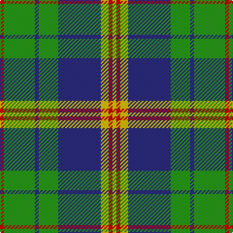

In pattern [RGBGBYRY](/patterns/rgbgbyry/).

This was sourced from tartans-authority.  It is a [8 stripes tartan](/stripes/stripes8/).

Original link http://www.tartansauthority.com/tartan-ferret/display/2522/

## Attestations

This cloth appears in 2 source records; the oldest owns this page.

- 1995 — New Mexico, State of (Fashion) (tartans-authority, [record](http://www.tartansauthority.com/tartan-ferret/display/2522/))
- 01/01/1996 — New Mexico, State of (register-of-tartans, [record](https://www.tartanregister.gov.uk/tartanDetails.aspx?ref=3116))

## Register references

External register numbers recorded for this tartan.

- Scottish Register of Tartans: [3116](https://www.tartanregister.gov.uk/tartanDetails.aspx?ref=3116)
- Scottish Tartans Authority (ITI): 2522
- Scottish Tartans World Register: 2522

## Thread count
R/4 G32 DB4 G20 DB44 Y8 R4 Y/4

## Palette
Each colour and its ΔE from the base-6 reference it is a variant of.

| Colour | Shade | Base | ΔE (OKLab) |
|---|---|---|---|
| DB | <code style="background-color:#2C2C80;">#2C2C80</code> `#2C2C80` | B <code style="background-color:#2A418A;">#2A418A</code> | 0.06 |
| G | <code style="background-color:#289C18;">#289C18</code> `#289C18` | G <code style="background-color:#006100;">#006100</code> | 0.19 |
| R | <code style="background-color:#C80000;">#C80000</code> `#C80000` | R <code style="background-color:#CC0000;">#CC0000</code> | 0.01 |
| Y | <code style="background-color:#E8C000;">#E8C000</code> `#E8C000` | Y <code style="background-color:#F2BF00;">#F2BF00</code> | 0.02 |

# Sample pattern

## Nearest tartans

The nearest existing variants by ΔTartan distance.

1. [Riley (Personal)](/setts/s8/b26g6k8g3k8g30w3g3~b9058d8-g289c18-k101010-wfcfcfc~x2/) — ΔT 0.60
1. [MacOrrell](/setts/s9/b10y4b36g28w3g3w3g8y6~b2c2c80-g00781c-we0e0e0-ye8c000/) — ΔT 0.80
1. [Crantock Trade Tartan Tartan Number: 707. Earliest known date: pre 2003 'Poached by Clan Laird from a Yorkshire mill and marketed as 'Crantock''(sic) (Scottish Tartans Society archives.) See products available Copyright © Blair Urquhart, Comrie, 2015](/setts/s8/g24b3g3b3g3b7ga20r3~b780078-g289c18-ga003820-rc80000~x2/) — ΔT 0.99
1. [Aiton](/setts/s8/b6k1g3k1b3k1g10r3~b304080-g008000-k000000-rc00000~x2/) — ΔT 1.02
1. [Albuquerque, City of](/setts/s8/r2g12b2g8b18w3r2w2~b2c2c80-g006818-rc80000-wf8f8f8~x2/) — ΔT 1.03
1. [MacOrrell](/setts/s9/b5y2b17g14w1g1w1g4y2~b304080-g008000-we0e0e0-yf0c000~x2/) — ΔT 1.06
1. [Crantock](/setts/s8/g24b3g3b3g3b7ga20r3~b800080-g30a010-ga003000-rc00000~x2/) — ΔT 1.06
1. [Bahamas](/setts/s8/b3g11w11r2g7b22y2b2~b304080-g008000-rc00000-we0e0e0-yf0c000~x2/) — ΔT 1.16
1. [Cork](/setts/s9/g28r12g4b20y2b3y2b3g7~b304080-g008000-rc00000-yf0c000~x2/) — ΔT 1.17
1. [Tweedside, hunting](/setts/s9/b21g5k5g15w3g5w3g5k3~b304080-g008000-k000000-we0e0e0~x2/) — ΔT 1.17

## Neighbour map

Every grey dot is one of 15726 variants placed by the first two principal components of the ΔTartan feature space (44% of its variance). Red is this tartan; blue dots are its nearest — click one to open its page.

<svg viewBox="0 0 640 380" role="img" style="max-width:100%;height:auto;border:1px solid #e0e0e0;border-radius:4px;display:block" xmlns="http://www.w3.org/2000/svg"><image href="/nn/cloud.v1.png" width="640" height="380"/><a href="/setts/s8/b26g6k8g3k8g30w3g3~b9058d8-g289c18-k101010-wfcfcfc~x2/"><circle cx="220.8" cy="180.6" r="4" fill="#3465a4"><title>Riley (Personal)</title></circle></a><a href="/setts/s9/b10y4b36g28w3g3w3g8y6~b2c2c80-g00781c-we0e0e0-ye8c000/"><circle cx="239.6" cy="170.5" r="4" fill="#3465a4"><title>MacOrrell</title></circle></a><a href="/setts/s8/g24b3g3b3g3b7ga20r3~b780078-g289c18-ga003820-rc80000~x2/"><circle cx="224.7" cy="195.3" r="4" fill="#3465a4"><title>Crantock Trade Tartan Tartan Number: 707. Earliest known date: pre 2003 'Poached by Clan Laird from a Yorkshire mill and marketed as 'Crantock''(sic) (Scottish Tartans Society archives.) See products available Copyright © Blair Urquhart, Comrie, 2015</title></circle></a><a href="/setts/s8/b6k1g3k1b3k1g10r3~b304080-g008000-k000000-rc00000~x2/"><circle cx="222.0" cy="200.4" r="4" fill="#3465a4"><title>Aiton</title></circle></a><a href="/setts/s8/r2g12b2g8b18w3r2w2~b2c2c80-g006818-rc80000-wf8f8f8~x2/"><circle cx="203.5" cy="190.5" r="4" fill="#3465a4"><title>Albuquerque, City of</title></circle></a><a href="/setts/s9/b5y2b17g14w1g1w1g4y2~b304080-g008000-we0e0e0-yf0c000~x2/"><circle cx="279.3" cy="159.7" r="4" fill="#3465a4"><title>MacOrrell</title></circle></a><a href="/setts/s8/g24b3g3b3g3b7ga20r3~b800080-g30a010-ga003000-rc00000~x2/"><circle cx="217.0" cy="192.1" r="4" fill="#3465a4"><title>Crantock</title></circle></a><a href="/setts/s8/b3g11w11r2g7b22y2b2~b304080-g008000-rc00000-we0e0e0-yf0c000~x2/"><circle cx="189.1" cy="166.2" r="4" fill="#3465a4"><title>Bahamas</title></circle></a><a href="/setts/s9/g28r12g4b20y2b3y2b3g7~b304080-g008000-rc00000-yf0c000~x2/"><circle cx="272.0" cy="175.9" r="4" fill="#3465a4"><title>Cork</title></circle></a><a href="/setts/s9/b21g5k5g15w3g5w3g5k3~b304080-g008000-k000000-we0e0e0~x2/"><circle cx="185.3" cy="202.6" r="4" fill="#3465a4"><title>Tweedside, hunting</title></circle></a><circle cx="222.4" cy="179.0" r="5" fill="#c00000"/></svg>

ID: /setts/s8/r1g8b1g5b11y2r1y1~b2c2c80-g289c18-rc80000-ye8c000~x4/
