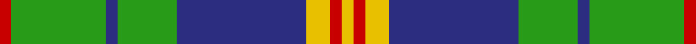

This page is one **sett** — a single exact thread-count. It belongs to the [tartan](/tartans/r1g8db1g5db11y2r1y1/)
(the same proportion at any scale), whose colour order is pattern [RGBGBYRY](/stripes/rgbgbyry/).

Sourced from tartans-authority.  It is a [8 stripe tartan](/stripes/stripes8/).

Original link http://www.tartansauthority.com/tartan-ferret/display/2522/

2 attestations — the source records this cloth was collapsed from (oldest owns this page)

<ul>
<li>1995 — New Mexico, State of (Fashion) (tartans-authority, <a href="http://www.tartansauthority.com/tartan-ferret/display/2522/">record</a>)</li>
<li>01/01/1996 — New Mexico, State of (register-of-tartans, <a href="https://www.tartanregister.gov.uk/tartanDetails.aspx?ref=3116">record</a>)</li>
</ul>

## Register references

External register numbers recorded for this tartan.

- Scottish Register of Tartans: [3116](https://www.tartanregister.gov.uk/tartanDetails.aspx?ref=3116)
- Scottish Tartans Authority (ITI): 2522
- Scottish Tartans World Register: 2522

## Thread count
R/4 G32 DB4 G20 DB44 Y8 R4 Y/4

## Palette
Each colour and the base-6 reference it is a variant of.

| Colour | Shade | Base |
|---|---|---|
| DB | <code style="background-color:#2C2C80;">#2C2C80</code> `oklch(35.0% 0.138 276.6)` <small>#2C2C80</small> | B <code style="background-color:#2A418A;">#2A418A</code> |
| G | <code style="background-color:#289C18;">#289C18</code> `oklch(60.6% 0.191 141.6)` <small>#289C18</small> | G <code style="background-color:#006100;">#006100</code> |
| R | <code style="background-color:#C80000;">#C80000</code> `oklch(52.3% 0.215 29.2)` <small>#C80000</small> | R <code style="background-color:#CC0000;">#CC0000</code> |
| Y | <code style="background-color:#E8C000;">#E8C000</code> `oklch(81.9% 0.168 93.7)` <small>#E8C000</small> | Y <code style="background-color:#F2BF00;">#F2BF00</code> |

# Sample pattern

## Nearest tartans

The nearest existing variants by ΔTartan distance, with this tartan at the top so the swatches line up against it.

ΔTartan

Tartan

Sett

—

<a href="/ttd/edit/#slug=r1g8db1g5db11ly2r1ly1~x4">New Mexico, State of (Fashion)</a> <a class="nn-out" href="/setts/s8/r1g8db1g5db11ly2r1ly1~x4/" title="open its dictionary page">↗</a>

0.60

<a href="/ttd/edit/#slug=p26g6k8g3k8g30w3g3~x2">Riley (Personal)</a> <a class="nn-out" href="/setts/s8/p26g6k8g3k8g30w3g3~x2/" title="open its dictionary page">↗</a>

0.80

<a href="/ttd/edit/#slug=db10ly4db36g28w3g3w3g8ly6">MacOrrell</a> <a class="nn-out" href="/setts/s9/db10ly4db36g28w3g3w3g8ly6/" title="open its dictionary page">↗</a>

0.99

<a href="/ttd/edit/#slug=g24dp3g3dp3g3dp7dg20r3~x2">Crantock Trade Tartan Tartan Number: 707. Earliest known date: pre 2003 'Poached by Clan Laird from a Yorkshire mill and marketed as 'Crantock''(sic) (Scottish Tartans Society archives.) See products available Copyright © Blair Urquhart, Comrie, 2015</a> <a class="nn-out" href="/setts/s8/g24dp3g3dp3g3dp7dg20r3~x2/" title="open its dictionary page">↗</a>

1.04

<a href="/ttd/edit/#slug=r2g12db2g8db18w3r2w2~x2">Albuquerque, City of</a> <a class="nn-out" href="/setts/s8/r2g12db2g8db18w3r2w2~x2/" title="open its dictionary page">↗</a>

1.06

<a href="/ttd/edit/#slug=db5ly2db17g14w1g1w1g4ly2~x2">MacOrrell</a> <a class="nn-out" href="/setts/s9/db5ly2db17g14w1g1w1g4ly2~x2/" title="open its dictionary page">↗</a>

1.06

<a href="/ttd/edit/#slug=g24p3g3p3g3p7dg20r3~x2">Crantock</a> <a class="nn-out" href="/setts/s8/g24p3g3p3g3p7dg20r3~x2/" title="open its dictionary page">↗</a>

1.16

<a href="/ttd/edit/#slug=g28r12g4db20ly2db3ly2db3g7~x2">Cork</a> <a class="nn-out" href="/setts/s9/g28r12g4db20ly2db3ly2db3g7~x2/" title="open its dictionary page">↗</a>

1.16

<a href="/ttd/edit/#slug=db3g11w11r2g7db22ly2db2~x2">Bahamas</a> <a class="nn-out" href="/setts/s8/db3g11w11r2g7db22ly2db2~x2/" title="open its dictionary page">↗</a>

1.17

<a href="/ttd/edit/#slug=db21g5k5g15w3g5w3g5k3~x2">Tweedside, hunting</a> <a class="nn-out" href="/setts/s9/db21g5k5g15w3g5w3g5k3~x2/" title="open its dictionary page">↗</a>

1.18

<a href="/ttd/edit/#slug=r1ly2db11g5db1g8r1g8db1g5db11ly2r1ly1~x4">New Mexico District Tartan Tartan Number: 2522. Earliest known date: 1995 The official state tartan for New Mexico which was designed in 1995 by Ralph L. Stevenson and included in his petition for the first US 'Tartan Day'. The rights of the tartan were placed in the public domain. Doubts were expressed for some time as to its perceived status but on 26th May 2003 the situation was clarified when Rebecca Vigil-Giron, Secretary of State for the State of New Mexico, issued a proclamation confirming that this was indeed the official state tartan. Woven by NGSI Woolen Mills of New Mexico. The history of the State of New Mexico Tartan began in 1995 when a wide cross section of New Mexico citizens with Scottish, Welsh, Irish, Manx, Spanish (Galician) Celtic ancestry, and Native American backgrounds gave their opinions and suggestions. The final design was created by Ralph L. Stevenson, Jr., a New Mexico citizen of Scottish descent, and woven by Jean Jones, a former Santa Fe textile artist who now resides in Asheville, North Carolina. The State Library was chosen as the permanent home for the display because of former Governor Garrey E. Carruthers' support of the New Mexico Tartan, his Scottish descent, and the naming of the library building after him approximately two years ago. Four colors are woven into the State of New Mexico Tartan -- Blue for the All Encompassing Sky, Green for the State's Plant Life and Forests, Red for the Original Cultural Providers, and Gold for the Minerals and Desert. See products available Copyright © Blair Urquhart, Comrie, 2015</a> <a class="nn-out" href="/setts/s14/r1ly2db11g5db1g8r1g8db1g5db11ly2r1ly1~x4/" title="open its dictionary page">↗</a>

## Neighbour map

Every grey dot is one of 14299 variants placed by the first two principal components of the ΔTartan feature space (44% of its variance). Red is this tartan; blue dots are its nearest — click one to open its page.

<svg viewBox="0 0 640 380" role="img" style="max-width:100%;height:auto;border:1px solid #e0e0e0;border-radius:4px;display:block" xmlns="http://www.w3.org/2000/svg"><image href="/nn/cloud.v1.png" width="640" height="380"/><a href="/setts/s8/p26g6k8g3k8g30w3g3~x2/"><circle cx="223.9" cy="178.7" r="4" fill="#3465a4"><title>Riley (Personal)</title></circle></a><a href="/setts/s9/db10ly4db36g28w3g3w3g8ly6/"><circle cx="243.0" cy="170.5" r="4" fill="#3465a4"><title>MacOrrell</title></circle></a><a href="/setts/s8/g24dp3g3dp3g3dp7dg20r3~x2/"><circle cx="227.5" cy="196.1" r="4" fill="#3465a4"><title>Crantock Trade Tartan Tartan Number: 707. Earliest known date: pre 2003 'Poached by Clan Laird from a Yorkshire mill and marketed as 'Crantock''(sic) (Scottish Tartans Society archives.) See products available Copyright © Blair Urquhart, Comrie, 2015</title></circle></a><a href="/setts/s8/r2g12db2g8db18w3r2w2~x2/"><circle cx="206.8" cy="190.4" r="4" fill="#3465a4"><title>Albuquerque, City of</title></circle></a><a href="/setts/s9/db5ly2db17g14w1g1w1g4ly2~x2/"><circle cx="282.4" cy="160.8" r="4" fill="#3465a4"><title>MacOrrell</title></circle></a><a href="/setts/s8/g24p3g3p3g3p7dg20r3~x2/"><circle cx="219.9" cy="191.9" r="4" fill="#3465a4"><title>Crantock</title></circle></a><a href="/setts/s9/g28r12g4db20ly2db3ly2db3g7~x2/"><circle cx="274.5" cy="177.8" r="4" fill="#3465a4"><title>Cork</title></circle></a><a href="/setts/s8/db3g11w11r2g7db22ly2db2~x2/"><circle cx="192.2" cy="166.3" r="4" fill="#3465a4"><title>Bahamas</title></circle></a><a href="/setts/s9/db21g5k5g15w3g5w3g5k3~x2/"><circle cx="189.0" cy="202.1" r="4" fill="#3465a4"><title>Tweedside, hunting</title></circle></a><a href="/setts/s14/r1ly2db11g5db1g8r1g8db1g5db11ly2r1ly1~x4/"><circle cx="221.8" cy="162.6" r="4" fill="#3465a4"><title>New Mexico District Tartan Tartan Number: 2522. Earliest known date: 1995 The official state tartan for New Mexico which was designed in 1995 by Ralph L. Stevenson and included in his petition for the first US 'Tartan Day'. The rights of the tartan were placed in the public domain. Doubts were expressed for some time as to its perceived status but on 26th May 2003 the situation was clarified when Rebecca Vigil-Giron, Secretary of State for the State of New Mexico, issued a proclamation confirming that this was indeed the official state tartan. Woven by NGSI Woolen Mills of New Mexico. The history of the State of New Mexico Tartan began in 1995 when a wide cross section of New Mexico citizens with Scottish, Welsh, Irish, Manx, Spanish (Galician) Celtic ancestry, and Native American backgrounds gave their opinions and suggestions. The final design was created by Ralph L. Stevenson, Jr., a New Mexico citizen of Scottish descent, and woven by Jean Jones, a former Santa Fe textile artist who now resides in Asheville, North Carolina. The State Library was chosen as the permanent home for the display because of former Governor Garrey E. Carruthers' support of the New Mexico Tartan, his Scottish descent, and the naming of the library building after him approximately two years ago. Four colors are woven into the State of New Mexico Tartan -- Blue for the All Encompassing Sky, Green for the State's Plant Life and Forests, Red for the Original Cultural Providers, and Gold for the Minerals and Desert. See products available Copyright © Blair Urquhart, Comrie, 2015</title></circle></a><circle cx="225.5" cy="178.3" r="5" fill="#c00000"/></svg>

ID: /setts/s8/r1g8db1g5db11ly2r1ly1~x4/
