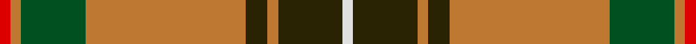
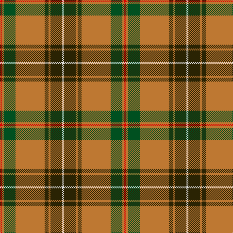

In pattern [RRGRGRGW](/stripes/rrgrgrgw/).

This was sourced from register-of-tartans.  It is a [8 stripe tartan](/stripes/stripes8/).

Original link https://www.tartanregister.gov.uk/tartanDetails.aspx?ref=5878

## Register references

External register numbers recorded for this tartan.

- Scottish Register of Tartans: [5878](https://www.tartanregister.gov.uk/tartanDetails.aspx?ref=5878)
- Scottish Tartans World Register: 3164

## Thread count
R/4 DO4 G24 DO60 K8 DO4 K24 LN/4

## Palette
Each colour and the base-6 reference it is a variant of.

| Colour | Shade | Base |
|---|---|---|
| DO | <code style="background-color:#BE7832;">#BE7832</code> `oklch(63.5% 0.121 62.2)` <small>#BE7832</small> | R <code style="background-color:#CC0000;">#CC0000</code> |
| G | <code style="background-color:#005020;">#005020</code> `oklch(37.7% 0.105 149.6)` <small>#005020</small> | G <code style="background-color:#006100;">#006100</code> |
| K | <code style="background-color:#2A2303;">#2A2303</code> `oklch(25.7% 0.049 96.8)` <small>#2A2303</small> | G <code style="background-color:#006100;">#006100</code> |
| LN | <code style="background-color:#E0E0E0;">#E0E0E0</code> `oklch(90.7% 0.000 89.9)` <small>#E0E0E0</small> | W <code style="background-color:#F7F7F7;">#F7F7F7</code> |
| R | <code style="background-color:#DC0000;">#DC0000</code> `oklch(56.2% 0.230 29.2)` <small>#DC0000</small> | R <code style="background-color:#CC0000;">#CC0000</code> |

# Sample pattern

## Nearest tartans

The nearest existing variants by ΔTartan distance, with this tartan at the top so the swatches line up against it.

ΔTartan

Tartan

Sett

—

<a href="/ttd/edit/#slug=r1o1dg6o15dy2o1dy6w1~x4">Connacht #2</a> <a class="nn-out" href="/setts/s8/r1o1dg6o15dy2o1dy6w1~x4/" title="open its dictionary page">↗</a>

0.88

<a href="/ttd/edit/#slug=g71k4r4dp9r4dp4r36dp4w4">Rattray</a> <a class="nn-out" href="/setts/s9/g71k4r4dp9r4dp4r36dp4w4/" title="open its dictionary page">↗</a>

0.92

<a href="/ttd/edit/#slug=t2g1t1g12r2g1m6ly2~x2">Manitoba District Tartan Tartan Number: 146. Earliest known date: 1962 The tartan as it would appear with red in place of green, the 'G' of green having been interpreted as 'Gules'. The designer, Hugh Kirkwood Rankine, clearly intended a green stripe. This version can be found in the shops. See products available Copyright © Blair Urquhart, Comrie, 2015</a> <a class="nn-out" href="/setts/s8/t2g1t1g12r2g1m6ly2~x2/" title="open its dictionary page">↗</a>

0.94

<a href="/ttd/edit/#slug=r3r4g3p3r11g30r3p7g3r2r4w2~x2">MacKinnon 1</a> <a class="nn-out" href="/setts/s12/r3r4g3p3r11g30r3p7g3r2r4w2~x2/" title="open its dictionary page">↗</a>

0.96

<a href="/ttd/edit/#slug=t2dg1t1dg12r2dg1r6ly2~x2">Manitoba Red</a> <a class="nn-out" href="/setts/s8/t2dg1t1dg12r2dg1r6ly2~x2/" title="open its dictionary page">↗</a>

1.06

<a href="/ttd/edit/#slug=g71k4r4db9r4db4r36db4w4">Rattray</a> <a class="nn-out" href="/setts/s9/g71k4r4db9r4db4r36db4w4/" title="open its dictionary page">↗</a>

1.06

<a href="/ttd/edit/#slug=g18lb3ly1r2ly1r3ly1r10~x4">Brisbane (Artefact)</a> <a class="nn-out" href="/setts/s8/g18lb3ly1r2ly1r3ly1r10~x4/" title="open its dictionary page">↗</a>

1.10

<a href="/ttd/edit/#slug=t2g1t1g12r2g1r6ly2~x2">Manitoba</a> <a class="nn-out" href="/setts/s8/t2g1t1g12r2g1r6ly2~x2/" title="open its dictionary page">↗</a>

1.18

<a href="/ttd/edit/#slug=r5k2dg1k2r5k2dg18lo3~x2">Midpac Tissue (non woven)</a> <a class="nn-out" href="/setts/s8/r5k2dg1k2r5k2dg18lo3~x2/" title="open its dictionary page">↗</a>

1.20

<a href="/ttd/edit/#slug=r96db16dg34g48r18k6r9">MacDuff</a> <a class="nn-out" href="/setts/s7/r96db16dg34g48r18k6r9/" title="open its dictionary page">↗</a>

1.21

<a href="/ttd/edit/#slug=k2r1g8r3g3r14ly1r1w2~x2">Melieres, Michel (Personal)</a> <a class="nn-out" href="/setts/s9/k2r1g8r3g3r14ly1r1w2~x2/" title="open its dictionary page">↗</a>

## Neighbour map

Every grey dot is one of 14299 variants placed by the first two principal components of the ΔTartan feature space (44% of its variance). Red is this tartan; blue dots are its nearest — click one to open its page.

<svg viewBox="0 0 640 380" role="img" style="max-width:100%;height:auto;border:1px solid #e0e0e0;border-radius:4px;display:block" xmlns="http://www.w3.org/2000/svg"><image href="/nn/cloud.v1.png" width="640" height="380"/><a href="/setts/s9/g71k4r4dp9r4dp4r36dp4w4/"><circle cx="307.1" cy="118.2" r="4" fill="#3465a4"><title>Rattray</title></circle></a><a href="/setts/s8/t2g1t1g12r2g1m6ly2~x2/"><circle cx="274.3" cy="163.3" r="4" fill="#3465a4"><title>Manitoba District Tartan Tartan Number: 146. Earliest known date: 1962 The tartan as it would appear with red in place of green, the 'G' of green having been interpreted as 'Gules'. The designer, Hugh Kirkwood Rankine, clearly intended a green stripe. This version can be found in the shops. See products available Copyright © Blair Urquhart, Comrie, 2015</title></circle></a><a href="/setts/s12/r3r4g3p3r11g30r3p7g3r2r4w2~x2/"><circle cx="266.0" cy="120.7" r="4" fill="#3465a4"><title>MacKinnon 1</title></circle></a><a href="/setts/s8/t2dg1t1dg12r2dg1r6ly2~x2/"><circle cx="274.2" cy="164.0" r="4" fill="#3465a4"><title>Manitoba Red</title></circle></a><a href="/setts/s9/g71k4r4db9r4db4r36db4w4/"><circle cx="297.9" cy="118.3" r="4" fill="#3465a4"><title>Rattray</title></circle></a><a href="/setts/s8/g18lb3ly1r2ly1r3ly1r10~x4/"><circle cx="297.8" cy="146.2" r="4" fill="#3465a4"><title>Brisbane (Artefact)</title></circle></a><a href="/setts/s8/t2g1t1g12r2g1r6ly2~x2/"><circle cx="268.9" cy="161.7" r="4" fill="#3465a4"><title>Manitoba</title></circle></a><a href="/setts/s8/r5k2dg1k2r5k2dg18lo3~x2/"><circle cx="309.2" cy="163.9" r="4" fill="#3465a4"><title>Midpac Tissue (non woven)</title></circle></a><a href="/setts/s7/r96db16dg34g48r18k6r9/"><circle cx="293.7" cy="159.4" r="4" fill="#3465a4"><title>MacDuff</title></circle></a><a href="/setts/s9/k2r1g8r3g3r14ly1r1w2~x2/"><circle cx="300.1" cy="135.2" r="4" fill="#3465a4"><title>Melieres, Michel (Personal)</title></circle></a><circle cx="284.5" cy="143.4" r="5" fill="#c00000"/></svg>

ID: /setts/s8/r1o1dg6o15dy2o1dy6w1~x4/
