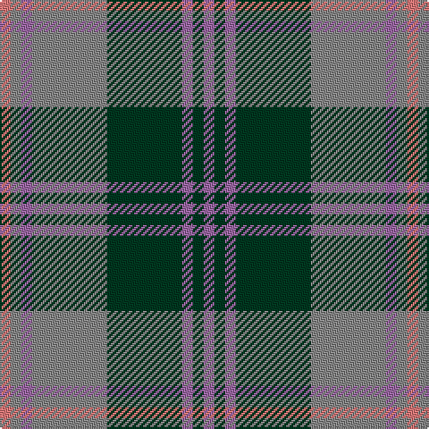

**Bands:** [RRRRGRGR](/stripes/rrrrgrgr/) · **Stripes:** [R O M O DG M DG M](/stripes/stripes8/) R O M O DG M DG M

This was sourced from register-of-tartans.  It is a [8 band tartan](/bands/bands8/).

Original link https://www.tartanregister.gov.uk/tartanDetails.aspx?ref=11167

## Register references

External register numbers recorded for this tartan.

- Scottish Register of Tartans: [11167](https://www.tartanregister.gov.uk/tartanDetails.aspx?ref=11167)

## Thread count
LR/6 N6 LP6 N42 DG42 LP6 DG6 LP/6

## Palette
Each colour and its ΔE from the base-6 reference it is a variant of.

| Colour | Shade | Base | ΔE (OKLab) |
|---|---|---|---|
| DG | <code style="background-color:#003820;">#003820</code> `#003820` | G <code style="background-color:#006100;">#006100</code> | 0.15 |
| LP | <code style="background-color:#9C68A4;">#9C68A4</code> `#9C68A4` | R <code style="background-color:#CC0000;">#CC0000</code> | 0.21 |
| LR | <code style="background-color:#E87878;">#E87878</code> `#E87878` | R <code style="background-color:#CC0000;">#CC0000</code> | 0.19 |
| N | <code style="background-color:#888888;">#888888</code> `#888888` | R <code style="background-color:#CC0000;">#CC0000</code> | 0.24 |

# Sample pattern

## Nearest tartans

The nearest existing variants by ΔTartan distance.

1. [Auld Lang Syne (Philip King Tailoring)](/setts/s8/k1t1k1t7y7k1y1lb1~x6/) — ΔT 0.43
1. [Auld Lang Syne](/setts/s8/k1n1k1n7dy7k1dy1lt1~x6/) — ΔT 0.91
1. [Hebridean 1](/setts/s9/db2r3g11r3db2t2db11r2g2~x2/) — ΔT 0.93
1. [Speyside Blue (Fashion)](/setts/s8/n32k3n3k3b5k8o21k4~x2/) — ΔT 0.97
1. [Speyside Grey (Fashion)](/setts/s8/n32k3n3k3o5k8o21k4~x2/) — ΔT 1.01
1. [Kyle](/setts/s7/y19k2w2k2n5k2n5~x4/) — ΔT 1.08
1. [Cercle de Fermieres de St-Elie . . .](/setts/s7/r2ly1b8r1g7ly1r2~x6/) — ΔT 1.09
1. [Lamont](/setts/s8/p11o2p2o2p2o11g14w2~x2/) — ΔT 1.09
1. [Antrim, County](/setts/s10/y5dt2y18lo2dt5lo2o5dt17y2lo4~x2/) — ΔT 1.11
1. [Kyle Tartan Tartan Number: 1288. Earliest known date: pre 1984 Seen in Service Station at Gretna Green in 1984 by Angela Nisbett MSTS . Berars no relation to the other two Kyles (3615 & 3616). See products available Copyright © Blair Urquhart, Comrie, 2015](/setts/s7/o19k2w4k2n5k2n5~x2/) — ΔT 1.12

## Neighbour map

Every grey dot is one of 14299 variants placed by the first two principal components of the ΔTartan feature space (44% of its variance). Red is this tartan; blue dots are its nearest — click one to open its page.

<svg viewBox="0 0 640 380" role="img" style="max-width:100%;height:auto;border:1px solid #e0e0e0;border-radius:4px;display:block" xmlns="http://www.w3.org/2000/svg"><image href="/nn/cloud.v1.png" width="640" height="380"/><a href="/setts/s8/k1t1k1t7y7k1y1lb1~x6/"><circle cx="234.4" cy="202.6" r="4" fill="#3465a4"><title>Auld Lang Syne (Philip King Tailoring)</title></circle></a><a href="/setts/s8/k1n1k1n7dy7k1dy1lt1~x6/"><circle cx="243.9" cy="216.0" r="4" fill="#3465a4"><title>Auld Lang Syne</title></circle></a><a href="/setts/s9/db2r3g11r3db2t2db11r2g2~x2/"><circle cx="212.3" cy="228.9" r="4" fill="#3465a4"><title>Hebridean 1</title></circle></a><a href="/setts/s8/n32k3n3k3b5k8o21k4~x2/"><circle cx="267.1" cy="197.7" r="4" fill="#3465a4"><title>Speyside Blue (Fashion)</title></circle></a><a href="/setts/s8/n32k3n3k3o5k8o21k4~x2/"><circle cx="270.3" cy="197.1" r="4" fill="#3465a4"><title>Speyside Grey (Fashion)</title></circle></a><a href="/setts/s7/y19k2w2k2n5k2n5~x4/"><circle cx="292.9" cy="192.6" r="4" fill="#3465a4"><title>Kyle</title></circle></a><a href="/setts/s7/r2ly1b8r1g7ly1r2~x6/"><circle cx="185.4" cy="203.4" r="4" fill="#3465a4"><title>Cercle de Fermieres de St-Elie . . .</title></circle></a><a href="/setts/s8/p11o2p2o2p2o11g14w2~x2/"><circle cx="187.2" cy="211.2" r="4" fill="#3465a4"><title>Lamont</title></circle></a><a href="/setts/s10/y5dt2y18lo2dt5lo2o5dt17y2lo4~x2/"><circle cx="249.3" cy="206.2" r="4" fill="#3465a4"><title>Antrim, County</title></circle></a><a href="/setts/s7/o19k2w4k2n5k2n5~x2/"><circle cx="255.7" cy="188.3" r="4" fill="#3465a4"><title>Kyle Tartan Tartan Number: 1288. Earliest known date: pre 1984 Seen in Service Station at Gretna Green in 1984 by Angela Nisbett MSTS . Berars no relation to the other two Kyles (3615 &amp; 3616). See products available Copyright © Blair Urquhart, Comrie, 2015</title></circle></a><circle cx="235.7" cy="203.5" r="5" fill="#c00000"/></svg>

ID: /setts/s8/r1o1m1o7dg7m1dg1m1~x6/
