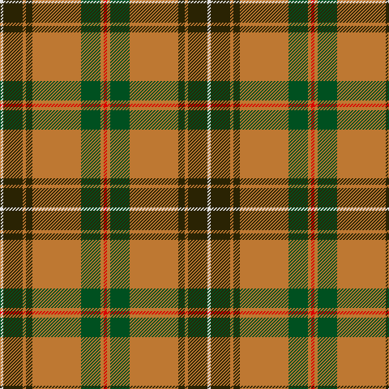

In pattern [RRGRGRGW](/patterns/rrgrgrgw/).

This was sourced from register-of-tartans.  It is a [8 stripes tartan](/stripes/stripes8/).

Original link https://www.tartanregister.gov.uk/tartanDetails.aspx?ref=5878

## Thread count
LN/4 K24 DO4 K8 DO60 G24 DO4 R/4

## Palette
Each colour and its ΔE from the base-6 reference it is a variant of.

| Colour | Shade | Base | ΔE (OKLab) |
|---|---|---|---|
| DO | <code style="background-color:#BE7832;">#BE7832</code> `#BE7832` | R <code style="background-color:#CC0000;">#CC0000</code> | 0.17 |
| G | <code style="background-color:#005020;">#005020</code> `#005020` | G <code style="background-color:#006100;">#006100</code> | 0.07 |
| K | <code style="background-color:#2A2303;">#2A2303</code> `#2A2303` | G <code style="background-color:#006100;">#006100</code> | 0.21 |
| LN | <code style="background-color:#E0E0E0;">#E0E0E0</code> `#E0E0E0` | W <code style="background-color:#F7F7F7;">#F7F7F7</code> | 0.07 |
| R | <code style="background-color:#DC0000;">#DC0000</code> `#DC0000` | R <code style="background-color:#CC0000;">#CC0000</code> | 0.03 |

# Sample pattern

## Nearest tartans

The nearest existing variants by ΔTartan distance.

1. [Rattray](/setts/s9/g71k4r4b9r4b4r36b4w4~b780078-g006818-k101010-rc80000-wfcfcfc/) — ΔT 0.88
1. [Manitoba District Tartan Tartan Number: 146. Earliest known date: 1962 The tartan as it would appear with red in place of green, the 'G' of green having been interpreted as 'Gules'. The designer, Hugh Kirkwood Rankine, clearly intended a green stripe. This version can be found in the shops. See products available Copyright © Blair Urquhart, Comrie, 2015](/setts/s8/b2g1b1g12r2g1ra6y2x2~b5c8ca8-g006818-rc80000-raa00048-ye8c000/) — ΔT 0.92
1. [MacKinnon 1](/setts/s12/r3ra4g3b3ra11g30ra3b7g3r2ra4w2x2~b800080-g008000-rd03030-rac00000-we0e0e0/) — ΔT 0.94
1. [Manitoba Red](/setts/s8/b2g1b1g12r2g1ra6y2x2~b3c82af-g005020-rdc0000-ra960028-ye8c000/) — ΔT 0.96
1. [Rattray Family Tartan Tartan Number: 819. Earliest known date: pre 2003 A Follower, but not a Sept, of the Murrays of Atholl. The family descends from Adam de Rattrieff in the 13th century. Their ancient seat is at Craighall, Blairgowrie, in Perthshire. See products available Copyright © Blair Urquhart, Comrie, 2015](/setts/s9/g71k4r4b9r4b4r36b4w4~b2c2c80-g006818-k101010-rc80000-we0e0e0/) — ΔT 1.01
1. [Rattray](/setts/s9/g71k4r4b9r4b4r36b4w4~b304080-g008000-k000000-rc00000-we0e0e0/) — ΔT 1.05
1. [Brisbane (Artefact)](/setts/s8/g18w3y1r2y1r3y1r10x4~g006818-rc80000-wc0c0c0-ye8c000/) — ΔT 1.06
1. [Manitoba](/setts/s8/b2g1b1g12r2g1ra6y2x2~b5480b0-g008000-rc00000-ra900030-yf0c000/) — ΔT 1.09
1. [Antrim County, Crest Range](/setts/s9/g4y9g3b4g3w3r32g4y3x2~b00008b-g006818-r8b0000-we0e0e0-ye8c000/) — ΔT 1.14
1. [Midpac Tissue (non woven)](/setts/s8/r5k2g1k2r5k2g18y3x2~g285800-k101010-rc80000-ybc8c00/) — ΔT 1.18

## Neighbour map

Every grey dot is one of 15726 variants placed by the first two principal components of the ΔTartan feature space (44% of its variance). Red is this tartan; blue dots are its nearest — click one to open its page.

<svg viewBox="0 0 640 380" role="img" style="max-width:100%;height:auto;border:1px solid #e0e0e0;border-radius:4px;display:block" xmlns="http://www.w3.org/2000/svg"><image href="/nn/cloud.v1.png" width="640" height="380"/><a href="/setts/s9/g71k4r4b9r4b4r36b4w4~b780078-g006818-k101010-rc80000-wfcfcfc/"><circle cx="305.6" cy="118.2" r="4" fill="#3465a4"><title>Rattray</title></circle></a><a href="/setts/s8/b2g1b1g12r2g1ra6y2x2~b5c8ca8-g006818-rc80000-raa00048-ye8c000/"><circle cx="272.7" cy="161.3" r="4" fill="#3465a4"><title>Manitoba District Tartan Tartan Number: 146. Earliest known date: 1962 The tartan as it would appear with red in place of green, the 'G' of green having been interpreted as 'Gules'. The designer, Hugh Kirkwood Rankine, clearly intended a green stripe. This version can be found in the shops. See products available Copyright © Blair Urquhart, Comrie, 2015</title></circle></a><a href="/setts/s12/r3ra4g3b3ra11g30ra3b7g3r2ra4w2x2~b800080-g008000-rd03030-rac00000-we0e0e0/"><circle cx="264.7" cy="119.6" r="4" fill="#3465a4"><title>MacKinnon 1</title></circle></a><a href="/setts/s8/b2g1b1g12r2g1ra6y2x2~b3c82af-g005020-rdc0000-ra960028-ye8c000/"><circle cx="272.4" cy="162.1" r="4" fill="#3465a4"><title>Manitoba Red</title></circle></a><a href="/setts/s9/g71k4r4b9r4b4r36b4w4~b2c2c80-g006818-k101010-rc80000-we0e0e0/"><circle cx="306.5" cy="121.8" r="4" fill="#3465a4"><title>Rattray Family Tartan Tartan Number: 819. Earliest known date: pre 2003 A Follower, but not a Sept, of the Murrays of Atholl. The family descends from Adam de Rattrieff in the 13th century. Their ancient seat is at Craighall, Blairgowrie, in Perthshire. See products available Copyright © Blair Urquhart, Comrie, 2015</title></circle></a><a href="/setts/s9/g71k4r4b9r4b4r36b4w4~b304080-g008000-k000000-rc00000-we0e0e0/"><circle cx="296.0" cy="118.2" r="4" fill="#3465a4"><title>Rattray</title></circle></a><a href="/setts/s8/g18w3y1r2y1r3y1r10x4~g006818-rc80000-wc0c0c0-ye8c000/"><circle cx="296.8" cy="147.3" r="4" fill="#3465a4"><title>Brisbane (Artefact)</title></circle></a><a href="/setts/s8/b2g1b1g12r2g1ra6y2x2~b5480b0-g008000-rc00000-ra900030-yf0c000/"><circle cx="267.2" cy="159.9" r="4" fill="#3465a4"><title>Manitoba</title></circle></a><a href="/setts/s9/g4y9g3b4g3w3r32g4y3x2~b00008b-g006818-r8b0000-we0e0e0-ye8c000/"><circle cx="239.8" cy="130.8" r="4" fill="#3465a4"><title>Antrim County, Crest Range</title></circle></a><a href="/setts/s8/r5k2g1k2r5k2g18y3x2~g285800-k101010-rc80000-ybc8c00/"><circle cx="307.8" cy="162.9" r="4" fill="#3465a4"><title>Midpac Tissue (non woven)</title></circle></a><circle cx="283.3" cy="143.5" r="5" fill="#c00000"/></svg>

ID: /setts/s8/r1ra1g6ra15ga2ra1ga6w1x4~g005020-ga2a2303-rdc0000-rabe7832-we0e0e0/
