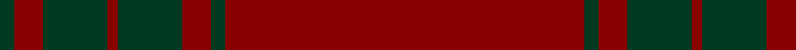

In pattern [GRGRGRGR](/patterns/grgrgrgr/).

This was sourced from register-of-tartans.  It is a [8 stripes tartan](/stripes/stripes8/).

Original link https://www.tartanregister.gov.uk/tartanDetails.aspx?ref=1925

## Thread count
DG/8 DR16 DG36 DR6 DG36 DR16 DG8 DR/200

## Palette
Each colour and its ΔE from the base-6 reference it is a variant of.

| Colour | Shade | Base | ΔE (OKLab) |
|---|---|---|---|
| DG | <code style="background-color:#003820;">#003820</code> `#003820` | G <code style="background-color:#006400;">#006400</code> | 0.16 |
| DR | <code style="background-color:#880000;">#880000</code> `#880000` | R <code style="background-color:#C80000;">#C80000</code> | 0.14 |

# Sample pattern

## Nearest tartans

The nearest existing variants by ΔTartan distance.

1. [Lomond](/setts/s8/r128b20r8b20r24b8r4b28-b5c5c5c-rc80000/) — ΔT 1.68
1. [Inverness Augustus](/setts/s7/r36g2k10g2k2g2r18-g005020-k101010-r781c38/) — ΔT 1.80
1. [KaDeWe (Corporate)](/setts/s5/r200g8r16g36r6-g003820-r880000/) — ΔT 1.93
1. [Fitzgibbon Red (Name)](/setts/s9/r4k12r48g4r4ra2r12k2ra4-g006818-k101010-r880000-rac80000/) — ΔT 2.03
1. [Fitzgibbon Red](/setts/s9/r4b12r48g4r4ra2r12b2ra4-b2d2d2d-g1c5627-ra3262a-rabd2125/) — ΔT 2.25
1. [Masai Shuka 06 (Artefact)](/setts/s10/r100b2r8b6r16b30r4b4r6b8-b780078-rc40000/) — ΔT 2.35
1. [Dunbar, John Telfer (Personal)](/setts/s7/r10k4r56k20r52k8r8-k101010-r883000/) — ΔT 2.41
1. [Kyle Green (Name)](/setts/s8/r108g12r10g12r20g6r4g36-g006818-rc80000/) — ΔT 2.45
1. [Kyle Blue (Clan)](/setts/s8/r108b12r10b12r20b6r4b36-b580058-rc80000/) — ΔT 2.48
1. [MacDonald Lord of the Isles](/setts/s4/r76g4r10g32-g11450d-raa0000/) — ΔT 2.53

## Neighbour map

Every grey dot is one of 15726 variants placed by the first two principal components of the ΔTartan feature space (44% of its variance). Red is this tartan; blue dots are its nearest — click one to open its page.

<svg viewBox="0 0 640 380" role="img" style="max-width:100%;height:auto;border:1px solid #e0e0e0;border-radius:4px;display:block" xmlns="http://www.w3.org/2000/svg"><image href="/nn/cloud.v1.png" width="640" height="380"/><a href="/setts/s8/r128b20r8b20r24b8r4b28-b5c5c5c-rc80000/"><circle cx="609.9" cy="188.5" r="4" fill="#3465a4"><title>Lomond</title></circle></a><a href="/setts/s7/r36g2k10g2k2g2r18-g005020-k101010-r781c38/"><circle cx="588.7" cy="215.6" r="4" fill="#3465a4"><title>Inverness Augustus</title></circle></a><a href="/setts/s5/r200g8r16g36r6-g003820-r880000/"><circle cx="626.0" cy="221.4" r="4" fill="#3465a4"><title>KaDeWe (Corporate)</title></circle></a><a href="/setts/s9/r4k12r48g4r4ra2r12k2ra4-g006818-k101010-r880000-rac80000/"><circle cx="564.8" cy="156.4" r="4" fill="#3465a4"><title>Fitzgibbon Red (Name)</title></circle></a><a href="/setts/s9/r4b12r48g4r4ra2r12b2ra4-b2d2d2d-g1c5627-ra3262a-rabd2125/"><circle cx="602.0" cy="171.3" r="4" fill="#3465a4"><title>Fitzgibbon Red</title></circle></a><a href="/setts/s10/r100b2r8b6r16b30r4b4r6b8-b780078-rc40000/"><circle cx="626.0" cy="145.5" r="4" fill="#3465a4"><title>Masai Shuka 06 (Artefact)</title></circle></a><a href="/setts/s7/r10k4r56k20r52k8r8-k101010-r883000/"><circle cx="605.3" cy="248.1" r="4" fill="#3465a4"><title>Dunbar, John Telfer (Personal)</title></circle></a><a href="/setts/s8/r108g12r10g12r20g6r4g36-g006818-rc80000/"><circle cx="538.0" cy="171.5" r="4" fill="#3465a4"><title>Kyle Green (Name)</title></circle></a><a href="/setts/s8/r108b12r10b12r20b6r4b36-b580058-rc80000/"><circle cx="568.0" cy="175.5" r="4" fill="#3465a4"><title>Kyle Blue (Clan)</title></circle></a><a href="/setts/s4/r76g4r10g32-g11450d-raa0000/"><circle cx="559.4" cy="248.9" r="4" fill="#3465a4"><title>MacDonald Lord of the Isles</title></circle></a><circle cx="626.0" cy="186.7" r="5" fill="#c00000"/></svg>

ID: /setts/s8/r200g8r16g36r6g36r16g8-g003820-r880000/
