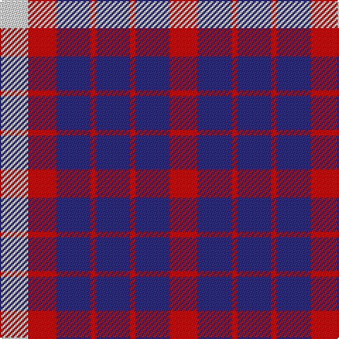

In pattern [RBRBRBRW](/patterns/rbrbrbrw/).

This was sourced from register-of-tartans.  It is a [8 stripes tartan](/stripes/stripes8/).

Original link https://www.tartanregister.gov.uk/tartanDetails.aspx?ref=4184

## Thread count
LN/20 R20 DB24 R4 DB24 R4 DB24 R/20

## Palette
Each colour and its ΔE from the base-6 reference it is a variant of.

| Colour | Shade | Base | ΔE (OKLab) |
|---|---|---|---|
| DB | <code style="background-color:#2C2C80;">#2C2C80</code> `#2C2C80` | B <code style="background-color:#2A418A;">#2A418A</code> | 0.06 |
| LN | <code style="background-color:#E0E0E0;">#E0E0E0</code> `#E0E0E0` | W <code style="background-color:#F7F7F7;">#F7F7F7</code> | 0.07 |
| R | <code style="background-color:#C80000;">#C80000</code> `#C80000` | R <code style="background-color:#CC0000;">#CC0000</code> | 0.01 |

# Sample pattern

## Nearest tartans

The nearest existing variants by ΔTartan distance.

1. [Coronation](/setts/s7/b14w2r14b8r4b8w4-b2c4084-rdc0000-we0e0e0/) — ΔT 0.90
1. [Coronation Commemorative Tartan Tartan Number: 661. Earliest known date: 1936 Designed to commemorate the coronation of King George VI and Queen Elizabeth in 1936. There is another count estimated from a drawing by Coulson Bonner which is now in the possession of the Scottish Tartan Society. B22 W2 R24 B12 R2 B12 W2 See products available Copyright © Blair Urquhart, Comrie, 2015](/setts/s7/b14w2r14b8r4b8w4-b202060-rc80000-we0e0e0/) — ΔT 0.96
1. [U.S. Coast Guard (Corporate)](/setts/s5/b24r4b24r20w20-b2c2c80-rc80000-we0e0e0/) — ΔT 1.13
1. [Coronation](/setts/s7/b14w2r14b8r4b8w4-b000050-rc00000-we0e0e0/) — ΔT 1.39
1. [Johore Regiment](/setts/s8/b40k10b36y52k12y52b36k10-b2c2c80-k101010-yd09800/) — ΔT 1.57
1. [Fiddes (Artefact)](/setts/s11/b36g10b12r50b12r10b10r12b36r24g32-b2c2c80-g289c18-rc80000/) — ΔT 1.60
1. [Edinburgh Marketing](/setts/s8/b24r4b4r8w4r8b4r12-b1c0070-rc80000-wfcfcfc/) — ΔT 1.65
1. [Commonwealth Games 1986 Special Event Tartan Tartan Number: 655. Earliest known date: 1984 Used in the uniforms of Games Officials. See products available Copyright © Blair Urquhart, Comrie, 2015](/setts/s10/b24w8r24w10k8w24b40r8b10r8-b2c2c80-k101010-rc80000-we0e0e0/) — ΔT 1.69
1. [Johore Regiment (Military)](/setts/s5/b40k10b36y52k12-b2c2c80-k101010-yd09800/) — ΔT 1.70
1. [Commonwealth Games 1986](/setts/s10/b24w8r24w12k8w24b40r8b12r8-b2c2c80-k101010-rc80000-wfcfcfc/) — ΔT 1.75

## Neighbour map

Every grey dot is one of 15726 variants placed by the first two principal components of the ΔTartan feature space (44% of its variance). Red is this tartan; blue dots are its nearest — click one to open its page.

<svg viewBox="0 0 640 380" role="img" style="max-width:100%;height:auto;border:1px solid #e0e0e0;border-radius:4px;display:block" xmlns="http://www.w3.org/2000/svg"><image href="/nn/cloud.v1.png" width="640" height="380"/><a href="/setts/s7/b14w2r14b8r4b8w4-b2c4084-rdc0000-we0e0e0/"><circle cx="277.5" cy="244.3" r="4" fill="#3465a4"><title>Coronation</title></circle></a><a href="/setts/s7/b14w2r14b8r4b8w4-b202060-rc80000-we0e0e0/"><circle cx="272.3" cy="244.2" r="4" fill="#3465a4"><title>Coronation Commemorative Tartan Tartan Number: 661. Earliest known date: 1936 Designed to commemorate the coronation of King George VI and Queen Elizabeth in 1936. There is another count estimated from a drawing by Coulson Bonner which is now in the possession of the Scottish Tartan Society. B22 W2 R24 B12 R2 B12 W2 See products available Copyright © Blair Urquhart, Comrie, 2015</title></circle></a><a href="/setts/s5/b24r4b24r20w20-b2c2c80-rc80000-we0e0e0/"><circle cx="213.3" cy="279.4" r="4" fill="#3465a4"><title>U.S. Coast Guard (Corporate)</title></circle></a><a href="/setts/s7/b14w2r14b8r4b8w4-b000050-rc00000-we0e0e0/"><circle cx="259.7" cy="244.9" r="4" fill="#3465a4"><title>Coronation</title></circle></a><a href="/setts/s8/b40k10b36y52k12y52b36k10-b2c2c80-k101010-yd09800/"><circle cx="195.7" cy="253.3" r="4" fill="#3465a4"><title>Johore Regiment</title></circle></a><a href="/setts/s11/b36g10b12r50b12r10b10r12b36r24g32-b2c2c80-g289c18-rc80000/"><circle cx="207.1" cy="237.9" r="4" fill="#3465a4"><title>Fiddes (Artefact)</title></circle></a><a href="/setts/s8/b24r4b4r8w4r8b4r12-b1c0070-rc80000-wfcfcfc/"><circle cx="261.1" cy="222.4" r="4" fill="#3465a4"><title>Edinburgh Marketing</title></circle></a><a href="/setts/s10/b24w8r24w10k8w24b40r8b10r8-b2c2c80-k101010-rc80000-we0e0e0/"><circle cx="152.6" cy="208.0" r="4" fill="#3465a4"><title>Commonwealth Games 1986 Special Event Tartan Tartan Number: 655. Earliest known date: 1984 Used in the uniforms of Games Officials. See products available Copyright © Blair Urquhart, Comrie, 2015</title></circle></a><a href="/setts/s5/b40k10b36y52k12-b2c2c80-k101010-yd09800/"><circle cx="227.4" cy="275.8" r="4" fill="#3465a4"><title>Johore Regiment (Military)</title></circle></a><a href="/setts/s10/b24w8r24w12k8w24b40r8b12r8-b2c2c80-k101010-rc80000-wfcfcfc/"><circle cx="142.2" cy="206.8" r="4" fill="#3465a4"><title>Commonwealth Games 1986</title></circle></a><circle cx="224.3" cy="255.5" r="5" fill="#c00000"/></svg>

ID: /setts/s8/r20b24r4b24r4b24r20w20-b2c2c80-rc80000-we0e0e0/
