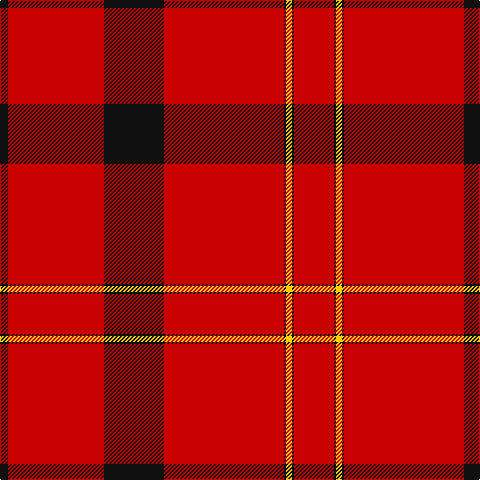

In pattern [KRKRKYKR](/patterns/krkrkykr/).

This was sourced from register-of-tartans.  It is a [8 stripes tartan](/stripes/stripes8/).

Original link https://www.tartanregister.gov.uk/tartanDetails.aspx?ref=217

## Attestations

This cloth appears in 2 source records; the oldest owns this page.

- 01/11/1982 — Barkwell (Personal) (register-of-tartans, [record](https://www.tartanregister.gov.uk/tartanDetails.aspx?ref=217))
- pre 2002 — Barkwell (Personal) (tartans-authority, [record](http://www.tartansauthority.com/tartan-ferret/display/2044/))

## Thread count
K/8 R96 K60 R120 K2 Y6 K2 R/40

## Palette
Each colour and its ΔE from the base-6 reference it is a variant of.

| Colour | Shade | Base | ΔE (OKLab) |
|---|---|---|---|
| K | <code style="background-color:#101010;">#101010</code> `#101010` | K <code style="background-color:#000000;">#000000</code> | 0.17 |
| R | <code style="background-color:#C80000;">#C80000</code> `#C80000` | R <code style="background-color:#CC0000;">#CC0000</code> | 0.01 |
| Y | <code style="background-color:#FCCC00;">#FCCC00</code> `#FCCC00` | Y <code style="background-color:#F2BF00;">#F2BF00</code> | 0.04 |

# Sample pattern

## Nearest tartans

The nearest existing variants by ΔTartan distance.

1. [Oilmens (Corporate)](/setts/s8/y4k1r30k15r24k2r4k1x4~k101010-rc80000-ye8c000/) — ΔT 1.12
1. [Oilmens](/setts/s14/r4k2r24k15r30k1y4k1r30k15r24k2r4k1x4~k101010-rc80000-ye8c000/) — ΔT 1.44
1. [Chalet](/setts/s6/g4r16k5r50g4w1x4~g007800-k000000-rc80000-wfcfcfc/) — ΔT 1.46
1. [Gudbrandsdalen, Rondastakken #2](/setts/s8/r65w1r6k8g8r6k3r11x2~g006818-k101010-rc80000-wfcfcfc/) — ΔT 1.56
1. [Barkwell, The](/setts/s8/y4k1r30k15r24k2r4k1x4~k000000-rc00000-yf0c000/) — ΔT 1.61
1. [MacPherson-Grant](/setts/s11/r90k6r6k6r90g6r6g45r6k4r3~g006818-k101010-rc80000/) — ΔT 1.66
1. [MacAndrew Dress (Name)](/setts/s6/r72k8r4g16r7ra2x2~g006818-k101010-rc80000-ra888888/) — ΔT 1.68
1. [Virgin](/setts/s8/r51ra2r6k10r2k4ra3k3x2~k101010-re80000-ra888888/) — ΔT 1.73
1. [Knights Templar Hunting](/setts/s8/k22w1k12r43w1r43k12w1x2~k101010-rc80000-wf8f8f8/) — ΔT 1.74
1. [Miyuki #2](/setts/s10/r40w1r1b8r1w1r6w1r1b8x2~b003c64-rc80000-we0e0e0/) — ΔT 1.80

## Neighbour map

Every grey dot is one of 15726 variants placed by the first two principal components of the ΔTartan feature space (44% of its variance). Red is this tartan; blue dots are its nearest — click one to open its page.

<svg viewBox="0 0 640 380" role="img" style="max-width:100%;height:auto;border:1px solid #e0e0e0;border-radius:4px;display:block" xmlns="http://www.w3.org/2000/svg"><image href="/nn/cloud.v1.png" width="640" height="380"/><a href="/setts/s8/y4k1r30k15r24k2r4k1x4~k101010-rc80000-ye8c000/"><circle cx="495.0" cy="152.3" r="4" fill="#3465a4"><title>Oilmens (Corporate)</title></circle></a><a href="/setts/s14/r4k2r24k15r30k1y4k1r30k15r24k2r4k1x4~k101010-rc80000-ye8c000/"><circle cx="503.7" cy="136.8" r="4" fill="#3465a4"><title>Oilmens</title></circle></a><a href="/setts/s6/g4r16k5r50g4w1x4~g007800-k000000-rc80000-wfcfcfc/"><circle cx="608.2" cy="124.2" r="4" fill="#3465a4"><title>Chalet</title></circle></a><a href="/setts/s8/r65w1r6k8g8r6k3r11x2~g006818-k101010-rc80000-wfcfcfc/"><circle cx="619.2" cy="108.6" r="4" fill="#3465a4"><title>Gudbrandsdalen, Rondastakken #2</title></circle></a><a href="/setts/s8/y4k1r30k15r24k2r4k1x4~k000000-rc00000-yf0c000/"><circle cx="473.2" cy="147.2" r="4" fill="#3465a4"><title>Barkwell, The</title></circle></a><a href="/setts/s11/r90k6r6k6r90g6r6g45r6k4r3~g006818-k101010-rc80000/"><circle cx="557.0" cy="134.6" r="4" fill="#3465a4"><title>MacPherson-Grant</title></circle></a><a href="/setts/s6/r72k8r4g16r7ra2x2~g006818-k101010-rc80000-ra888888/"><circle cx="565.4" cy="138.4" r="4" fill="#3465a4"><title>MacAndrew Dress (Name)</title></circle></a><a href="/setts/s8/r51ra2r6k10r2k4ra3k3x2~k101010-re80000-ra888888/"><circle cx="520.1" cy="126.6" r="4" fill="#3465a4"><title>Virgin</title></circle></a><a href="/setts/s8/k22w1k12r43w1r43k12w1x2~k101010-rc80000-wf8f8f8/"><circle cx="450.6" cy="143.9" r="4" fill="#3465a4"><title>Knights Templar Hunting</title></circle></a><a href="/setts/s10/r40w1r1b8r1w1r6w1r1b8x2~b003c64-rc80000-we0e0e0/"><circle cx="547.8" cy="106.0" r="4" fill="#3465a4"><title>Miyuki #2</title></circle></a><circle cx="562.9" cy="141.2" r="5" fill="#c00000"/></svg>

ID: /setts/s8/r20k1y3k1r60k30r48k4x2~k101010-rc80000-yfccc00/
