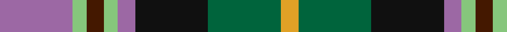
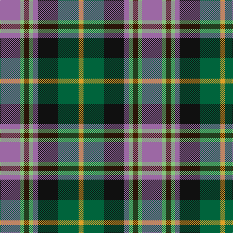

In pattern [RYBYRKGY](/patterns/rybyrkgy/).

This was sourced from register-of-tartans.  It is a [8 stripes tartan](/stripes/stripes8/).

Original link https://www.tartanregister.gov.uk/tartanDetails.aspx?ref=11077

## Thread count
LP/42 LG8 DR10 LG8 LP10 K42 G42 Y/10

## Palette
Each colour and its ΔE from the base-6 reference it is a variant of.

| Colour | Shade | Base | ΔE (OKLab) |
|---|---|---|---|
| DR | <code style="background-color:#441800;">#441800</code> `#441800` | B <code style="background-color:#2A418A;">#2A418A</code> | 0.23 |
| G | <code style="background-color:#00643C;">#00643C</code> `#00643C` | G <code style="background-color:#006100;">#006100</code> | 0.05 |
| K | <code style="background-color:#101010;">#101010</code> `#101010` | K <code style="background-color:#000000;">#000000</code> | 0.17 |
| LG | <code style="background-color:#86C67C;">#86C67C</code> `#86C67C` | Y <code style="background-color:#F2BF00;">#F2BF00</code> | 0.15 |
| LP | <code style="background-color:#9C68A4;">#9C68A4</code> `#9C68A4` | R <code style="background-color:#CC0000;">#CC0000</code> | 0.21 |
| Y | <code style="background-color:#E0A126;">#E0A126</code> `#E0A126` | Y <code style="background-color:#F2BF00;">#F2BF00</code> | 0.08 |

# Sample pattern

## Nearest tartans

The nearest existing variants by ΔTartan distance.

1. [Caledonian Labrador Retrievers](/setts/s8/r21b4ba5b4r5k21g21y5x2~b000048-ba501400-g006818-k101010-r9c68a4-yfccc00/) — ΔT 0.43
1. [Labrador Club of Scotland (Corporate](/setts/s8/r21y4g5y4r5k21ga21ya5x2~g604000-ga006818-k101010-ra478a0-y98a46c-yabc8c00/) — ΔT 0.49
1. [Burnfoot Check](/setts/s8/r3g2b2g3k6ba2ra10ba2x2~b646464-ba00008c-g004c00-k000000-r8c0000-raa0783c/) — ΔT 0.92
1. [South Africa 1994 (Fashion)](/setts/s7/k20y4b13w4g30w4r13x2~b2c2c80-g006818-k101010-rc80000-we0e0e0-ye8c000/) — ΔT 0.92
1. [Mitsukoshi Sendai](/setts/s10/r4k1w1k1w1k1r4b2g6ra1x6~b4c6484-g0c5e41-k000000-r848589-raa50313-wfffff0/) — ΔT 0.95
1. [Cherokee](/setts/s8/g4b2g9k4g2r6ba12w2x2~b5c8ca8-ba1c0070-g408060-k101010-rc80000-wf8f8f8/) — ΔT 0.96
1. [McLion](/setts/s9/w1b6g1b1g1b1ga4r5y1x4~b304080-g008000-ga30a010-r802040-we0e0e0-yff8500/) — ΔT 0.97
1. [Black Hills (Corporate)](/setts/s9/b3w2g14r14k2b7k9y2k2x2~b2c2c80-g408060-k101010-rc80000-we0e0e0-ye8c000/) — ΔT 0.98
1. [Black Hills](/setts/s9/b3w2g14r14k2b7k9y2k2x2~b2c2c80-g408060-k101010-rc80000-wffffff-ye8c000/) — ΔT 1.00
1. [Mitsukoshi](/setts/s10/g12k3w3k3w3k3g13b6ba17r3x2~b07648c-ba141e46-g808080-k101010-r960000-we0e0e0/) — ΔT 1.03

## Neighbour map

Every grey dot is one of 15726 variants placed by the first two principal components of the ΔTartan feature space (44% of its variance). Red is this tartan; blue dots are its nearest — click one to open its page.

<svg viewBox="0 0 640 380" role="img" style="max-width:100%;height:auto;border:1px solid #e0e0e0;border-radius:4px;display:block" xmlns="http://www.w3.org/2000/svg"><image href="/nn/cloud.v1.png" width="640" height="380"/><a href="/setts/s8/r21b4ba5b4r5k21g21y5x2~b000048-ba501400-g006818-k101010-r9c68a4-yfccc00/"><circle cx="59.5" cy="187.2" r="4" fill="#3465a4"><title>Caledonian Labrador Retrievers</title></circle></a><a href="/setts/s8/r21y4g5y4r5k21ga21ya5x2~g604000-ga006818-k101010-ra478a0-y98a46c-yabc8c00/"><circle cx="67.7" cy="188.8" r="4" fill="#3465a4"><title>Labrador Club of Scotland (Corporate</title></circle></a><a href="/setts/s8/r3g2b2g3k6ba2ra10ba2x2~b646464-ba00008c-g004c00-k000000-r8c0000-raa0783c/"><circle cx="57.7" cy="190.5" r="4" fill="#3465a4"><title>Burnfoot Check</title></circle></a><a href="/setts/s7/k20y4b13w4g30w4r13x2~b2c2c80-g006818-k101010-rc80000-we0e0e0-ye8c000/"><circle cx="76.7" cy="178.0" r="4" fill="#3465a4"><title>South Africa 1994 (Fashion)</title></circle></a><a href="/setts/s10/r4k1w1k1w1k1r4b2g6ra1x6~b4c6484-g0c5e41-k000000-r848589-raa50313-wfffff0/"><circle cx="75.9" cy="163.9" r="4" fill="#3465a4"><title>Mitsukoshi Sendai</title></circle></a><a href="/setts/s8/g4b2g9k4g2r6ba12w2x2~b5c8ca8-ba1c0070-g408060-k101010-rc80000-wf8f8f8/"><circle cx="87.2" cy="189.0" r="4" fill="#3465a4"><title>Cherokee</title></circle></a><a href="/setts/s9/w1b6g1b1g1b1ga4r5y1x4~b304080-g008000-ga30a010-r802040-we0e0e0-yff8500/"><circle cx="117.9" cy="173.6" r="4" fill="#3465a4"><title>McLion</title></circle></a><a href="/setts/s9/b3w2g14r14k2b7k9y2k2x2~b2c2c80-g408060-k101010-rc80000-we0e0e0-ye8c000/"><circle cx="59.9" cy="162.2" r="4" fill="#3465a4"><title>Black Hills (Corporate)</title></circle></a><a href="/setts/s9/b3w2g14r14k2b7k9y2k2x2~b2c2c80-g408060-k101010-rc80000-wffffff-ye8c000/"><circle cx="56.8" cy="160.9" r="4" fill="#3465a4"><title>Black Hills</title></circle></a><a href="/setts/s10/g12k3w3k3w3k3g13b6ba17r3x2~b07648c-ba141e46-g808080-k101010-r960000-we0e0e0/"><circle cx="93.6" cy="173.1" r="4" fill="#3465a4"><title>Mitsukoshi</title></circle></a><circle cx="61.5" cy="186.1" r="5" fill="#c00000"/></svg>

ID: /setts/s8/r21y4b5y4r5k21g21ya5x2~b441800-g00643c-k101010-r9c68a4-y86c67c-yae0a126/
