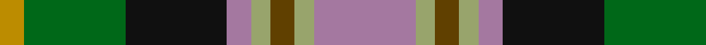
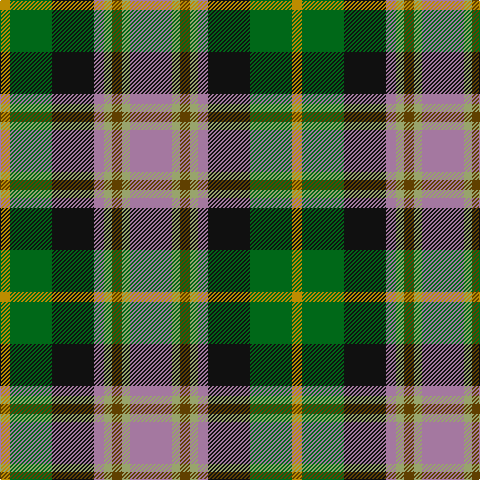

In pattern [RYGYRKGY](/patterns/rygyrkgy/).

This was sourced from tartans-authority.  It is a [8 stripes tartan](/stripes/stripes8/).

Original link http://www.tartansauthority.com/tartan-ferret/display/8262/

## Thread count
DY/10 G42 K42 LP10 LT8 T10 LT8 LP/42

## Palette
Each colour and its ΔE from the base-6 reference it is a variant of.

| Colour | Shade | Base | ΔE (OKLab) |
|---|---|---|---|
| DY | <code style="background-color:#BC8C00;">#BC8C00</code> `#BC8C00` | Y <code style="background-color:#F2BF00;">#F2BF00</code> | 0.16 |
| G | <code style="background-color:#006818;">#006818</code> `#006818` | G <code style="background-color:#006100;">#006100</code> | 0.02 |
| K | <code style="background-color:#101010;">#101010</code> `#101010` | K <code style="background-color:#000000;">#000000</code> | 0.17 |
| LP | <code style="background-color:#A478A0;">#A478A0</code> `#A478A0` | R <code style="background-color:#CC0000;">#CC0000</code> | 0.21 |
| LT | <code style="background-color:#98A46C;">#98A46C</code> `#98A46C` | Y <code style="background-color:#F2BF00;">#F2BF00</code> | 0.17 |
| T | <code style="background-color:#604000;">#604000</code> `#604000` | G <code style="background-color:#006100;">#006100</code> | 0.14 |

# Sample pattern

## Nearest tartans

The nearest existing variants by ΔTartan distance.

1. [Caledonian Labrador Retrievers](/setts/s8/r21y4b5y4r5k21g21ya5x2~b441800-g00643c-k101010-r9c68a4-y86c67c-yae0a126/) — ΔT 0.49
1. [Caledonian Labrador Retrievers](/setts/s8/r21b4ba5b4r5k21g21y5x2~b000048-ba501400-g006818-k101010-r9c68a4-yfccc00/) — ΔT 0.81
1. [South Africa 1994 (Fashion)](/setts/s7/k20y4b13w4g30w4r13x2~b2c2c80-g006818-k101010-rc80000-we0e0e0-ye8c000/) — ΔT 0.94
1. [McLion](/setts/s9/w1b6g1b1g1b1ga4r5y1x4~b304080-g008000-ga30a010-r802040-we0e0e0-yff8500/) — ΔT 1.00
1. [Burnfoot Check](/setts/s8/r3g2b2g3k6ba2ra10ba2x2~b646464-ba00008c-g004c00-k000000-r8c0000-raa0783c/) — ΔT 1.06
1. [Unnamed No 14](/setts/s9/r22b6ba10y4r4w4g22ba8y3~b5480b0-ba304080-g008000-rc00000-we0e0e0-yf0c000/) — ΔT 1.08
1. [Unnamed No 14 Tartan Tartan Number: 1326. Earliest known date: 1870 This sett is taken from the records of Messrs Bolingbroke and Jones of Norwich, who were weavers around 1870. Some of the tartans have been adopted or modified in recent times as the copyright of the designs is now in the public domain. See products available Copyright © Blair Urquhart, Comrie, 2015](/setts/s9/r22b6ba10y4r4w4g22ba8y3~b5c8ca8-ba2c2c80-g006818-rc80000-we0e0e0-ye8c000/) — ΔT 1.10
1. [Kilkenny County Crest (Fashion)](/setts/s8/y6r8k4w6g16k13ya19k5x2~g5c6428-k101010-r880000-we0e0e0-ybc8c00-yaa0a0a0/) — ΔT 1.11
1. [Mitsukoshi Sendai](/setts/s10/r4k1w1k1w1k1r4b2g6ra1x6~b4c6484-g0c5e41-k000000-r848589-raa50313-wfffff0/) — ΔT 1.12
1. [Glen Chalmadale](/setts/s9/g13w2g10k5r13k3r5b15ra5x2~b003c64-g006818-k101010-rc80000-ra843c50-we0e0e0/) — ΔT 1.13

## Neighbour map

Every grey dot is one of 15726 variants placed by the first two principal components of the ΔTartan feature space (44% of its variance). Red is this tartan; blue dots are its nearest — click one to open its page.

<svg viewBox="0 0 640 380" role="img" style="max-width:100%;height:auto;border:1px solid #e0e0e0;border-radius:4px;display:block" xmlns="http://www.w3.org/2000/svg"><image href="/nn/cloud.v1.png" width="640" height="380"/><a href="/setts/s8/r21y4b5y4r5k21g21ya5x2~b441800-g00643c-k101010-r9c68a4-y86c67c-yae0a126/"><circle cx="61.5" cy="186.1" r="4" fill="#3465a4"><title>Caledonian Labrador Retrievers</title></circle></a><a href="/setts/s8/r21b4ba5b4r5k21g21y5x2~b000048-ba501400-g006818-k101010-r9c68a4-yfccc00/"><circle cx="59.5" cy="187.2" r="4" fill="#3465a4"><title>Caledonian Labrador Retrievers</title></circle></a><a href="/setts/s7/k20y4b13w4g30w4r13x2~b2c2c80-g006818-k101010-rc80000-we0e0e0-ye8c000/"><circle cx="76.7" cy="178.0" r="4" fill="#3465a4"><title>South Africa 1994 (Fashion)</title></circle></a><a href="/setts/s9/w1b6g1b1g1b1ga4r5y1x4~b304080-g008000-ga30a010-r802040-we0e0e0-yff8500/"><circle cx="117.9" cy="173.6" r="4" fill="#3465a4"><title>McLion</title></circle></a><a href="/setts/s8/r3g2b2g3k6ba2ra10ba2x2~b646464-ba00008c-g004c00-k000000-r8c0000-raa0783c/"><circle cx="57.7" cy="190.5" r="4" fill="#3465a4"><title>Burnfoot Check</title></circle></a><a href="/setts/s9/r22b6ba10y4r4w4g22ba8y3~b5480b0-ba304080-g008000-rc00000-we0e0e0-yf0c000/"><circle cx="87.5" cy="161.4" r="4" fill="#3465a4"><title>Unnamed No 14</title></circle></a><a href="/setts/s9/r22b6ba10y4r4w4g22ba8y3~b5c8ca8-ba2c2c80-g006818-rc80000-we0e0e0-ye8c000/"><circle cx="84.8" cy="160.1" r="4" fill="#3465a4"><title>Unnamed No 14 Tartan Tartan Number: 1326. Earliest known date: 1870 This sett is taken from the records of Messrs Bolingbroke and Jones of Norwich, who were weavers around 1870. Some of the tartans have been adopted or modified in recent times as the copyright of the designs is now in the public domain. See products available Copyright © Blair Urquhart, Comrie, 2015</title></circle></a><a href="/setts/s8/y6r8k4w6g16k13ya19k5x2~g5c6428-k101010-r880000-we0e0e0-ybc8c00-yaa0a0a0/"><circle cx="18.2" cy="201.9" r="4" fill="#3465a4"><title>Kilkenny County Crest (Fashion)</title></circle></a><a href="/setts/s10/r4k1w1k1w1k1r4b2g6ra1x6~b4c6484-g0c5e41-k000000-r848589-raa50313-wfffff0/"><circle cx="75.9" cy="163.9" r="4" fill="#3465a4"><title>Mitsukoshi Sendai</title></circle></a><a href="/setts/s9/g13w2g10k5r13k3r5b15ra5x2~b003c64-g006818-k101010-rc80000-ra843c50-we0e0e0/"><circle cx="88.9" cy="192.7" r="4" fill="#3465a4"><title>Glen Chalmadale</title></circle></a><circle cx="67.7" cy="188.8" r="5" fill="#c00000"/></svg>

ID: /setts/s8/r21y4g5y4r5k21ga21ya5x2~g604000-ga006818-k101010-ra478a0-y98a46c-yabc8c00/
