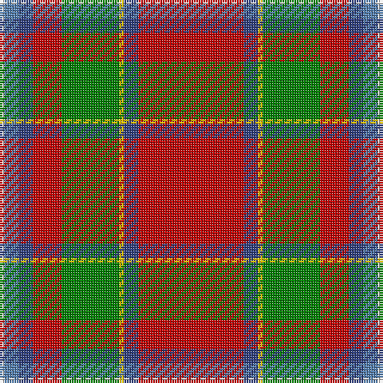

In pattern [RBYGRBBW](/stripes/rbygrbbw/).

This was sourced from weddslist.  It is a [8 stripe tartan](/stripes/stripes8/).

Original link http://www.weddslist.com/cgi-bin/tartans/pg.pl?source=sts

## Thread count
R/44 B6 Y2 G24 R12 B6 Ba6 LN/2

## Palette
Each colour and the base-6 reference it is a variant of.

| Colour | Shade | Base |
|---|---|---|
| B | <code style="background-color:#304080;">#304080</code> `oklch(39.4% 0.109 270.2)` <small>#304080</small> | B <code style="background-color:#2A418A;">#2A418A</code> |
| Ba | <code style="background-color:#5480B0;">#5480B0</code> `oklch(58.8% 0.089 251.5)` <small>#5480B0</small> | B <code style="background-color:#2A418A;">#2A418A</code> |
| G | <code style="background-color:#008000;">#008000</code> `oklch(52.0% 0.177 142.5)` <small>#008000</small> | G <code style="background-color:#006100;">#006100</code> |
| LN | <code style="background-color:#E0E0E0;">#E0E0E0</code> `oklch(90.7% 0.000 89.9)` <small>#E0E0E0</small> | W <code style="background-color:#F7F7F7;">#F7F7F7</code> |
| R | <code style="background-color:#C00000;">#C00000</code> `oklch(50.7% 0.208 29.2)` <small>#C00000</small> | R <code style="background-color:#CC0000;">#CC0000</code> |
| Y | <code style="background-color:#F0C000;">#F0C000</code> `oklch(82.7% 0.169 90.5)` <small>#F0C000</small> | Y <code style="background-color:#F2BF00;">#F2BF00</code> |

# Sample pattern

## Nearest tartans

The nearest existing variants by ΔTartan distance, with this tartan at the top so the swatches line up against it.

ΔTartan

Tartan

Sett

—

<a href="/ttd/edit/#slug=r22db3ly1g12r6db3t3w1~x2">Drummond, (Fingask)</a> <a class="nn-out" href="/setts/s8/r22db3ly1g12r6db3t3w1~x2/" title="open its dictionary page">↗</a>

0.78

<a href="/ttd/edit/#slug=r41w2p5ly2g21r9p5db3w2~x2">Perthshire, or Drummond</a> <a class="nn-out" href="/setts/s9/r41w2p5ly2g21r9p5db3w2~x2/" title="open its dictionary page">↗</a>

0.84

<a href="/ttd/edit/#slug=r41w2dp5ly2g21r9dp5db3w2~x2">Perthshire or Drummond District Tartan Tartan Number: 1670. Earliest known date: c.1819 Perthshire is known as the gateway to the Highlands. The Perthshire tartan is similar to a the Drummond sett, the tartan of a Drummond clan who had extensive lands in the district. The first record of this tartan is in the early nineteenth century account book of Wilson's of Bannockburn where it is referred to as the 'Perthshire Rock and Wheel' being an early type of soft tartan. See products available Copyright © Blair Urquhart, Comrie, 2015</a> <a class="nn-out" href="/setts/s9/r41w2dp5ly2g21r9dp5db3w2~x2/" title="open its dictionary page">↗</a>

0.98

<a href="/ttd/edit/#slug=w6r25y2g3y30k3y2r30ly6~x2">Virginia Military Institute, New Market</a> <a class="nn-out" href="/setts/s9/w6r25y2g3y30k3y2r30ly6~x2/" title="open its dictionary page">↗</a>

1.11

<a href="/ttd/edit/#slug=w6r25o2g3o30k3o2r30ly6~x2">Virginia Military Institute, New Market</a> <a class="nn-out" href="/setts/s9/w6r25o2g3o30k3o2r30ly6~x2/" title="open its dictionary page">↗</a>

1.12

<a href="/ttd/edit/#slug=k3r34dg10r5t2k8o2w3~x2">Lambert (Front Royal) Greer</a> <a class="nn-out" href="/setts/s8/k3r34dg10r5t2k8o2w3~x2/" title="open its dictionary page">↗</a>

1.13

<a href="/ttd/edit/#slug=r6b22r6g20ly2r45b2w5~x2">Elbrick Dress (Personal)</a> <a class="nn-out" href="/setts/s8/r6b22r6g20ly2r45b2w5~x2/" title="open its dictionary page">↗</a>

1.14

<a href="/ttd/edit/#slug=r3lo15g4dt6w2r30dt6ly3~x2">Round Table Sweden</a> <a class="nn-out" href="/setts/s8/r3lo15g4dt6w2r30dt6ly3~x2/" title="open its dictionary page">↗</a>

1.16

<a href="/ttd/edit/#slug=r25db7r3g13t1k2~x4">MacPhail</a> <a class="nn-out" href="/setts/s6/r25db7r3g13t1k2~x4/" title="open its dictionary page">↗</a>

1.18

<a href="/ttd/edit/#slug=t4k2db3r33g9w3r5db10r6g2k2~x2">MacArthur-Fox Dress (Personal)</a> <a class="nn-out" href="/setts/s11/t4k2db3r33g9w3r5db10r6g2k2~x2/" title="open its dictionary page">↗</a>

1.18

<a href="/ttd/edit/#slug=r48t8k10ly2k3w2g25r10k3r3w2~x2">Followers' Plaid</a> <a class="nn-out" href="/setts/s11/r48t8k10ly2k3w2g25r10k3r3w2~x2/" title="open its dictionary page">↗</a>

## Neighbour map

Every grey dot is one of 14299 variants placed by the first two principal components of the ΔTartan feature space (44% of its variance). Red is this tartan; blue dots are its nearest — click one to open its page.

<svg viewBox="0 0 640 380" role="img" style="max-width:100%;height:auto;border:1px solid #e0e0e0;border-radius:4px;display:block" xmlns="http://www.w3.org/2000/svg"><image href="/nn/cloud.v1.png" width="640" height="380"/><a href="/setts/s9/r41w2p5ly2g21r9p5db3w2~x2/"><circle cx="309.1" cy="94.9" r="4" fill="#3465a4"><title>Perthshire, or Drummond</title></circle></a><a href="/setts/s9/r41w2dp5ly2g21r9dp5db3w2~x2/"><circle cx="316.1" cy="97.2" r="4" fill="#3465a4"><title>Perthshire or Drummond District Tartan Tartan Number: 1670. Earliest known date: c.1819 Perthshire is known as the gateway to the Highlands. The Perthshire tartan is similar to a the Drummond sett, the tartan of a Drummond clan who had extensive lands in the district. The first record of this tartan is in the early nineteenth century account book of Wilson's of Bannockburn where it is referred to as the 'Perthshire Rock and Wheel' being an early type of soft tartan. See products available Copyright © Blair Urquhart, Comrie, 2015</title></circle></a><a href="/setts/s9/w6r25y2g3y30k3y2r30ly6~x2/"><circle cx="274.2" cy="122.8" r="4" fill="#3465a4"><title>Virginia Military Institute, New Market</title></circle></a><a href="/setts/s9/w6r25o2g3o30k3o2r30ly6~x2/"><circle cx="282.2" cy="125.3" r="4" fill="#3465a4"><title>Virginia Military Institute, New Market</title></circle></a><a href="/setts/s8/k3r34dg10r5t2k8o2w3~x2/"><circle cx="326.7" cy="117.0" r="4" fill="#3465a4"><title>Lambert (Front Royal) Greer</title></circle></a><a href="/setts/s8/r6b22r6g20ly2r45b2w5~x2/"><circle cx="308.8" cy="128.3" r="4" fill="#3465a4"><title>Elbrick Dress (Personal)</title></circle></a><a href="/setts/s8/r3lo15g4dt6w2r30dt6ly3~x2/"><circle cx="230.2" cy="120.1" r="4" fill="#3465a4"><title>Round Table Sweden</title></circle></a><a href="/setts/s6/r25db7r3g13t1k2~x4/"><circle cx="328.4" cy="142.6" r="4" fill="#3465a4"><title>MacPhail</title></circle></a><a href="/setts/s11/t4k2db3r33g9w3r5db10r6g2k2~x2/"><circle cx="287.7" cy="96.9" r="4" fill="#3465a4"><title>MacArthur-Fox Dress (Personal)</title></circle></a><a href="/setts/s11/r48t8k10ly2k3w2g25r10k3r3w2~x2/"><circle cx="281.6" cy="76.1" r="4" fill="#3465a4"><title>Followers' Plaid</title></circle></a><circle cx="308.0" cy="115.7" r="5" fill="#c00000"/></svg>

ID: /setts/s8/r22db3ly1g12r6db3t3w1~x2/
