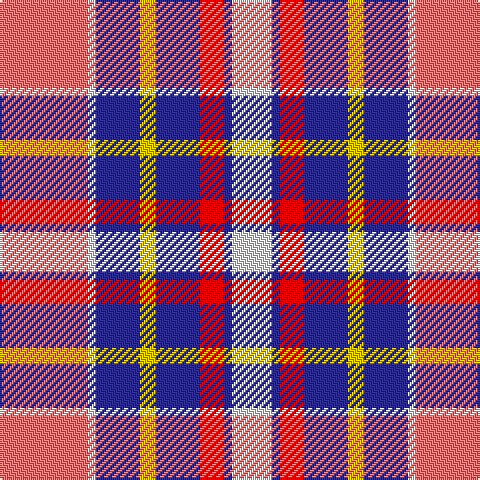

This page is one **sett** — a single exact thread-count. It belongs to the [tartan](/tartans/r22w2db11ly4db11r6db2w10/)
(the same proportion at any scale), whose colour order is pattern [RWBYBRBW](/stripes/rwbybrbw/).

Sourced from tartans-authority.  It is a [8 stripe tartan](/stripes/stripes8/).

Original link http://www.tartansauthority.com/tartan-ferret/display/8027/

## Thread count
LR/44 LN4 DB22 Y8 DB22 R12 DB4 LN/20

## Palette

Palette: <strong>Tartan Register</strong>
<table><thead><tr><th>Colour</th><th>Threads</th><th>Shade</th><th>Base</th><th>OKLCh</th></tr></thead><tbody><tr><td>LR/</td><td style="text-align:right;font-variant-numeric:tabular-nums">44</td><td><code style="background-color:#E87878;">#E87878</code> <small style="color:#888">#E87878</small></td><td>R <code style="background-color:#CC0000;">#CC0000</code></td><td><small style="color:#888">oklch(70.0% 0.139 21.2)</small></td></tr><tr><td>LN</td><td style="text-align:right;font-variant-numeric:tabular-nums">4</td><td><code style="background-color:#E0E0E0;">#E0E0E0</code> <small style="color:#888">#E0E0E0</small></td><td>W <code style="background-color:#F7F7F7;">#F7F7F7</code></td><td><small style="color:#888">oklch(90.7% 0.000 89.9)</small></td></tr><tr><td>DB</td><td style="text-align:right;font-variant-numeric:tabular-nums">22</td><td><code style="background-color:#2C2C80;">#2C2C80</code> <small style="color:#888">#2C2C80</small></td><td>B <code style="background-color:#2A418A;">#2A418A</code></td><td><small style="color:#888">oklch(35.0% 0.138 276.6)</small></td></tr><tr><td>Y</td><td style="text-align:right;font-variant-numeric:tabular-nums">8</td><td><code style="background-color:#E8C000;">#E8C000</code> <small style="color:#888">#E8C000</small></td><td>Y <code style="background-color:#F2BF00;">#F2BF00</code></td><td><small style="color:#888">oklch(81.9% 0.168 93.7)</small></td></tr><tr><td>DB</td><td style="text-align:right;font-variant-numeric:tabular-nums">22</td><td><code style="background-color:#2C2C80;">#2C2C80</code> <small style="color:#888">#2C2C80</small></td><td>B <code style="background-color:#2A418A;">#2A418A</code></td><td><small style="color:#888">oklch(35.0% 0.138 276.6)</small></td></tr><tr><td>R</td><td style="text-align:right;font-variant-numeric:tabular-nums">12</td><td><code style="background-color:#C80000;">#C80000</code> <small style="color:#888">#C80000</small></td><td>R <code style="background-color:#CC0000;">#CC0000</code></td><td><small style="color:#888">oklch(52.3% 0.215 29.2)</small></td></tr><tr><td>DB</td><td style="text-align:right;font-variant-numeric:tabular-nums">4</td><td><code style="background-color:#2C2C80;">#2C2C80</code> <small style="color:#888">#2C2C80</small></td><td>B <code style="background-color:#2A418A;">#2A418A</code></td><td><small style="color:#888">oklch(35.0% 0.138 276.6)</small></td></tr><tr><td>LN/</td><td style="text-align:right;font-variant-numeric:tabular-nums">20</td><td><code style="background-color:#E0E0E0;">#E0E0E0</code> <small style="color:#888">#E0E0E0</small></td><td>W <code style="background-color:#F7F7F7;">#F7F7F7</code></td><td><small style="color:#888">oklch(90.7% 0.000 89.9)</small></td></tr></tbody></table>

# Sample pattern

## Nearest tartans

The nearest existing variants by ΔTartan distance, with this tartan at the top so the swatches line up against it.

ΔTartan

Tartan

Sett

—

<a href="/ttd/edit/#slug=r22w2db11ly4db11r6db2w10~x2">Thousand Islands Int. Council (Corp)</a> <a class="nn-out" href="/setts/s8/r22w2db11ly4db11r6db2w10~x2/" title="open its dictionary page">↗</a>

0.97

<a href="/ttd/edit/#slug=r4w2r1w18dp18m18g3m4~x2">Gigha, Lilac (Dance)</a> <a class="nn-out" href="/setts/s8/r4w2r1w18dp18m18g3m4~x2/" title="open its dictionary page">↗</a>

1.08

<a href="/ttd/edit/#slug=r6db2p21w3dg19w26dg3w5~x2">Culloden, dress Ancient</a> <a class="nn-out" href="/setts/s8/r6db2p21w3dg19w26dg3w5~x2/" title="open its dictionary page">↗</a>

1.12

<a href="/ttd/edit/#slug=dt1lr7w1o3w1o7dt4p13w1~x4">Wcwm 1893-11</a> <a class="nn-out" href="/setts/s9/dt1lr7w1o3w1o7dt4p13w1~x4/" title="open its dictionary page">↗</a>

1.14

<a href="/ttd/edit/#slug=w5g3r3g3r3db20r16w21k3~x2">Oliver, dress</a> <a class="nn-out" href="/setts/s9/w5g3r3g3r3db20r16w21k3~x2/" title="open its dictionary page">↗</a>

1.20

<a href="/ttd/edit/#slug=g16p8r45w6p45w44p6w12">Culloden, Red (dress)</a> <a class="nn-out" href="/setts/s8/g16p8r45w6p45w44p6w12/" title="open its dictionary page">↗</a>

1.24

<a href="/ttd/edit/#slug=dp12n3r13dp4r10w2lb18n22r4~x2">Wild Rose (Commemorative)</a> <a class="nn-out" href="/setts/s9/dp12n3r13dp4r10w2lb18n22r4~x2/" title="open its dictionary page">↗</a>

1.24

<a href="/ttd/edit/#slug=w4t32w12k5r9lo8r4w4~x2">Brunnbauer (2015)</a> <a class="nn-out" href="/setts/s8/w4t32w12k5r9lo8r4w4~x2/" title="open its dictionary page">↗</a>

1.26

<a href="/ttd/edit/#slug=r6db2dp21w3dg19w26dg3w5~x2">Culloden Dress Ancient</a> <a class="nn-out" href="/setts/s8/r6db2dp21w3dg19w26dg3w5~x2/" title="open its dictionary page">↗</a>

1.26

<a href="/ttd/edit/#slug=r6t3m20ly2k20w20k2w5~x2">Humming Bird (Fashion)</a> <a class="nn-out" href="/setts/s8/r6t3m20ly2k20w20k2w5~x2/" title="open its dictionary page">↗</a>

1.27

<a href="/ttd/edit/#slug=w4db8w1db1r6db3lo6db1w4~x4">Wombles 2 (Corporate)</a> <a class="nn-out" href="/setts/s9/w4db8w1db1r6db3lo6db1w4~x4/" title="open its dictionary page">↗</a>

## Neighbour map

Every grey dot is one of 14299 variants placed by the first two principal components of the ΔTartan feature space (44% of its variance). Red is this tartan; blue dots are its nearest — click one to open its page.

<svg viewBox="0 0 640 380" role="img" style="max-width:100%;height:auto;border:1px solid #e0e0e0;border-radius:4px;display:block" xmlns="http://www.w3.org/2000/svg"><image href="/nn/cloud.v1.png" width="640" height="380"/><a href="/setts/s8/r4w2r1w18dp18m18g3m4~x2/"><circle cx="155.7" cy="130.9" r="4" fill="#3465a4"><title>Gigha, Lilac (Dance)</title></circle></a><a href="/setts/s8/r6db2p21w3dg19w26dg3w5~x2/"><circle cx="155.5" cy="140.0" r="4" fill="#3465a4"><title>Culloden, dress Ancient</title></circle></a><a href="/setts/s9/dt1lr7w1o3w1o7dt4p13w1~x4/"><circle cx="138.1" cy="135.4" r="4" fill="#3465a4"><title>Wcwm 1893-11</title></circle></a><a href="/setts/s9/w5g3r3g3r3db20r16w21k3~x2/"><circle cx="110.6" cy="154.6" r="4" fill="#3465a4"><title>Oliver, dress</title></circle></a><a href="/setts/s8/g16p8r45w6p45w44p6w12/"><circle cx="142.0" cy="179.8" r="4" fill="#3465a4"><title>Culloden, Red (dress)</title></circle></a><a href="/setts/s9/dp12n3r13dp4r10w2lb18n22r4~x2/"><circle cx="135.5" cy="172.3" r="4" fill="#3465a4"><title>Wild Rose (Commemorative)</title></circle></a><a href="/setts/s8/w4t32w12k5r9lo8r4w4~x2/"><circle cx="152.0" cy="155.6" r="4" fill="#3465a4"><title>Brunnbauer (2015)</title></circle></a><a href="/setts/s8/r6db2dp21w3dg19w26dg3w5~x2/"><circle cx="152.5" cy="141.5" r="4" fill="#3465a4"><title>Culloden Dress Ancient</title></circle></a><a href="/setts/s8/r6t3m20ly2k20w20k2w5~x2/"><circle cx="91.0" cy="133.3" r="4" fill="#3465a4"><title>Humming Bird (Fashion)</title></circle></a><a href="/setts/s9/w4db8w1db1r6db3lo6db1w4~x4/"><circle cx="43.0" cy="167.2" r="4" fill="#3465a4"><title>Wombles 2 (Corporate)</title></circle></a><circle cx="133.7" cy="159.1" r="5" fill="#c00000"/></svg>

ID: /setts/s8/r22w2db11ly4db11r6db2w10~x2/
