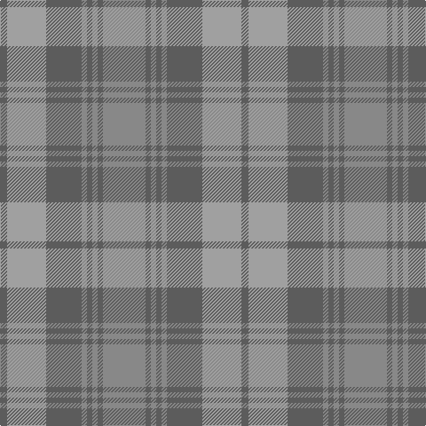

In pattern [BYBRBRBR](/patterns/bybrbrbr/).

This was sourced from register-of-tartans.  It is a [8 stripes tartan](/stripes/stripes8/).

Original link https://www.tartanregister.gov.uk/tartanDetails.aspx?ref=4160

## Register references

External register numbers recorded for this tartan.

- Scottish Register of Tartans: [4160](https://www.tartanregister.gov.uk/tartanDetails.aspx?ref=4160)
- Scottish Tartans Authority (ITI): 1749
- Scottish Tartans World Register: 1749

## Thread count
Na/8 N44 Na40 Nb6 Na6 Nb6 Na6 Nb/48

## Palette
Each colour and its ΔE from the base-6 reference it is a variant of.

| Colour | Shade | Base | ΔE (OKLab) |
|---|---|---|---|
| N | <code style="background-color:#A0A0A0;">#A0A0A0</code> `#A0A0A0` | Y <code style="background-color:#F2BF00;">#F2BF00</code> | 0.21 |
| Na | <code style="background-color:#5C5C5C;">#5C5C5C</code> `#5C5C5C` | B <code style="background-color:#2A418A;">#2A418A</code> | 0.15 |
| Nb | <code style="background-color:#888888;">#888888</code> `#888888` | R <code style="background-color:#CC0000;">#CC0000</code> | 0.24 |

# Sample pattern

## Nearest tartans

The nearest existing variants by ΔTartan distance.

1. [Manx Centenary](/setts/s9/b22g3b3g3b3g9r28g3r6~b40748c-g006818-r888888~x2/) — ΔT 1.23
1. [Clyde](/setts/s10/r5b3r22ra3b6ba17ra2ba4ra2ba4~b646464-ba5c5c5c-r8c8c8c-ra8c0000~x2/) — ΔT 1.33
1. [Glen Burns (WCWM-2)](/setts/s6/b1r6b6ra6b1ra1~b646464-rbe7832-ra8c8c8c~x4/) — ΔT 1.36
1. [Daks, (Muted Skye)](/setts/s8/b5g15r4g4r24g4r4b5~b304080-g808080-r806050/) — ΔT 1.50
1. [Outlander #2](/setts/s9/r7b6w1y6b1y6b6w1r6~b5c5c5c-r888888-w98c8e8-ya08858~x8/) — ΔT 1.72
1. [Outlander #2](/setts/s9/g7b6w1y6b1y6b6w1g6~b5c5c5c-g808080-w82cffd-ya08858~x8/) — ΔT 1.72
1. [Scottish Ballet](/setts/s6/y5g22r15w11r5g2~g789484-r9c68a4-wc49cd8-ye0a126~x2/) — ΔT 1.87
1. [Tenmaya](/setts/s8/w3g36wa6b6wa6b12wa32w3~b8080d0-g808080-we0e0e0-wac0a0e0/) — ΔT 2.10
1. [Blue Ridge](/setts/s10/g6b8r2b2y2b16g18b4g4b3~b5c8ca8-g408060-re86000-ye8c000~x2/) — ΔT 2.12
1. [Blue Ridge (District)](/setts/s10/g6b8r2b2y2b16g18b4g4b3~b5c8ca8-g408060-re86000-ye8c000~x4/) — ΔT 2.12

## Neighbour map

Every grey dot is one of 15726 variants placed by the first two principal components of the ΔTartan feature space (44% of its variance). Red is this tartan; blue dots are its nearest — click one to open its page.

<svg viewBox="0 0 640 380" role="img" style="max-width:100%;height:auto;border:1px solid #e0e0e0;border-radius:4px;display:block" xmlns="http://www.w3.org/2000/svg"><image href="/nn/cloud.v1.png" width="640" height="380"/><a href="/setts/s9/b22g3b3g3b3g9r28g3r6~b40748c-g006818-r888888~x2/"><circle cx="369.5" cy="250.8" r="4" fill="#3465a4"><title>Manx Centenary</title></circle></a><a href="/setts/s10/r5b3r22ra3b6ba17ra2ba4ra2ba4~b646464-ba5c5c5c-r8c8c8c-ra8c0000~x2/"><circle cx="337.8" cy="220.3" r="4" fill="#3465a4"><title>Clyde</title></circle></a><a href="/setts/s6/b1r6b6ra6b1ra1~b646464-rbe7832-ra8c8c8c~x4/"><circle cx="351.4" cy="308.9" r="4" fill="#3465a4"><title>Glen Burns (WCWM-2)</title></circle></a><a href="/setts/s8/b5g15r4g4r24g4r4b5~b304080-g808080-r806050/"><circle cx="415.1" cy="291.7" r="4" fill="#3465a4"><title>Daks, (Muted Skye)</title></circle></a><a href="/setts/s9/r7b6w1y6b1y6b6w1r6~b5c5c5c-r888888-w98c8e8-ya08858~x8/"><circle cx="263.8" cy="280.5" r="4" fill="#3465a4"><title>Outlander #2</title></circle></a><a href="/setts/s9/g7b6w1y6b1y6b6w1g6~b5c5c5c-g808080-w82cffd-ya08858~x8/"><circle cx="264.3" cy="281.5" r="4" fill="#3465a4"><title>Outlander #2</title></circle></a><a href="/setts/s6/y5g22r15w11r5g2~g789484-r9c68a4-wc49cd8-ye0a126~x2/"><circle cx="309.4" cy="252.7" r="4" fill="#3465a4"><title>Scottish Ballet</title></circle></a><a href="/setts/s8/w3g36wa6b6wa6b12wa32w3~b8080d0-g808080-we0e0e0-wac0a0e0/"><circle cx="340.8" cy="213.8" r="4" fill="#3465a4"><title>Tenmaya</title></circle></a><a href="/setts/s10/g6b8r2b2y2b16g18b4g4b3~b5c8ca8-g408060-re86000-ye8c000~x2/"><circle cx="416.2" cy="254.9" r="4" fill="#3465a4"><title>Blue Ridge</title></circle></a><a href="/setts/s10/g6b8r2b2y2b16g18b4g4b3~b5c8ca8-g408060-re86000-ye8c000~x4/"><circle cx="416.2" cy="254.9" r="4" fill="#3465a4"><title>Blue Ridge (District)</title></circle></a><circle cx="346.0" cy="265.9" r="5" fill="#c00000"/></svg>

ID: /setts/s8/r24b3r3b3r3b20y22b4~b5c5c5c-r888888-ya0a0a0~x2/
