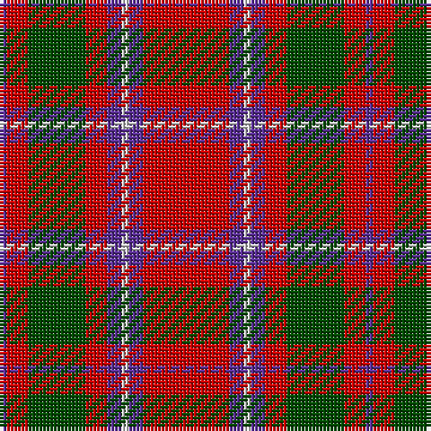

In pattern [BRGRBWBR](/patterns/brgrbwbr/).

This was sourced from weddslist.  It is a [8 stripes tartan](/stripes/stripes8/).

Original link http://www.weddslist.com/cgi-bin/tartans/pg.pl?source=rb

## Thread count
P/2 R6 G16 R6 P4 N2 P4 R/24

## Palette
Each colour and its ΔE from the base-6 reference it is a variant of.

| Colour | Shade | Base | ΔE (OKLab) |
|---|---|---|---|
| G | <code style="background-color:#004C00;">#004C00</code> `#004C00` | G <code style="background-color:#006100;">#006100</code> | 0.07 |
| N | <code style="background-color:#D0D0D0;">#D0D0D0</code> `#D0D0D0` | W <code style="background-color:#F7F7F7;">#F7F7F7</code> | 0.12 |
| P | <code style="background-color:#5A3094;">#5A3094</code> `#5A3094` | B <code style="background-color:#2A418A;">#2A418A</code> | 0.08 |
| R | <code style="background-color:#C80000;">#C80000</code> `#C80000` | R <code style="background-color:#CC0000;">#CC0000</code> | 0.01 |

# Sample pattern

## Nearest tartans

The nearest existing variants by ΔTartan distance.

1. [Chisholm (Portrait) The.. Clan Tartan Tartan Number: 532. Earliest known date: 1800 This is without doubt the oldest of the Chisholm tartans, dating from around 1800 and which appears in a portrait of the clan heroine 'Mary Chisholm' of about that date. She was famous for having sided with the clansmen during the clearances. D.C.Stewart says it is a variation of one of the MacIntosh setts, said to have been found in a cave at Achnacarry in 1746. Cockburn Collection No.40 (1800 - 10). Logan (1831) See products available Copyright © Blair Urquhart, Comrie, 2015](/setts/s8/r24b4w2b4r6g16r6b2-b2c2c80-g006818-rc80000-we0e0e0/) — ΔT 0.36
1. [Chisholm, The](/setts/s8/r24b4w2b4r6g16r6b2-b304080-g008000-rc00000-we0e0e0/) — ΔT 0.64
1. [Chisholm, The](/setts/s8/r48b8w4b8r12g32r12b4-b1474b4-g006818-rc80000-wfcfcfc/) — ΔT 0.68
1. [Grant of Lurg](/setts/s6/r4b20r4g20r50w4-b2c2c80-g006818-rc80000-wf8f8f8/) — ΔT 0.77
1. [Jenkins (Name)](/setts/s10/b4r60g16r6g16r12b8r6b24w4-b202060-g006818-rc80000-we0e0e0/) — ΔT 0.85
1. [Wasko (Personal)](/setts/s7/r16w4ra60g24ra6g24ra6-g006818-rc80000-raa00048-we0e0e0/) — ΔT 0.86
1. [Carrick (Strathmore) District Tartan Tartan Number: 3216. Earliest known date: c.1999 Sales help Princess Diana Memorial Trust See products available Copyright © Blair Urquhart, Comrie, 2015](/setts/s7/r56b24r6g40ba4g4r14-b202060-ba5c8ca8-g003820-rc80000/) — ΔT 0.87
1. [Harkness Family Tartan Tartan Number: 580. Earliest known date: 1982 Based on the Nithsdale District tartan. See products available Copyright © Blair Urquhart, Comrie, 2015](/setts/s10/b20r4w4r32g12r2g4r2g6r12-b2c2c80-g006818-rc80000-we0e0e0/) — ΔT 0.90
1. [MacDuff - 1819 (Clan)](/setts/s7/r72b18k24g34r20k6r20-b2c2c80-g006818-k101010-rc80000/) — ΔT 0.91
1. [MacNab (Crimson)](/setts/s7/g56r14ra14g28ra14r96k8-g005020-k101010-rdc0000-ra781c38/) — ΔT 0.93

## Neighbour map

Every grey dot is one of 15726 variants placed by the first two principal components of the ΔTartan feature space (44% of its variance). Red is this tartan; blue dots are its nearest — click one to open its page.

<svg viewBox="0 0 640 380" role="img" style="max-width:100%;height:auto;border:1px solid #e0e0e0;border-radius:4px;display:block" xmlns="http://www.w3.org/2000/svg"><image href="/nn/cloud.v1.png" width="640" height="380"/><a href="/setts/s8/r24b4w2b4r6g16r6b2-b2c2c80-g006818-rc80000-we0e0e0/"><circle cx="322.9" cy="176.7" r="4" fill="#3465a4"><title>Chisholm (Portrait) The.. Clan Tartan Tartan Number: 532. Earliest known date: 1800 This is without doubt the oldest of the Chisholm tartans, dating from around 1800 and which appears in a portrait of the clan heroine 'Mary Chisholm' of about that date. She was famous for having sided with the clansmen during the clearances. D.C.Stewart says it is a variation of one of the MacIntosh setts, said to have been found in a cave at Achnacarry in 1746. Cockburn Collection No.40 (1800 - 10). Logan (1831) See products available Copyright © Blair Urquhart, Comrie, 2015</title></circle></a><a href="/setts/s8/r24b4w2b4r6g16r6b2-b304080-g008000-rc00000-we0e0e0/"><circle cx="324.2" cy="178.2" r="4" fill="#3465a4"><title>Chisholm, The</title></circle></a><a href="/setts/s8/r48b8w4b8r12g32r12b4-b1474b4-g006818-rc80000-wfcfcfc/"><circle cx="321.2" cy="176.5" r="4" fill="#3465a4"><title>Chisholm, The</title></circle></a><a href="/setts/s6/r4b20r4g20r50w4-b2c2c80-g006818-rc80000-wf8f8f8/"><circle cx="328.6" cy="180.1" r="4" fill="#3465a4"><title>Grant of Lurg</title></circle></a><a href="/setts/s10/b4r60g16r6g16r12b8r6b24w4-b202060-g006818-rc80000-we0e0e0/"><circle cx="314.4" cy="150.2" r="4" fill="#3465a4"><title>Jenkins (Name)</title></circle></a><a href="/setts/s7/r16w4ra60g24ra6g24ra6-g006818-rc80000-raa00048-we0e0e0/"><circle cx="331.0" cy="184.9" r="4" fill="#3465a4"><title>Wasko (Personal)</title></circle></a><a href="/setts/s7/r56b24r6g40ba4g4r14-b202060-ba5c8ca8-g003820-rc80000/"><circle cx="308.2" cy="184.6" r="4" fill="#3465a4"><title>Carrick (Strathmore) District Tartan Tartan Number: 3216. Earliest known date: c.1999 Sales help Princess Diana Memorial Trust See products available Copyright © Blair Urquhart, Comrie, 2015</title></circle></a><a href="/setts/s10/b20r4w4r32g12r2g4r2g6r12-b2c2c80-g006818-rc80000-we0e0e0/"><circle cx="303.1" cy="153.4" r="4" fill="#3465a4"><title>Harkness Family Tartan Tartan Number: 580. Earliest known date: 1982 Based on the Nithsdale District tartan. See products available Copyright © Blair Urquhart, Comrie, 2015</title></circle></a><a href="/setts/s7/r72b18k24g34r20k6r20-b2c2c80-g006818-k101010-rc80000/"><circle cx="310.6" cy="200.4" r="4" fill="#3465a4"><title>MacDuff - 1819 (Clan)</title></circle></a><a href="/setts/s7/g56r14ra14g28ra14r96k8-g005020-k101010-rdc0000-ra781c38/"><circle cx="297.9" cy="187.4" r="4" fill="#3465a4"><title>MacNab (Crimson)</title></circle></a><circle cx="330.3" cy="178.2" r="5" fill="#c00000"/></svg>

ID: /setts/s8/r24b4w2b4r6g16r6b2-b5a3094-g004c00-rc80000-wd0d0d0/
