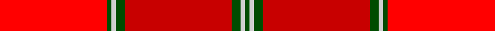
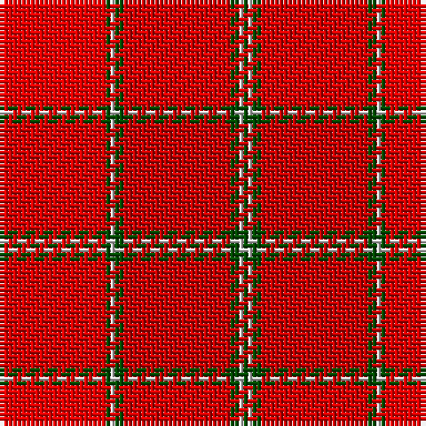

In pattern [GWGRGWGR](/stripes/gwgrgwgr/).

This was sourced from weddslist.  It is a [8 stripe tartan](/stripes/stripes8/).

Original link http://www.weddslist.com/cgi-bin/tartans/pg.pl?source=rb

## Thread count
Ra/24 G1 N1 G2 R24 G2 N1 G/1

## Palette
Each colour and the base-6 reference it is a variant of.

| Colour | Shade | Base |
|---|---|---|
| G | <code style="background-color:#004C00;">#004C00</code> `oklch(36.1% 0.123 142.5)` <small>#004C00</small> | G <code style="background-color:#006100;">#006100</code> |
| N | <code style="background-color:#D0D0D0;">#D0D0D0</code> `oklch(85.8% 0.000 89.9)` <small>#D0D0D0</small> | W <code style="background-color:#F7F7F7;">#F7F7F7</code> |
| R | <code style="background-color:#C80000;">#C80000</code> `oklch(52.3% 0.215 29.2)` <small>#C80000</small> | R <code style="background-color:#CC0000;">#CC0000</code> |
| Ra | <code style="background-color:#FF0000;">#FF0000</code> `oklch(62.8% 0.258 29.2)` <small>#FF0000</small> | R <code style="background-color:#CC0000;">#CC0000</code> |

# Sample pattern

## Nearest tartans

The nearest existing variants by ΔTartan distance.

1. [Aberdeen F.C. Corporate Tartan Tartan Number: 2057. Earliest known date: 1990 The tartan of the Aberdeen Football Club launched on 12th April, 1990. See products available Copyright © Blair Urquhart, Comrie, 2015](/setts/s7/w2k1r28k3r28k1w2~x2/) — ΔT 1.49
1. [Barbour - Cardinal Red](/setts/s7/r3ly2r18db8w1r18r2~x2/) — ΔT 1.99
1. [Ferguson Red, George (Personal)](/setts/s12/r8dr48r6r48r3r6r6r4r8r2r22r8/) — ΔT 2.02
1. [Aberdeen Football Club (1990)](/setts/s7/w2k1r28k3m28k1w2~x2/) — ΔT 2.13
1. [Morgan (Welsh Name)](/setts/s11/r4r34do20r4do8r6ly2r5do2r3r4/) — ΔT 2.19
1. [MacNab - 1800 (Portrait)](/setts/s5/r96g3lb3g6r95/) — ΔT 2.21
1. [Fueglistal (Aargau) (Personal)](/setts/s9/k3o6lr13r2lr2r32lr1r2lr2~x2/) — ΔT 2.28
1. [Haughey (2015)](/setts/s5/do5r21lo21w2db1~x2/) — ΔT 2.29
1. [Canfor (Corporate)](/setts/s12/r62r1r6r9n2k2r9lb6n1lb6n20lb2~x2/) — ΔT 2.39
1. [Star Is Born, A](/setts/s10/o2lo14o14r1o2r2b2r2o20b2~x4/) — ΔT 2.43

## Neighbour map

Every grey dot is one of 14299 variants placed by the first two principal components of the ΔTartan feature space (44% of its variance). Red is this tartan; blue dots are its nearest — click one to open its page.

<svg viewBox="0 0 640 380" role="img" style="max-width:100%;height:auto;border:1px solid #e0e0e0;border-radius:4px;display:block" xmlns="http://www.w3.org/2000/svg"><image href="/nn/cloud.v1.png" width="640" height="380"/><a href="/setts/s7/w2k1r28k3r28k1w2~x2/"><circle cx="368.0" cy="139.4" r="4" fill="#3465a4"><title>Aberdeen F.C. Corporate Tartan Tartan Number: 2057. Earliest known date: 1990 The tartan of the Aberdeen Football Club launched on 12th April, 1990. See products available Copyright © Blair Urquhart, Comrie, 2015</title></circle></a><a href="/setts/s7/r3ly2r18db8w1r18r2~x2/"><circle cx="304.9" cy="162.2" r="4" fill="#3465a4"><title>Barbour - Cardinal Red</title></circle></a><a href="/setts/s12/r8dr48r6r48r3r6r6r4r8r2r22r8/"><circle cx="275.6" cy="114.3" r="4" fill="#3465a4"><title>Ferguson Red, George (Personal)</title></circle></a><a href="/setts/s7/w2k1r28k3m28k1w2~x2/"><circle cx="345.3" cy="126.7" r="4" fill="#3465a4"><title>Aberdeen Football Club (1990)</title></circle></a><a href="/setts/s11/r4r34do20r4do8r6ly2r5do2r3r4/"><circle cx="401.3" cy="152.1" r="4" fill="#3465a4"><title>Morgan (Welsh Name)</title></circle></a><a href="/setts/s5/r96g3lb3g6r95/"><circle cx="466.3" cy="183.6" r="4" fill="#3465a4"><title>MacNab - 1800 (Portrait)</title></circle></a><a href="/setts/s9/k3o6lr13r2lr2r32lr1r2lr2~x2/"><circle cx="413.3" cy="112.3" r="4" fill="#3465a4"><title>Fueglistal (Aargau) (Personal)</title></circle></a><a href="/setts/s5/do5r21lo21w2db1~x2/"><circle cx="302.1" cy="161.9" r="4" fill="#3465a4"><title>Haughey (2015)</title></circle></a><a href="/setts/s12/r62r1r6r9n2k2r9lb6n1lb6n20lb2~x2/"><circle cx="391.3" cy="61.8" r="4" fill="#3465a4"><title>Canfor (Corporate)</title></circle></a><a href="/setts/s10/o2lo14o14r1o2r2b2r2o20b2~x4/"><circle cx="276.8" cy="137.2" r="4" fill="#3465a4"><title>Star Is Born, A</title></circle></a><circle cx="382.7" cy="132.0" r="5" fill="#c00000"/></svg>

ID: /setts/s8/r24dg2lb1dg1r24/
