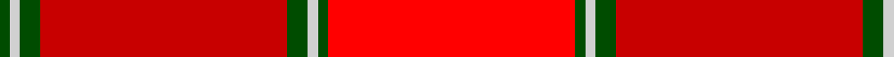

In pattern [GWGRGWGR](/patterns/gwgrgwgr/).

This was sourced from weddslist.  It is a [8 stripes tartan](/stripes/stripes8/).

Original link http://www.weddslist.com/cgi-bin/tartans/pg.pl?source=rb

## Thread count
G/2 N2 G4 R48 G4 N2 G2 Ra/48

## Palette
Each colour and its ΔE from the base-6 reference it is a variant of.

| Colour | Shade | Base | ΔE (OKLab) |
|---|---|---|---|
| G | <code style="background-color:#004C00;">#004C00</code> `#004C00` | G <code style="background-color:#006100;">#006100</code> | 0.07 |
| N | <code style="background-color:#D0D0D0;">#D0D0D0</code> `#D0D0D0` | W <code style="background-color:#F7F7F7;">#F7F7F7</code> | 0.12 |
| R | <code style="background-color:#C80000;">#C80000</code> `#C80000` | R <code style="background-color:#CC0000;">#CC0000</code> | 0.01 |
| Ra | <code style="background-color:#FF0000;">#FF0000</code> `#FF0000` | R <code style="background-color:#CC0000;">#CC0000</code> | 0.11 |

# Sample pattern

## Nearest tartans

The nearest existing variants by ΔTartan distance.

1. [Aberdeen F.C. Corporate Tartan Tartan Number: 2057. Earliest known date: 1990 The tartan of the Aberdeen Football Club launched on 12th April, 1990. See products available Copyright © Blair Urquhart, Comrie, 2015](/setts/s7/w2k1r28k3ra28k1w2~k101010-r901c38-rac80000-we0e0e0~x2/) — ΔT 1.49
1. [Barbour - Cardinal Red](/setts/s7/r3y2r18b8w1ra18r2~b2c2c80-rc80000-rab03000-wfcfcfc-yfccc00~x2/) — ΔT 1.98
1. [Ferguson Red, George (Personal)](/setts/s12/r8b48ra6rb48ra3rb6ra6rb4ra8rb2ra22rc8~b680028-r880000-rae87878-rbc80000-rcd05054/) — ΔT 2.02
1. [Aberdeen Football Club (1990)](/setts/s7/w2k1r28k3ra28k1w2~k101010-r781c38-radc0000-we0e0e0~x2/) — ΔT 2.14
1. [Morgan (Welsh Name)](/setts/s11/r4ra34b20ra4b8ra6y2ra5b2ra3r4~b441800-r901c38-rac80000-ye8c000/) — ΔT 2.20
1. [MacNab - 1800 (Portrait)](/setts/s5/r96g3w3g6ra95~g006818-rc80000-rae86070-w98c8e8/) — ΔT 2.22
1. [Haughey (2015)](/setts/s5/b5r21y21w2ba1~b4c3428-ba000080-rdc0000-wf8f8f8-yd87c00~x2/) — ΔT 2.28
1. [Fueglistal (Aargau) (Personal)](/setts/s9/k3r6y13ra2y2ra32y1ra2y2~k101010-rc27c05-rac50000-y9da39d~x2/) — ΔT 2.29
1. [Aberdeen F.C.](/setts/s7/w2k1r28k3ra28k1w2~k000000-r802040-rac00000-we0e0e0~x2/) — ΔT 2.36
1. [Canfor (Corporate)](/setts/s12/r62ra1r6ra9b2k2ra9w6b1w6b20w2~b5c5c5c-k101010-rc80000-ra880000-we8ccb8~x2/) — ΔT 2.39

## Neighbour map

Every grey dot is one of 15726 variants placed by the first two principal components of the ΔTartan feature space (44% of its variance). Red is this tartan; blue dots are its nearest — click one to open its page.

<svg viewBox="0 0 640 380" role="img" style="max-width:100%;height:auto;border:1px solid #e0e0e0;border-radius:4px;display:block" xmlns="http://www.w3.org/2000/svg"><image href="/nn/cloud.v1.png" width="640" height="380"/><a href="/setts/s7/w2k1r28k3ra28k1w2~k101010-r901c38-rac80000-we0e0e0~x2/"><circle cx="369.0" cy="138.2" r="4" fill="#3465a4"><title>Aberdeen F.C. Corporate Tartan Tartan Number: 2057. Earliest known date: 1990 The tartan of the Aberdeen Football Club launched on 12th April, 1990. See products available Copyright © Blair Urquhart, Comrie, 2015</title></circle></a><a href="/setts/s7/r3y2r18b8w1ra18r2~b2c2c80-rc80000-rab03000-wfcfcfc-yfccc00~x2/"><circle cx="305.9" cy="159.2" r="4" fill="#3465a4"><title>Barbour - Cardinal Red</title></circle></a><a href="/setts/s12/r8b48ra6rb48ra3rb6ra6rb4ra8rb2ra22rc8~b680028-r880000-rae87878-rbc80000-rcd05054/"><circle cx="276.6" cy="109.5" r="4" fill="#3465a4"><title>Ferguson Red, George (Personal)</title></circle></a><a href="/setts/s7/w2k1r28k3ra28k1w2~k101010-r781c38-radc0000-we0e0e0~x2/"><circle cx="345.8" cy="128.5" r="4" fill="#3465a4"><title>Aberdeen Football Club (1990)</title></circle></a><a href="/setts/s11/r4ra34b20ra4b8ra6y2ra5b2ra3r4~b441800-r901c38-rac80000-ye8c000/"><circle cx="402.7" cy="151.5" r="4" fill="#3465a4"><title>Morgan (Welsh Name)</title></circle></a><a href="/setts/s5/r96g3w3g6ra95~g006818-rc80000-rae86070-w98c8e8/"><circle cx="469.0" cy="177.8" r="4" fill="#3465a4"><title>MacNab - 1800 (Portrait)</title></circle></a><a href="/setts/s5/b5r21y21w2ba1~b4c3428-ba000080-rdc0000-wf8f8f8-yd87c00~x2/"><circle cx="303.4" cy="161.7" r="4" fill="#3465a4"><title>Haughey (2015)</title></circle></a><a href="/setts/s9/k3r6y13ra2y2ra32y1ra2y2~k101010-rc27c05-rac50000-y9da39d~x2/"><circle cx="414.3" cy="113.5" r="4" fill="#3465a4"><title>Fueglistal (Aargau) (Personal)</title></circle></a><a href="/setts/s7/w2k1r28k3ra28k1w2~k000000-r802040-rac00000-we0e0e0~x2/"><circle cx="341.3" cy="129.7" r="4" fill="#3465a4"><title>Aberdeen F.C.</title></circle></a><a href="/setts/s12/r62ra1r6ra9b2k2ra9w6b1w6b20w2~b5c5c5c-k101010-rc80000-ra880000-we8ccb8~x2/"><circle cx="392.3" cy="60.5" r="4" fill="#3465a4"><title>Canfor (Corporate)</title></circle></a><circle cx="384.8" cy="130.0" r="5" fill="#c00000"/></svg>

ID: /setts/s8/r24g1w1g2ra24g2w1g1~g004c00-rff0000-rac80000-wd0d0d0~x2/
