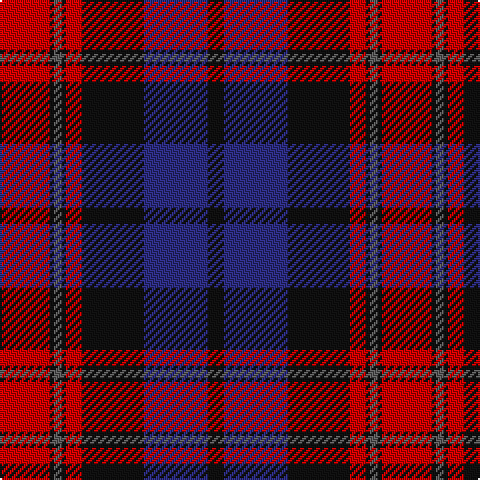

In pattern [KBKRKBKR](/stripes/kbkrkbkr/).

This was sourced from register-of-tartans.  It is a [8 stripe tartan](/stripes/stripes8/).

Original link https://www.tartanregister.gov.uk/tartanDetails.aspx?ref=270

## Register references

External register numbers recorded for this tartan.

- Scottish Register of Tartans: [270](https://www.tartanregister.gov.uk/tartanDetails.aspx?ref=270)
- Scottish Tartans Authority (ITI): 7301

## Thread count
R/25 K2 N4 K2 R8 K31 DB32 K/8

## Palette
Each colour and its ΔE from the base-6 reference it is a variant of.

| Colour | Shade | Base | ΔE (OKLab) |
|---|---|---|---|
| DB | <code style="background-color:#2C2C80;">#2C2C80</code> `#2C2C80` | B <code style="background-color:#2A418A;">#2A418A</code> | 0.06 |
| K | <code style="background-color:#101010;">#101010</code> `#101010` | K <code style="background-color:#000000;">#000000</code> | 0.17 |
| N | <code style="background-color:#5C5C5C;">#5C5C5C</code> `#5C5C5C` | B <code style="background-color:#2A418A;">#2A418A</code> | 0.15 |
| R | <code style="background-color:#C80000;">#C80000</code> `#C80000` | R <code style="background-color:#CC0000;">#CC0000</code> | 0.01 |

# Sample pattern

## Nearest tartans

The nearest existing variants by ΔTartan distance.

1. [Grady (Personal)](/setts/s9/k36r3db3r3k8db24r18g3r3~x2/) — ΔT 0.82
1. [Girl Guiding Scotland (Corporate)](/setts/s9/k36r3db3r3k8db24r18ly3r3~x2/) — ΔT 0.90
1. [Brown Family Tartan Tartan Number: 432. Earliest known date: 1850 The Scott Adie collection, a book of manufacturers samples, was recently sold at auction. The book is dated 1850 and the samples are thought to represent the tartans available for purchase between 1840-50. See products available Copyright © Blair Urquhart, Comrie, 2015](/setts/s8/db6r1db2r1db2k18r8g2~x4/) — ΔT 0.92
1. [MacInroy (Wedding) (Personal)](/setts/s12/db10g1db2g3db16g1k16r16g3r2g1r10~x2/) — ΔT 1.05
1. [Nibley (Personal)](/setts/s6/w3dg18db22r19dg1r2~x2/) — ΔT 1.09
1. [Americana - 1978 #2 (Fashion)](/setts/s7/db2r2db28k11r27w2r2~x2/) — ΔT 1.13
1. [Ross Dempster (Personal)](/setts/s7/db4dg2r18r10dg10db29b4~x2/) — ΔT 1.13
1. [Skene of Cromar - 1950 (Clan)](/setts/s8/k4r37db37r2db37g37r37k4~x2/) — ΔT 1.15
1. [Sandberg](/setts/s7/r3k12g4db12r1k2r1~x4/) — ΔT 1.16
1. [Gwyn Welsh Name Tartan Tartan Number: 5734. Earliest known date: 2002 The tartan for this Welsh surname and its spelling variation, Wynn, is actually woven in Wales at the Cambrian Woollen Mill, weaving on the same site since 1830. This tartan differs from many traditional patterns in that the warp and weft differ, giving the finished worsted wool cloth more of a predominant stripe, vertically noticeable in the finished Kilt, or Cilt in Wales. See products available Copyright © Blair Urquhart, Comrie, 2015](/setts/s11/w2k35db30k3r30k2r4k2r30k3w2/) — ΔT 1.19

## Neighbour map

Every grey dot is one of 14299 variants placed by the first two principal components of the ΔTartan feature space (44% of its variance). Red is this tartan; blue dots are its nearest — click one to open its page.

<svg viewBox="0 0 640 380" role="img" style="max-width:100%;height:auto;border:1px solid #e0e0e0;border-radius:4px;display:block" xmlns="http://www.w3.org/2000/svg"><image href="/nn/cloud.v1.png" width="640" height="380"/><a href="/setts/s9/k36r3db3r3k8db24r18g3r3~x2/"><circle cx="259.7" cy="177.7" r="4" fill="#3465a4"><title>Grady (Personal)</title></circle></a><a href="/setts/s9/k36r3db3r3k8db24r18ly3r3~x2/"><circle cx="250.9" cy="171.7" r="4" fill="#3465a4"><title>Girl Guiding Scotland (Corporate)</title></circle></a><a href="/setts/s8/db6r1db2r1db2k18r8g2~x4/"><circle cx="284.9" cy="164.4" r="4" fill="#3465a4"><title>Brown Family Tartan Tartan Number: 432. Earliest known date: 1850 The Scott Adie collection, a book of manufacturers samples, was recently sold at auction. The book is dated 1850 and the samples are thought to represent the tartans available for purchase between 1840-50. See products available Copyright © Blair Urquhart, Comrie, 2015</title></circle></a><a href="/setts/s12/db10g1db2g3db16g1k16r16g3r2g1r10~x2/"><circle cx="207.9" cy="155.2" r="4" fill="#3465a4"><title>MacInroy (Wedding) (Personal)</title></circle></a><a href="/setts/s6/w3dg18db22r19dg1r2~x2/"><circle cx="224.6" cy="179.7" r="4" fill="#3465a4"><title>Nibley (Personal)</title></circle></a><a href="/setts/s7/db2r2db28k11r27w2r2~x2/"><circle cx="270.5" cy="168.0" r="4" fill="#3465a4"><title>Americana - 1978 #2 (Fashion)</title></circle></a><a href="/setts/s7/db4dg2r18r10dg10db29b4~x2/"><circle cx="224.9" cy="183.7" r="4" fill="#3465a4"><title>Ross Dempster (Personal)</title></circle></a><a href="/setts/s8/k4r37db37r2db37g37r37k4~x2/"><circle cx="234.9" cy="190.2" r="4" fill="#3465a4"><title>Skene of Cromar - 1950 (Clan)</title></circle></a><a href="/setts/s7/r3k12g4db12r1k2r1~x4/"><circle cx="243.7" cy="206.3" r="4" fill="#3465a4"><title>Sandberg</title></circle></a><a href="/setts/s11/w2k35db30k3r30k2r4k2r30k3w2/"><circle cx="297.8" cy="159.0" r="4" fill="#3465a4"><title>Gwyn Welsh Name Tartan Tartan Number: 5734. Earliest known date: 2002 The tartan for this Welsh surname and its spelling variation, Wynn, is actually woven in Wales at the Cambrian Woollen Mill, weaving on the same site since 1830. This tartan differs from many traditional patterns in that the warp and weft differ, giving the finished worsted wool cloth more of a predominant stripe, vertically noticeable in the finished Kilt, or Cilt in Wales. See products available Copyright © Blair Urquhart, Comrie, 2015</title></circle></a><circle cx="240.4" cy="181.1" r="5" fill="#c00000"/></svg>

ID: /setts/s8/r25k2n4k2r8k31db32k8/
