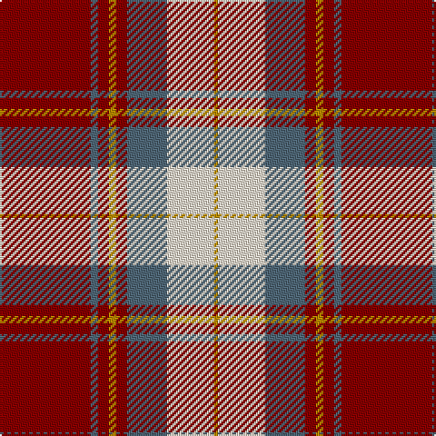

This page is one **sett** — a single exact thread-count. It belongs to the [tartan](/tartans/r25n2r3lo2r3n11w13lo1/)
(the same proportion at any scale), whose colour order is pattern [RBRYRBWY](/stripes/rbryrbwy/).

Sourced from tartans-authority.  It is a [8 stripe tartan](/stripes/stripes8/).

Original link http://www.tartansauthority.com/tartan-ferret/display/8250/

## Thread count
DR/50 N4 DR6 DY4 DR6 N22 W26 DY/2

## Palette

Palette: <strong>Tartan Register</strong> <small style="color:#888">(2 of 4 colours)</small>
<table><thead><tr><th>Colour</th><th>Threads</th><th>Shade</th><th>Base</th><th>OKLCh</th></tr></thead><tbody><tr><td>DR/</td><td style="text-align:right;font-variant-numeric:tabular-nums">50</td><td><code style="background-color:#880000;">#880000</code> <small style="color:#888">#880000</small></td><td>R <code style="background-color:#CC0000;">#CC0000</code></td><td><small style="color:#888">oklch(39.4% 0.162 29.2)</small></td></tr><tr><td>N</td><td style="text-align:right;font-variant-numeric:tabular-nums">4</td><td><code style="background-color:#506878;">#506878</code> <small style="color:#888">#506878</small></td><td>B <code style="background-color:#2A418A;">#2A418A</code></td><td><small style="color:#888">oklch(50.4% 0.038 237.7)</small></td></tr><tr><td>DR</td><td style="text-align:right;font-variant-numeric:tabular-nums">6</td><td><code style="background-color:#880000;">#880000</code> <small style="color:#888">#880000</small></td><td>R <code style="background-color:#CC0000;">#CC0000</code></td><td><small style="color:#888">oklch(39.4% 0.162 29.2)</small></td></tr><tr><td>DY</td><td style="text-align:right;font-variant-numeric:tabular-nums">4</td><td><code style="background-color:#BC8C00;">#BC8C00</code> <small style="color:#888">#BC8C00</small></td><td>Y <code style="background-color:#F2BF00;">#F2BF00</code></td><td><small style="color:#888">oklch(66.8% 0.137 84.1)</small></td></tr><tr><td>DR</td><td style="text-align:right;font-variant-numeric:tabular-nums">6</td><td><code style="background-color:#880000;">#880000</code> <small style="color:#888">#880000</small></td><td>R <code style="background-color:#CC0000;">#CC0000</code></td><td><small style="color:#888">oklch(39.4% 0.162 29.2)</small></td></tr><tr><td>N</td><td style="text-align:right;font-variant-numeric:tabular-nums">22</td><td><code style="background-color:#506878;">#506878</code> <small style="color:#888">#506878</small></td><td>B <code style="background-color:#2A418A;">#2A418A</code></td><td><small style="color:#888">oklch(50.4% 0.038 237.7)</small></td></tr><tr><td>W</td><td style="text-align:right;font-variant-numeric:tabular-nums">26</td><td><code style="background-color:#F0E0CC;">#F0E0CC</code> <small style="color:#888">#F0E0CC</small></td><td>W <code style="background-color:#F7F7F7;">#F7F7F7</code></td><td><small style="color:#888">oklch(91.4% 0.032 73.5)</small></td></tr><tr><td>DY/</td><td style="text-align:right;font-variant-numeric:tabular-nums">2</td><td><code style="background-color:#BC8C00;">#BC8C00</code> <small style="color:#888">#BC8C00</small></td><td>Y <code style="background-color:#F2BF00;">#F2BF00</code></td><td><small style="color:#888">oklch(66.8% 0.137 84.1)</small></td></tr></tbody></table>

# Sample pattern

## Nearest tartans

The nearest existing variants by ΔTartan distance, with this tartan at the top so the swatches line up against it.

ΔTartan

Tartan

Sett

—

<a href="/ttd/edit/#slug=r25n2r3lo2r3n11w13lo1~x2">Citylink Gold (Corporate)</a> <a class="nn-out" href="/setts/s8/r25n2r3lo2r3n11w13lo1~x2/" title="open its dictionary page">↗</a>

0.93

<a href="/ttd/edit/#slug=r42r2w2r2r5r12w32r4~x2">Longniddry Burgundy (Dance)</a> <a class="nn-out" href="/setts/s8/r42r2w2r2r5r12w32r4~x2/" title="open its dictionary page">↗</a>

1.01

<a href="/ttd/edit/#slug=r56w2db6w2g32r11db6w5">Spens</a> <a class="nn-out" href="/setts/s8/r56w2db6w2g32r11db6w5/" title="open its dictionary page">↗</a>

1.07

<a href="/ttd/edit/#slug=o32k5w3o3w3o7r5k1r17w3~x2">President High School</a> <a class="nn-out" href="/setts/s10/o32k5w3o3w3o7r5k1r17w3~x2/" title="open its dictionary page">↗</a>

1.09

<a href="/ttd/edit/#slug=b10r2w2r16g6r1g2r1g3r6~x4">Harkness Dress (Name)</a> <a class="nn-out" href="/setts/s10/b10r2w2r16g6r1g2r1g3r6~x4/" title="open its dictionary page">↗</a>

1.11

<a href="/ttd/edit/#slug=w5dg1w1dg33ly3r24dg3r4~x2">Sutherland de Albergaria Dress (Personal)</a> <a class="nn-out" href="/setts/s8/w5dg1w1dg33ly3r24dg3r4~x2/" title="open its dictionary page">↗</a>

1.11

<a href="/ttd/edit/#slug=r2db12r2g12r24w1~x2">Fraser (1745)</a> <a class="nn-out" href="/setts/s6/r2db12r2g12r24w1~x2/" title="open its dictionary page">↗</a>

1.11

<a href="/ttd/edit/#slug=r107k9r5db41r5g51r14">Buccleuch</a> <a class="nn-out" href="/setts/s7/r107k9r5db41r5g51r14/" title="open its dictionary page">↗</a>

1.19

<a href="/ttd/edit/#slug=r6b22r6g20ly2r45b2w5~x2">Elbrick Dress (Personal)</a> <a class="nn-out" href="/setts/s8/r6b22r6g20ly2r45b2w5~x2/" title="open its dictionary page">↗</a>

1.20

<a href="/ttd/edit/#slug=db10r2w2r16g6r1g2r1g3r6~x2">Harkness</a> <a class="nn-out" href="/setts/s10/db10r2w2r16g6r1g2r1g3r6~x2/" title="open its dictionary page">↗</a>

1.21

<a href="/ttd/edit/#slug=w1r12g2r2w16r2g2r12lo1~x4">MacFie Dress</a> <a class="nn-out" href="/setts/s9/w1r12g2r2w16r2g2r12lo1~x4/" title="open its dictionary page">↗</a>

## Neighbour map

Every grey dot is one of 14299 variants placed by the first two principal components of the ΔTartan feature space (44% of its variance). Red is this tartan; blue dots are its nearest — click one to open its page.

<svg viewBox="0 0 640 380" role="img" style="max-width:100%;height:auto;border:1px solid #e0e0e0;border-radius:4px;display:block" xmlns="http://www.w3.org/2000/svg"><image href="/nn/cloud.v1.png" width="640" height="380"/><a href="/setts/s8/r42r2w2r2r5r12w32r4~x2/"><circle cx="301.7" cy="116.1" r="4" fill="#3465a4"><title>Longniddry Burgundy (Dance)</title></circle></a><a href="/setts/s8/r56w2db6w2g32r11db6w5/"><circle cx="360.3" cy="123.9" r="4" fill="#3465a4"><title>Spens</title></circle></a><a href="/setts/s10/o32k5w3o3w3o7r5k1r17w3~x2/"><circle cx="326.1" cy="108.5" r="4" fill="#3465a4"><title>President High School</title></circle></a><a href="/setts/s10/b10r2w2r16g6r1g2r1g3r6~x4/"><circle cx="302.0" cy="153.1" r="4" fill="#3465a4"><title>Harkness Dress (Name)</title></circle></a><a href="/setts/s8/w5dg1w1dg33ly3r24dg3r4~x2/"><circle cx="320.0" cy="104.5" r="4" fill="#3465a4"><title>Sutherland de Albergaria Dress (Personal)</title></circle></a><a href="/setts/s6/r2db12r2g12r24w1~x2/"><circle cx="333.4" cy="163.2" r="4" fill="#3465a4"><title>Fraser (1745)</title></circle></a><a href="/setts/s7/r107k9r5db41r5g51r14/"><circle cx="352.2" cy="153.4" r="4" fill="#3465a4"><title>Buccleuch</title></circle></a><a href="/setts/s8/r6b22r6g20ly2r45b2w5~x2/"><circle cx="308.8" cy="128.3" r="4" fill="#3465a4"><title>Elbrick Dress (Personal)</title></circle></a><a href="/setts/s10/db10r2w2r16g6r1g2r1g3r6~x2/"><circle cx="306.5" cy="155.6" r="4" fill="#3465a4"><title>Harkness</title></circle></a><a href="/setts/s9/w1r12g2r2w16r2g2r12lo1~x4/"><circle cx="309.4" cy="134.0" r="4" fill="#3465a4"><title>MacFie Dress</title></circle></a><circle cx="304.6" cy="128.0" r="5" fill="#c00000"/></svg>

ID: /setts/s8/r25n2r3lo2r3n11w13lo1~x2/
