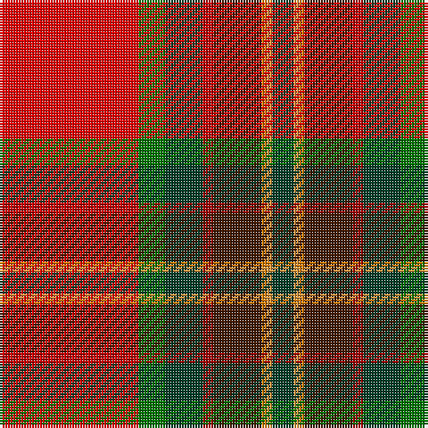

In pattern [GYYBRGGR](/stripes/gyybrggr/).

This was sourced from register-of-tartans.  It is a [8 stripe tartan](/stripes/stripes8/).

Original link https://www.tartanregister.gov.uk/tartanDetails.aspx?ref=10975

## Attestations

This cloth appears in 2 source records; the oldest owns this page.

- 18/12/2013 — Tartan Army Whisky (register-of-tartans, [record](https://www.tartanregister.gov.uk/tartanDetails.aspx?ref=10975))
- 2014 — Tartan Army Whisky (tartans-authority, [record](http://www.tartansauthority.com/tartan-ferret/display/10975/))

## Register references

External register numbers recorded for this tartan.

- Scottish Register of Tartans: [10975](https://www.tartanregister.gov.uk/tartanDetails.aspx?ref=10975)

## Thread count
R/52 G10 DG14 DR4 DRa18 O2 Oa2 DG/8

## Palette
Each colour and its ΔE from the base-6 reference it is a variant of.

| Colour | Shade | Base | ΔE (OKLab) |
|---|---|---|---|
| DG | <code style="background-color:#004028;">#004028</code> `#004028` | G <code style="background-color:#006100;">#006100</code> | 0.13 |
| DR | <code style="background-color:#A00000;">#A00000</code> `#A00000` | R <code style="background-color:#CC0000;">#CC0000</code> | 0.09 |
| DRa | <code style="background-color:#441800;">#441800</code> `#441800` | B <code style="background-color:#2A418A;">#2A418A</code> | 0.23 |
| G | <code style="background-color:#007800;">#007800</code> `#007800` | G <code style="background-color:#006100;">#006100</code> | 0.07 |
| O | <code style="background-color:#D87C00;">#D87C00</code> `#D87C00` | Y <code style="background-color:#F2BF00;">#F2BF00</code> | 0.17 |
| Oa | <code style="background-color:#DC943C;">#DC943C</code> `#DC943C` | Y <code style="background-color:#F2BF00;">#F2BF00</code> | 0.12 |
| R | <code style="background-color:#FF0000;">#FF0000</code> `#FF0000` | R <code style="background-color:#CC0000;">#CC0000</code> | 0.11 |

# Sample pattern

## Nearest tartans

The nearest existing variants by ΔTartan distance.

1. [Ancient Caledonian Society](/setts/s8/r40g16ly2k8y4w1db5w2~x2/) — ΔT 1.12
1. [Dalmagarry (Corporate)](/setts/s8/ly3r4k1r27ly14r4db15w2~x2/) — ΔT 1.32
1. [Caledonian Society, Ancient](/setts/s8/r40g16ly2k8t4w1db5w2~x2/) — ΔT 1.32
1. [MacQueen of Dalmagarry (Clan?)](/setts/s8/g3r4k1r26y14r4dp16w2~x2/) — ΔT 1.32
1. [Round Table Sweden](/setts/s8/r3lo15g4dt6w2r30dt6ly3~x2/) — ΔT 1.44
1. [Followers' Plaid](/setts/s11/r48t8k10ly2k3w2g25r10k3r3w2~x2/) — ΔT 1.47
1. [Drummond Relic](/setts/s12/r26w1k8ly1dg13k1w4k1ly2k4t3r8~x4/) — ΔT 1.48
1. [Perthshire, or Drummond](/setts/s9/r41w2p5ly2g21r9p5db3w2~x2/) — ΔT 1.50
1. [MacLean of Duart](/setts/s12/y9t5k8ly2k4w4k4dg31r50t4r4k3~x2/) — ΔT 1.52
1. [Hogeboom (Personal)](/setts/s9/t4g3t9dt14ly8dt2r35r2r3~x2/) — ΔT 1.53

## Neighbour map

Every grey dot is one of 14299 variants placed by the first two principal components of the ΔTartan feature space (44% of its variance). Red is this tartan; blue dots are its nearest — click one to open its page.

<svg viewBox="0 0 640 380" role="img" style="max-width:100%;height:auto;border:1px solid #e0e0e0;border-radius:4px;display:block" xmlns="http://www.w3.org/2000/svg"><image href="/nn/cloud.v1.png" width="640" height="380"/><a href="/setts/s8/r40g16ly2k8y4w1db5w2~x2/"><circle cx="275.6" cy="56.6" r="4" fill="#3465a4"><title>Ancient Caledonian Society</title></circle></a><a href="/setts/s8/ly3r4k1r27ly14r4db15w2~x2/"><circle cx="255.0" cy="92.4" r="4" fill="#3465a4"><title>Dalmagarry (Corporate)</title></circle></a><a href="/setts/s8/r40g16ly2k8t4w1db5w2~x2/"><circle cx="263.9" cy="52.8" r="4" fill="#3465a4"><title>Caledonian Society, Ancient</title></circle></a><a href="/setts/s8/g3r4k1r26y14r4dp16w2~x2/"><circle cx="272.1" cy="112.8" r="4" fill="#3465a4"><title>MacQueen of Dalmagarry (Clan?)</title></circle></a><a href="/setts/s8/r3lo15g4dt6w2r30dt6ly3~x2/"><circle cx="230.2" cy="120.1" r="4" fill="#3465a4"><title>Round Table Sweden</title></circle></a><a href="/setts/s11/r48t8k10ly2k3w2g25r10k3r3w2~x2/"><circle cx="281.6" cy="76.1" r="4" fill="#3465a4"><title>Followers' Plaid</title></circle></a><a href="/setts/s12/r26w1k8ly1dg13k1w4k1ly2k4t3r8~x4/"><circle cx="229.7" cy="67.6" r="4" fill="#3465a4"><title>Drummond Relic</title></circle></a><a href="/setts/s9/r41w2p5ly2g21r9p5db3w2~x2/"><circle cx="309.1" cy="94.9" r="4" fill="#3465a4"><title>Perthshire, or Drummond</title></circle></a><a href="/setts/s12/y9t5k8ly2k4w4k4dg31r50t4r4k3~x2/"><circle cx="200.7" cy="53.5" r="4" fill="#3465a4"><title>MacLean of Duart</title></circle></a><a href="/setts/s9/t4g3t9dt14ly8dt2r35r2r3~x2/"><circle cx="236.6" cy="104.0" r="4" fill="#3465a4"><title>Hogeboom (Personal)</title></circle></a><circle cx="237.2" cy="76.7" r="5" fill="#c00000"/></svg>

ID: /setts/s8/r26g5dg7r2do9lo1lo1dg4~x2/
