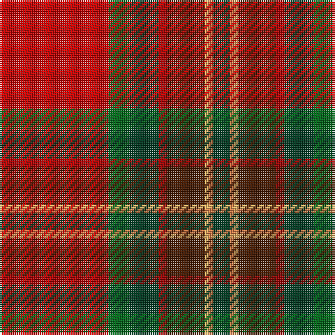

This page is one **sett** — a single exact thread-count. It belongs to the [tartan](/tartans/r26g5dg7ri2do9lo1loi1dg4/)
(the same proportion at any scale), whose colour order is pattern [GYYBRGGR](/stripes/gyybrggr/).

Sourced from tartans-authority.  It is a [8 stripe tartan](/stripes/stripes8/).

Original link http://www.tartansauthority.com/tartan-ferret/display/10975/

## Register references

External register numbers recorded for this tartan.

- Scottish Register of Tartans: [10975](https://www.tartanregister.gov.uk/tartanDetails?ref=10975)
- Scottish Tartans Authority (ITI): 10975

## Thread count
R/52 G10 DG14 DRa4 DR18 LG2 O2 DG/8

## Palette

Palette: <strong>Tartan Register</strong> <small style="color:#888">(6 of 7 colours)</small>
<table><thead><tr><th>Colour</th><th>Threads</th><th>Shade</th><th>Base</th><th>OKLCh</th></tr></thead><tbody><tr><td>R/</td><td style="text-align:right;font-variant-numeric:tabular-nums">52</td><td><code style="background-color:#C80000;">#C80000</code> <small style="color:#888">#C80000</small></td><td>R <code style="background-color:#CC0000;">#CC0000</code></td><td><small style="color:#888">oklch(52.3% 0.215 29.2)</small></td></tr><tr><td>G</td><td style="text-align:right;font-variant-numeric:tabular-nums">10</td><td><code style="background-color:#006818;">#006818</code> <small style="color:#888">#006818</small></td><td>G <code style="background-color:#006100;">#006100</code></td><td><small style="color:#888">oklch(45.0% 0.142 145.0)</small></td></tr><tr><td>DG</td><td style="text-align:right;font-variant-numeric:tabular-nums">14</td><td><code style="background-color:#003820;">#003820</code> <small style="color:#888">#003820</small></td><td>G <code style="background-color:#006100;">#006100</code></td><td><small style="color:#888">oklch(30.0% 0.070 158.3)</small></td></tr><tr><td>DRa</td><td style="text-align:right;font-variant-numeric:tabular-nums">4</td><td><code style="background-color:#A00000;">#A00000</code> <small style="color:#888">#A00000</small></td><td>R <code style="background-color:#CC0000;">#CC0000</code></td><td><small style="color:#888">oklch(44.3% 0.182 29.2)</small></td></tr><tr><td>DR</td><td style="text-align:right;font-variant-numeric:tabular-nums">18</td><td><code style="background-color:#441800;">#441800</code> <small style="color:#888">#441800</small></td><td>B <code style="background-color:#2A418A;">#2A418A</code></td><td><small style="color:#888">oklch(27.3% 0.076 46.3)</small></td></tr><tr><td>LG</td><td style="text-align:right;font-variant-numeric:tabular-nums">2</td><td><code style="background-color:#FCB464;">#FCB464</code> <small style="color:#888">#FCB464</small></td><td>Y <code style="background-color:#F2BF00;">#F2BF00</code></td><td><small style="color:#888">oklch(82.2% 0.128 67.3)</small></td></tr><tr><td>O</td><td style="text-align:right;font-variant-numeric:tabular-nums">2</td><td><code style="background-color:#EC8048;">#EC8048</code> <small style="color:#888">#EC8048</small></td><td>Y <code style="background-color:#F2BF00;">#F2BF00</code></td><td><small style="color:#888">oklch(71.0% 0.150 46.4)</small></td></tr><tr><td>DG/</td><td style="text-align:right;font-variant-numeric:tabular-nums">8</td><td><code style="background-color:#003820;">#003820</code> <small style="color:#888">#003820</small></td><td>G <code style="background-color:#006100;">#006100</code></td><td><small style="color:#888">oklch(30.0% 0.070 158.3)</small></td></tr></tbody></table>

# Sample pattern

## Nearest tartans

The nearest existing variants by ΔTartan distance, with this tartan at the top so the swatches line up against it.

ΔTartan

Tartan

Sett

—

<a href="/ttd/edit/#slug=r26g5dg7ri2do9lo1loi1dg4~x2">Tartan Army Whisky</a> <a class="nn-out" href="/setts/s8/r26g5dg7ri2do9lo1loi1dg4~x2/" title="open its dictionary page">↗</a>

1.09

<a href="/ttd/edit/#slug=r26g5dg7ri2do9loi1lo1dg4~x2">Tartan Army Whisky</a> <a class="nn-out" href="/setts/s8/r26g5dg7ri2do9loi1lo1dg4~x2/" title="open its dictionary page">↗</a>

1.18

<a href="/ttd/edit/#slug=k2g6dy4t1r18dy5lo1~x4">Snelgrove (Name)</a> <a class="nn-out" href="/setts/s7/k2g6dy4t1r18dy5lo1~x4/" title="open its dictionary page">↗</a>

1.22

<a href="/ttd/edit/#slug=g9ly2g6r35db6lb1ri20db5lb2~x2">Telfer (Name)</a> <a class="nn-out" href="/setts/s9/g9ly2g6r35db6lb1ri20db5lb2~x2/" title="open its dictionary page">↗</a>

1.30

<a href="/ttd/edit/#slug=g3r4k1r26y14r4dp16w2~x2">MacQueen of Dalmagarry (Clan?)</a> <a class="nn-out" href="/setts/s8/g3r4k1r26y14r4dp16w2~x2/" title="open its dictionary page">↗</a>

1.32

<a href="/ttd/edit/#slug=g9lo2g6r35db6lb1ri20db5lb2~x2">Telfer</a> <a class="nn-out" href="/setts/s9/g9lo2g6r35db6lb1ri20db5lb2~x2/" title="open its dictionary page">↗</a>

1.44

<a href="/ttd/edit/#slug=r40g16ly2k8y4w1db5w2~x2">Ancient Caledonian Society</a> <a class="nn-out" href="/setts/s8/r40g16ly2k8y4w1db5w2~x2/" title="open its dictionary page">↗</a>

1.51

<a href="/ttd/edit/#slug=gi18g2db5r45dbi3db18dbi3r5w2">MacNiven Family Tartan Tartan Number: 752. Earliest known date: 1986 Based in part on the MacNaughton of which the MacNivens are a Sept. The name in Mr Cannonito's family was spelt, MacKniffen. Other members of the family have dropped the 'Mac' since arriving in America in 1650. This clan tartan was accredited by the Scottish Tartans Society in 1988. See products available Copyright © Blair Urquhart, Comrie, 2015</a> <a class="nn-out" href="/setts/s9/gi18g2db5r45dbi3db18dbi3r5w2/" title="open its dictionary page">↗</a>

1.55

<a href="/ttd/edit/#slug=w3dy1r29dy16dg23db3dg3lo2~x2">Tache, Sir Etienne Paschal #2</a> <a class="nn-out" href="/setts/s8/w3dy1r29dy16dg23db3dg3lo2~x2/" title="open its dictionary page">↗</a>

1.57

<a href="/ttd/edit/#slug=w2r2db14g16ly2k2g2r35g1~x2">King (Austria) (Personal)</a> <a class="nn-out" href="/setts/s9/w2r2db14g16ly2k2g2r35g1~x2/" title="open its dictionary page">↗</a>

1.57

<a href="/ttd/edit/#slug=r22db3ly1g12r6db3t3w1~x2">Drummond, (Fingask)</a> <a class="nn-out" href="/setts/s8/r22db3ly1g12r6db3t3w1~x2/" title="open its dictionary page">↗</a>

## Neighbour map

Every grey dot is one of 14359 variants placed by the first two principal components of the ΔTartan feature space (44% of its variance). Red is this tartan; blue dots are its nearest — click one to open its page.

<svg viewBox="0 0 640 380" role="img" style="max-width:100%;height:auto;border:1px solid #e0e0e0;border-radius:4px;display:block" xmlns="http://www.w3.org/2000/svg"><image href="/nn/cloud.v1.png" width="640" height="380"/><a href="/setts/s8/r26g5dg7ri2do9loi1lo1dg4~x2/"><circle cx="236.0" cy="77.0" r="4" fill="#3465a4"><title>Tartan Army Whisky</title></circle></a><a href="/setts/s7/k2g6dy4t1r18dy5lo1~x4/"><circle cx="287.5" cy="139.2" r="4" fill="#3465a4"><title>Snelgrove (Name)</title></circle></a><a href="/setts/s9/g9ly2g6r35db6lb1ri20db5lb2~x2/"><circle cx="249.9" cy="93.5" r="4" fill="#3465a4"><title>Telfer (Name)</title></circle></a><a href="/setts/s8/g3r4k1r26y14r4dp16w2~x2/"><circle cx="271.0" cy="113.2" r="4" fill="#3465a4"><title>MacQueen of Dalmagarry (Clan?)</title></circle></a><a href="/setts/s9/g9lo2g6r35db6lb1ri20db5lb2~x2/"><circle cx="249.9" cy="92.4" r="4" fill="#3465a4"><title>Telfer</title></circle></a><a href="/setts/s8/r40g16ly2k8y4w1db5w2~x2/"><circle cx="274.4" cy="56.7" r="4" fill="#3465a4"><title>Ancient Caledonian Society</title></circle></a><a href="/setts/s9/gi18g2db5r45dbi3db18dbi3r5w2/"><circle cx="273.3" cy="100.0" r="4" fill="#3465a4"><title>MacNiven Family Tartan Tartan Number: 752. Earliest known date: 1986 Based in part on the MacNaughton of which the MacNivens are a Sept. The name in Mr Cannonito's family was spelt, MacKniffen. Other members of the family have dropped the 'Mac' since arriving in America in 1650. This clan tartan was accredited by the Scottish Tartans Society in 1988. See products available Copyright © Blair Urquhart, Comrie, 2015</title></circle></a><a href="/setts/s8/w3dy1r29dy16dg23db3dg3lo2~x2/"><circle cx="225.9" cy="114.8" r="4" fill="#3465a4"><title>Tache, Sir Etienne Paschal #2</title></circle></a><a href="/setts/s9/w2r2db14g16ly2k2g2r35g1~x2/"><circle cx="288.4" cy="77.0" r="4" fill="#3465a4"><title>King (Austria) (Personal)</title></circle></a><a href="/setts/s8/r22db3ly1g12r6db3t3w1~x2/"><circle cx="306.9" cy="116.0" r="4" fill="#3465a4"><title>Drummond, (Fingask)</title></circle></a><circle cx="261.6" cy="96.4" r="5" fill="#c00000"/></svg>

ID: /setts/s8/r26g5dg7ri2do9lo1loi1dg4~x2/
