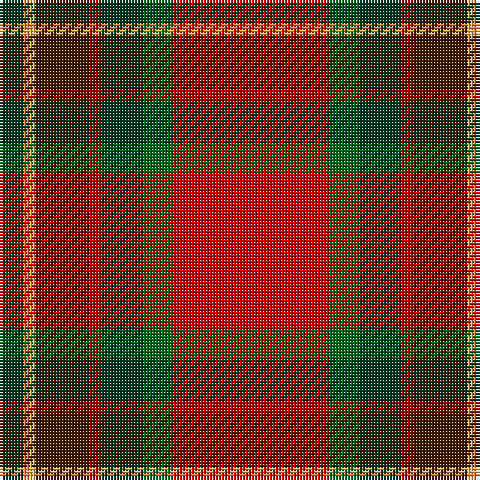

In pattern [GYYBRGGR](/patterns/gyybrggr/).

This was sourced from tartans-authority.  It is a [8 stripes tartan](/stripes/stripes8/).

Original link http://www.tartansauthority.com/tartan-ferret/display/10975/

## Thread count
DG/8 O2 LG2 DR18 DRa4 DG14 G10 R/52

## Palette
Each colour and its ΔE from the base-6 reference it is a variant of.

| Colour | Shade | Base | ΔE (OKLab) |
|---|---|---|---|
| DG | <code style="background-color:#003820;">#003820</code> `#003820` | G <code style="background-color:#006100;">#006100</code> | 0.15 |
| DR | <code style="background-color:#441800;">#441800</code> `#441800` | B <code style="background-color:#2A418A;">#2A418A</code> | 0.23 |
| DRa | <code style="background-color:#A00000;">#A00000</code> `#A00000` | R <code style="background-color:#CC0000;">#CC0000</code> | 0.09 |
| G | <code style="background-color:#006818;">#006818</code> `#006818` | G <code style="background-color:#006100;">#006100</code> | 0.02 |
| LG | <code style="background-color:#FCB464;">#FCB464</code> `#FCB464` | Y <code style="background-color:#F2BF00;">#F2BF00</code> | 0.07 |
| O | <code style="background-color:#EC8048;">#EC8048</code> `#EC8048` | Y <code style="background-color:#F2BF00;">#F2BF00</code> | 0.17 |
| R | <code style="background-color:#C80000;">#C80000</code> `#C80000` | R <code style="background-color:#CC0000;">#CC0000</code> | 0.01 |

# Sample pattern

## Nearest tartans

The nearest existing variants by ΔTartan distance.

1. [Tartan Army Whisky](/setts/s8/r26g5ga7ra2b9y1ya1ga4~b441800-g007800-ga004028-rff0000-raa00000-yd87c00-yadc943c~x2/) — ΔT 1.10
1. [Snelgrove (Name)](/setts/s7/k2g6ga4b1r18ga5y1~b2888c4-g006818-ga642000-k101010-rc80000-ybc8c00~x4/) — ΔT 1.18
1. [Telfer (Name)](/setts/s9/g9y2g6r35b6w1ra20b5w2~b1c1c50-g006818-rc80000-ra880000-wa8ace8-ye8c000~x2/) — ΔT 1.22
1. [MacQueen of Dalmagarry (Clan?)](/setts/s8/g3r4k1r26ga14r4b16w2~b440044-g289c18-ga5c6428-k101010-rc80000-wfcfcfc~x2/) — ΔT 1.30
1. [Telfer](/setts/s9/g9y2g6r35b6w1ra20b5w2~b1c1c50-g288028-rc8002c-ra880000-wa8ace8-yf09400~x2/) — ΔT 1.32
1. [Caledonian Society Ancient Artifact Tartan Tartan Number: 1554. Earliest known date: 1847 Coat at Banff museum. The MacPherson of MacPherson's Rant was hanged at Banff market cross. See products available Copyright © Blair Urquhart, Comrie, 2015](/setts/s8/r40g16y2k8b4w1ba5w2~b5c8ca8-ba2c2c80-g006818-k101010-rc80000-we0e0e0-ye8c000~x2/) — ΔT 1.39
1. [Ancient Caledonian Society](/setts/s8/r40g16y2k8ga4w1b5w2~b2c2c80-g006818-ga789484-k101010-rc80000-wf8f8f8-ye8c000~x2/) — ΔT 1.45
1. [MacNiven Family Tartan Tartan Number: 752. Earliest known date: 1986 Based in part on the MacNaughton of which the MacNivens are a Sept. The name in Mr Cannonito's family was spelt, MacKniffen. Other members of the family have dropped the 'Mac' since arriving in America in 1650. This clan tartan was accredited by the Scottish Tartans Society in 1988. See products available Copyright © Blair Urquhart, Comrie, 2015](/setts/s9/g18ga2b5r45ba3b18ba3r5w2~b202060-ba2c2c80-g006818-ga289c18-rc80000-we0e0e0/) — ΔT 1.52
1. [Tache, Sir Etienne Paschal #2](/setts/s8/w3g1r29g16ga23b3ga3y2~b2c2c80-g604000-ga005010-rc80000-wfcfcfc-ybc8c00~x2/) — ΔT 1.55
1. [Drummond, (Fingask)](/setts/s8/r22b3y1g12r6b3ba3w1~b304080-ba5480b0-g008000-rc00000-we0e0e0-yf0c000~x2/) — ΔT 1.57

## Neighbour map

Every grey dot is one of 15726 variants placed by the first two principal components of the ΔTartan feature space (44% of its variance). Red is this tartan; blue dots are its nearest — click one to open its page.

<svg viewBox="0 0 640 380" role="img" style="max-width:100%;height:auto;border:1px solid #e0e0e0;border-radius:4px;display:block" xmlns="http://www.w3.org/2000/svg"><image href="/nn/cloud.v1.png" width="640" height="380"/><a href="/setts/s8/r26g5ga7ra2b9y1ya1ga4~b441800-g007800-ga004028-rff0000-raa00000-yd87c00-yadc943c~x2/"><circle cx="237.1" cy="77.6" r="4" fill="#3465a4"><title>Tartan Army Whisky</title></circle></a><a href="/setts/s7/k2g6ga4b1r18ga5y1~b2888c4-g006818-ga642000-k101010-rc80000-ybc8c00~x4/"><circle cx="288.5" cy="136.3" r="4" fill="#3465a4"><title>Snelgrove (Name)</title></circle></a><a href="/setts/s9/g9y2g6r35b6w1ra20b5w2~b1c1c50-g006818-rc80000-ra880000-wa8ace8-ye8c000~x2/"><circle cx="250.3" cy="90.5" r="4" fill="#3465a4"><title>Telfer (Name)</title></circle></a><a href="/setts/s8/g3r4k1r26ga14r4b16w2~b440044-g289c18-ga5c6428-k101010-rc80000-wfcfcfc~x2/"><circle cx="271.9" cy="112.9" r="4" fill="#3465a4"><title>MacQueen of Dalmagarry (Clan?)</title></circle></a><a href="/setts/s9/g9y2g6r35b6w1ra20b5w2~b1c1c50-g288028-rc8002c-ra880000-wa8ace8-yf09400~x2/"><circle cx="250.4" cy="89.5" r="4" fill="#3465a4"><title>Telfer</title></circle></a><a href="/setts/s8/r40g16y2k8b4w1ba5w2~b5c8ca8-ba2c2c80-g006818-k101010-rc80000-we0e0e0-ye8c000~x2/"><circle cx="277.6" cy="58.8" r="4" fill="#3465a4"><title>Caledonian Society Ancient Artifact Tartan Tartan Number: 1554. Earliest known date: 1847 Coat at Banff museum. The MacPherson of MacPherson's Rant was hanged at Banff market cross. See products available Copyright © Blair Urquhart, Comrie, 2015</title></circle></a><a href="/setts/s8/r40g16y2k8ga4w1b5w2~b2c2c80-g006818-ga789484-k101010-rc80000-wf8f8f8-ye8c000~x2/"><circle cx="275.0" cy="57.5" r="4" fill="#3465a4"><title>Ancient Caledonian Society</title></circle></a><a href="/setts/s9/g18ga2b5r45ba3b18ba3r5w2~b202060-ba2c2c80-g006818-ga289c18-rc80000-we0e0e0/"><circle cx="273.3" cy="99.4" r="4" fill="#3465a4"><title>MacNiven Family Tartan Tartan Number: 752. Earliest known date: 1986 Based in part on the MacNaughton of which the MacNivens are a Sept. The name in Mr Cannonito's family was spelt, MacKniffen. Other members of the family have dropped the 'Mac' since arriving in America in 1650. This clan tartan was accredited by the Scottish Tartans Society in 1988. See products available Copyright © Blair Urquhart, Comrie, 2015</title></circle></a><a href="/setts/s8/w3g1r29g16ga23b3ga3y2~b2c2c80-g604000-ga005010-rc80000-wfcfcfc-ybc8c00~x2/"><circle cx="225.5" cy="110.9" r="4" fill="#3465a4"><title>Tache, Sir Etienne Paschal #2</title></circle></a><a href="/setts/s8/r22b3y1g12r6b3ba3w1~b304080-ba5480b0-g008000-rc00000-we0e0e0-yf0c000~x2/"><circle cx="307.7" cy="115.9" r="4" fill="#3465a4"><title>Drummond, (Fingask)</title></circle></a><circle cx="262.2" cy="93.3" r="5" fill="#c00000"/></svg>

ID: /setts/s8/r26g5ga7ra2b9y1ya1ga4~b441800-g006818-ga003820-rc80000-raa00000-yfcb464-yaec8048~x2/
