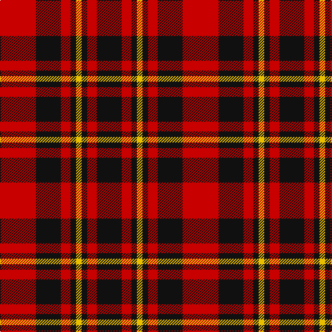

In pattern [KRKYKRKR](/stripes/krkykrkr/).

This was sourced from register-of-tartans.  It is a [8 stripe tartan](/stripes/stripes8/).

Original link https://www.tartanregister.gov.uk/tartanDetails.aspx?ref=1568

## Also known as

This cloth is also recorded under:

- Haig & Haig Whisky

## Register references

External register numbers recorded for this tartan.

- Scottish Register of Tartans: [1568](https://www.tartanregister.gov.uk/tartanDetails.aspx?ref=1568)
- Scottish Tartans Authority (ITI): 1609
- Scottish Tartans World Register: 1609

## Thread count
R/52 K36 R14 K8 Y8 K8 R14 K/36

## Palette
Each colour and its ΔE from the base-6 reference it is a variant of.

| Colour | Shade | Base | ΔE (OKLab) |
|---|---|---|---|
| DR | <code style="background-color:#880000;">#880000</code> `#880000` | R <code style="background-color:#CC0000;">#CC0000</code> | 0.15 |
| DY | <code style="background-color:#D09800;">#D09800</code> `#D09800` | Y <code style="background-color:#F2BF00;">#F2BF00</code> | 0.12 |
| K | <code style="background-color:#101010;">#101010</code> `#101010` | K <code style="background-color:#000000;">#000000</code> | 0.17 |
| R | <code style="background-color:#C80000;">#C80000</code> `#C80000` | R <code style="background-color:#CC0000;">#CC0000</code> | 0.01 |
| Y | <code style="background-color:#E8C000;">#E8C000</code> `#E8C000` | Y <code style="background-color:#F2BF00;">#F2BF00</code> | 0.02 |

# Sample pattern

## Nearest tartans

The nearest existing variants by ΔTartan distance.

1. [Brodie (Clan)](/setts/s6/k3r15k11ly2k4r3~x2/) — ΔT 0.70
1. [bodog.com Corporate Tartan Tartan Number: 6889. Earliest known date: 2006 Corporate brand name and colours, red, black and silver grey used to support brand identification. Company owner and executive is Scottish. First tartan to be name after a web site and first ever tartan for Costa Rica. See products available Copyright © Blair Urquhart, Comrie, 2015](/setts/s8/k25r25k10lb3k10r25k25r3~x2/) — ΔT 0.87
1. [German National (US) (Fashion)](/setts/s12/r16k2r2k2r13k12r2k12r13k13r2ly2~x2/) — ΔT 1.00
1. [MacKeane (Clan?)](/setts/s7/r4k8r4k8r12k1ly1~x2/) — ΔT 1.06
1. [MacDonald of Ardnamurchan (Clan?)](/setts/s7/r4k8r4k8r12k1ly2~x4/) — ΔT 1.06
1. [Bodog.com](/setts/s5/r3k25r25k10lb3~x2/) — ΔT 1.09
1. [Swanstrom (Personal)](/setts/s6/k8r1k8r11ly1r1~x4/) — ΔT 1.11
1. [Nakayama (Personal)](/setts/s8/db1r1k2r7k7r1k2w1~x6/) — ΔT 1.20
1. [MacIver (Clan)](/setts/s9/w2r12k3r3k16r3k3r12ly2~x2/) — ΔT 1.21
1. [Nakayama (Fashion)](/setts/s8/b1r1k2r7k7r1k2w1~x6/) — ΔT 1.22

## Neighbour map

Every grey dot is one of 14299 variants placed by the first two principal components of the ΔTartan feature space (44% of its variance). Red is this tartan; blue dots are its nearest — click one to open its page.

<svg viewBox="0 0 640 380" role="img" style="max-width:100%;height:auto;border:1px solid #e0e0e0;border-radius:4px;display:block" xmlns="http://www.w3.org/2000/svg"><image href="/nn/cloud.v1.png" width="640" height="380"/><a href="/setts/s6/k3r15k11ly2k4r3~x2/"><circle cx="287.9" cy="227.7" r="4" fill="#3465a4"><title>Brodie (Clan)</title></circle></a><a href="/setts/s8/k25r25k10lb3k10r25k25r3~x2/"><circle cx="314.5" cy="236.1" r="4" fill="#3465a4"><title>bodog.com Corporate Tartan Tartan Number: 6889. Earliest known date: 2006 Corporate brand name and colours, red, black and silver grey used to support brand identification. Company owner and executive is Scottish. First tartan to be name after a web site and first ever tartan for Costa Rica. See products available Copyright © Blair Urquhart, Comrie, 2015</title></circle></a><a href="/setts/s12/r16k2r2k2r13k12r2k12r13k13r2ly2~x2/"><circle cx="309.4" cy="201.3" r="4" fill="#3465a4"><title>German National (US) (Fashion)</title></circle></a><a href="/setts/s7/r4k8r4k8r12k1ly1~x2/"><circle cx="327.8" cy="213.9" r="4" fill="#3465a4"><title>MacKeane (Clan?)</title></circle></a><a href="/setts/s7/r4k8r4k8r12k1ly2~x4/"><circle cx="306.0" cy="215.4" r="4" fill="#3465a4"><title>MacDonald of Ardnamurchan (Clan?)</title></circle></a><a href="/setts/s5/r3k25r25k10lb3~x2/"><circle cx="317.5" cy="237.3" r="4" fill="#3465a4"><title>Bodog.com</title></circle></a><a href="/setts/s6/k8r1k8r11ly1r1~x4/"><circle cx="336.5" cy="214.7" r="4" fill="#3465a4"><title>Swanstrom (Personal)</title></circle></a><a href="/setts/s8/db1r1k2r7k7r1k2w1~x6/"><circle cx="262.3" cy="188.8" r="4" fill="#3465a4"><title>Nakayama (Personal)</title></circle></a><a href="/setts/s9/w2r12k3r3k16r3k3r12ly2~x2/"><circle cx="282.9" cy="182.1" r="4" fill="#3465a4"><title>MacIver (Clan)</title></circle></a><a href="/setts/s8/b1r1k2r7k7r1k2w1~x6/"><circle cx="265.8" cy="192.3" r="4" fill="#3465a4"><title>Nakayama (Fashion)</title></circle></a><circle cx="283.9" cy="227.4" r="5" fill="#c00000"/></svg>

ID: /setts/s8/r26k18r7k4ly4~x2/
