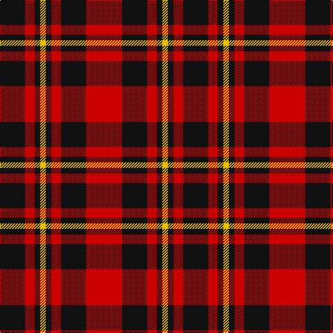

In pattern [KRKYKRKR](/patterns/krkykrkr/).

This was sourced from register-of-tartans.  It is a [8 stripes tartan](/stripes/stripes8/).

Original link https://www.tartanregister.gov.uk/tartanDetails.aspx?ref=1568

## Thread count
K/36 R14 K8 Y8 K8 R14 K36 R/52

## Palette
Each colour and its ΔE from the base-6 reference it is a variant of.

| Colour | Shade | Base | ΔE (OKLab) |
|---|---|---|---|
| DR | <code style="background-color:#880000;">#880000</code> `#880000` | R <code style="background-color:#CC0000;">#CC0000</code> | 0.15 |
| DY | <code style="background-color:#D09800;">#D09800</code> `#D09800` | Y <code style="background-color:#F2BF00;">#F2BF00</code> | 0.12 |
| K | <code style="background-color:#101010;">#101010</code> `#101010` | K <code style="background-color:#000000;">#000000</code> | 0.17 |
| R | <code style="background-color:#C80000;">#C80000</code> `#C80000` | R <code style="background-color:#CC0000;">#CC0000</code> | 0.01 |
| Y | <code style="background-color:#E8C000;">#E8C000</code> `#E8C000` | Y <code style="background-color:#F2BF00;">#F2BF00</code> | 0.02 |

# Sample pattern

## Nearest tartans

The nearest existing variants by ΔTartan distance.

1. [Brodie (Clan)](/setts/s6/k3r15k11y2k4r3x2~k101010-rc80000-ye8c000/) — ΔT 0.70
1. [bodog.com Corporate Tartan Tartan Number: 6889. Earliest known date: 2006 Corporate brand name and colours, red, black and silver grey used to support brand identification. Company owner and executive is Scottish. First tartan to be name after a web site and first ever tartan for Costa Rica. See products available Copyright © Blair Urquhart, Comrie, 2015](/setts/s8/k25r25k10w3k10r25k25r3x2~k101010-rc80000-wc0c0c0/) — ΔT 0.87
1. [German National (US) (Fashion)](/setts/s12/r16k2r2k2r13k12r2k12r13k13r2y2x2~k101010-rc80000-ye8c000/) — ΔT 1.00
1. [MacKeane (Clan?)](/setts/s7/r4k8r4k8r12k1y1x2~k101010-rc80000-ye8c000/) — ΔT 1.06
1. [MacDonald of Ardnamurchan (Clan?)](/setts/s7/r4k8r4k8r12k1y2x4~k101010-rc80000-ye8c000/) — ΔT 1.06
1. [MacKeane (MacIan) Clan Tartan Tartan Number: 1608. Earliest known date: 1842 The design comes from the Vestiarium Scoticum (1842). The authors, the Sobieski Stuart brothers, enjoyed a popular following among the Scottish gentry in the early Victorian era, and in the spirit of the times, added mystery, romance and some spurious historical documentation to the subject of tartan. Of the better known tartans, the book offers some minor variation, but in other cases it provides the only recorded version of many tartans in use today. See products available Copyright © Blair Urquhart, Comrie, 2015](/setts/s7/r4k8r4k8r12k1y2x2~k101010-rc80000-ye8c000/) — ΔT 1.06
1. [Bodog.com](/setts/s5/r3k25r25k10w3x2~k101010-rc80000-wc0c0c0/) — ΔT 1.10
1. [Swanstrom (Personal)](/setts/s6/k8r1k8r11y1r1x4~k101010-rc80000-ye8c000/) — ΔT 1.11
1. [Brodie](/setts/s6/k3r15k11y2k4r3x2~k000000-rc00000-yf0c000/) — ΔT 1.18
1. [Nakayama (Personal)](/setts/s8/b1r1k2r7k7r1k2w1x6~b2c4084-k101010-rdc0000-we0e0e0/) — ΔT 1.19

## Neighbour map

Every grey dot is one of 15726 variants placed by the first two principal components of the ΔTartan feature space (44% of its variance). Red is this tartan; blue dots are its nearest — click one to open its page.

<svg viewBox="0 0 640 380" role="img" style="max-width:100%;height:auto;border:1px solid #e0e0e0;border-radius:4px;display:block" xmlns="http://www.w3.org/2000/svg"><image href="/nn/cloud.v1.png" width="640" height="380"/><a href="/setts/s6/k3r15k11y2k4r3x2~k101010-rc80000-ye8c000/"><circle cx="287.2" cy="233.7" r="4" fill="#3465a4"><title>Brodie (Clan)</title></circle></a><a href="/setts/s8/k25r25k10w3k10r25k25r3x2~k101010-rc80000-wc0c0c0/"><circle cx="313.8" cy="241.4" r="4" fill="#3465a4"><title>bodog.com Corporate Tartan Tartan Number: 6889. Earliest known date: 2006 Corporate brand name and colours, red, black and silver grey used to support brand identification. Company owner and executive is Scottish. First tartan to be name after a web site and first ever tartan for Costa Rica. See products available Copyright © Blair Urquhart, Comrie, 2015</title></circle></a><a href="/setts/s12/r16k2r2k2r13k12r2k12r13k13r2y2x2~k101010-rc80000-ye8c000/"><circle cx="309.1" cy="206.6" r="4" fill="#3465a4"><title>German National (US) (Fashion)</title></circle></a><a href="/setts/s7/r4k8r4k8r12k1y1x2~k101010-rc80000-ye8c000/"><circle cx="327.5" cy="219.9" r="4" fill="#3465a4"><title>MacKeane (Clan?)</title></circle></a><a href="/setts/s7/r4k8r4k8r12k1y2x4~k101010-rc80000-ye8c000/"><circle cx="305.6" cy="221.5" r="4" fill="#3465a4"><title>MacDonald of Ardnamurchan (Clan?)</title></circle></a><a href="/setts/s7/r4k8r4k8r12k1y2x2~k101010-rc80000-ye8c000/"><circle cx="305.6" cy="221.5" r="4" fill="#3465a4"><title>MacKeane (MacIan) Clan Tartan Tartan Number: 1608. Earliest known date: 1842 The design comes from the Vestiarium Scoticum (1842). The authors, the Sobieski Stuart brothers, enjoyed a popular following among the Scottish gentry in the early Victorian era, and in the spirit of the times, added mystery, romance and some spurious historical documentation to the subject of tartan. Of the better known tartans, the book offers some minor variation, but in other cases it provides the only recorded version of many tartans in use today. See products available Copyright © Blair Urquhart, Comrie, 2015</title></circle></a><a href="/setts/s5/r3k25r25k10w3x2~k101010-rc80000-wc0c0c0/"><circle cx="316.6" cy="243.3" r="4" fill="#3465a4"><title>Bodog.com</title></circle></a><a href="/setts/s6/k8r1k8r11y1r1x4~k101010-rc80000-ye8c000/"><circle cx="335.7" cy="220.5" r="4" fill="#3465a4"><title>Swanstrom (Personal)</title></circle></a><a href="/setts/s6/k3r15k11y2k4r3x2~k000000-rc00000-yf0c000/"><circle cx="270.9" cy="232.0" r="4" fill="#3465a4"><title>Brodie</title></circle></a><a href="/setts/s8/b1r1k2r7k7r1k2w1x6~b2c4084-k101010-rdc0000-we0e0e0/"><circle cx="261.2" cy="193.9" r="4" fill="#3465a4"><title>Nakayama (Personal)</title></circle></a><circle cx="283.2" cy="232.9" r="5" fill="#c00000"/></svg>

ID: /setts/s8/r26k18r7k4y4k4r7k18x2~k101010-rc80000-ye8c000/
