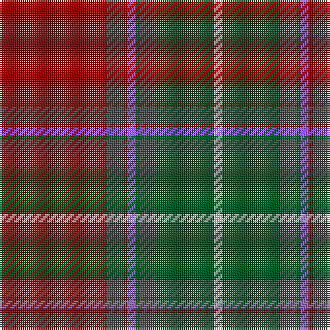

This page is one **sett** — a single exact thread-count. It belongs to the [tartan](/tartans/r26n4r1p2dg1n4dg14w2/)
(the same proportion at any scale), whose colour order is pattern [RBRBGBGW](/stripes/rbrbgbgw/).

Sourced from register-of-tartans.  It is a [8 stripe tartan](/stripes/stripes8/).

Original link https://www.tartanregister.gov.uk/tartanDetails.aspx?ref=11435

## Register references

External register numbers recorded for this tartan.

- Scottish Register of Tartans: [11435](https://www.tartanregister.gov.uk/tartanDetails.aspx?ref=11435)

## Thread count
DR/52 N8 DR2 P4 G2 N8 G28 LN/4

## Palette

Palette: <strong>Tartan Register</strong>
<table><thead><tr><th>Colour</th><th>Threads</th><th>Shade</th><th>Base</th><th>OKLCh</th></tr></thead><tbody><tr><td>DR/</td><td style="text-align:right;font-variant-numeric:tabular-nums">52</td><td><code style="background-color:#880000;">#880000</code> <small style="color:#888">#880000</small></td><td>R <code style="background-color:#CC0000;">#CC0000</code></td><td><small style="color:#888">oklch(39.4% 0.162 29.2)</small></td></tr><tr><td>N</td><td style="text-align:right;font-variant-numeric:tabular-nums">8</td><td><code style="background-color:#505050;">#505050</code> <small style="color:#888">#505050</small></td><td>B <code style="background-color:#2A418A;">#2A418A</code></td><td><small style="color:#888">oklch(43.1% 0.000 89.9)</small></td></tr><tr><td>DR</td><td style="text-align:right;font-variant-numeric:tabular-nums">2</td><td><code style="background-color:#880000;">#880000</code> <small style="color:#888">#880000</small></td><td>R <code style="background-color:#CC0000;">#CC0000</code></td><td><small style="color:#888">oklch(39.4% 0.162 29.2)</small></td></tr><tr><td>P</td><td style="text-align:right;font-variant-numeric:tabular-nums">4</td><td><code style="background-color:#9058D8;">#9058D8</code> <small style="color:#888">#9058D8</small></td><td>B <code style="background-color:#2A418A;">#2A418A</code></td><td><small style="color:#888">oklch(58.4% 0.190 300.8)</small></td></tr><tr><td>G</td><td style="text-align:right;font-variant-numeric:tabular-nums">2</td><td><code style="background-color:#005020;">#005020</code> <small style="color:#888">#005020</small></td><td>G <code style="background-color:#006100;">#006100</code></td><td><small style="color:#888">oklch(37.7% 0.105 149.6)</small></td></tr><tr><td>N</td><td style="text-align:right;font-variant-numeric:tabular-nums">8</td><td><code style="background-color:#505050;">#505050</code> <small style="color:#888">#505050</small></td><td>B <code style="background-color:#2A418A;">#2A418A</code></td><td><small style="color:#888">oklch(43.1% 0.000 89.9)</small></td></tr><tr><td>G</td><td style="text-align:right;font-variant-numeric:tabular-nums">28</td><td><code style="background-color:#005020;">#005020</code> <small style="color:#888">#005020</small></td><td>G <code style="background-color:#006100;">#006100</code></td><td><small style="color:#888">oklch(37.7% 0.105 149.6)</small></td></tr><tr><td>LN/</td><td style="text-align:right;font-variant-numeric:tabular-nums">4</td><td><code style="background-color:#E0E0E0;">#E0E0E0</code> <small style="color:#888">#E0E0E0</small></td><td>W <code style="background-color:#F7F7F7;">#F7F7F7</code></td><td><small style="color:#888">oklch(90.7% 0.000 89.9)</small></td></tr></tbody></table>

# Sample pattern

## Nearest tartans

The nearest existing variants by ΔTartan distance, with this tartan at the top so the swatches line up against it.

ΔTartan

Tartan

Sett

—

<a href="/ttd/edit/#slug=r26n4r1p2dg1n4dg14w2~x2">Redpath, Robert A (Personal)</a> <a class="nn-out" href="/setts/s8/r26n4r1p2dg1n4dg14w2~x2/" title="open its dictionary page">↗</a>

0.83

<a href="/ttd/edit/#slug=do7r4do4r25dp1y32dp4y2w2y5~x2">Bell of Ardbel (Personal)</a> <a class="nn-out" href="/setts/s10/do7r4do4r25dp1y32dp4y2w2y5~x2/" title="open its dictionary page">↗</a>

1.11

<a href="/ttd/edit/#slug=r34dp4r1dp4g2k3g1k3g22~x2">Queen of Scots</a> <a class="nn-out" href="/setts/s9/r34dp4r1dp4g2k3g1k3g22~x2/" title="open its dictionary page">↗</a>

1.13

<a href="/ttd/edit/#slug=b5k1r30n15r8dg30r8n2~x2">Shaw</a> <a class="nn-out" href="/setts/s8/b5k1r30n15r8dg30r8n2~x2/" title="open its dictionary page">↗</a>

1.13

<a href="/ttd/edit/#slug=b5k1r30n15r8dg30r8n2">Shaw</a> <a class="nn-out" href="/setts/s8/b5k1r30n15r8dg30r8n2/" title="open its dictionary page">↗</a>

1.16

<a href="/ttd/edit/#slug=ri2dg16r1ri2r12ly1y1~x2">Spragg, Andrew</a> <a class="nn-out" href="/setts/s7/ri2dg16r1ri2r12ly1y1~x2/" title="open its dictionary page">↗</a>

1.18

<a href="/ttd/edit/#slug=r24lb1k3lb1g14r8k3dp3lb2~x4">Leach (1995)</a> <a class="nn-out" href="/setts/s9/r24lb1k3lb1g14r8k3dp3lb2~x4/" title="open its dictionary page">↗</a>

1.24

<a href="/ttd/edit/#slug=y3dg1g3dg16r32dg1ly1db4g2~x2">Connemara (District)</a> <a class="nn-out" href="/setts/s9/y3dg1g3dg16r32dg1ly1db4g2~x2/" title="open its dictionary page">↗</a>

1.25

<a href="/ttd/edit/#slug=db4yi30do2yi2do14w2do2w1do6y3~x2">Hickory</a> <a class="nn-out" href="/setts/s10/db4yi30do2yi2do14w2do2w1do6y3~x2/" title="open its dictionary page">↗</a>

1.27

<a href="/ttd/edit/#slug=db4dr2db2w2dr9o27r4~x3">Unidentified 35</a> <a class="nn-out" href="/setts/s7/db4dr2db2w2dr9o27r4~x3/" title="open its dictionary page">↗</a>

1.28

<a href="/ttd/edit/#slug=w4dt38g6r2g6r38lo2r3~x2">21st Century (Fashion)</a> <a class="nn-out" href="/setts/s8/w4dt38g6r2g6r38lo2r3~x2/" title="open its dictionary page">↗</a>

## Neighbour map

Every grey dot is one of 14359 variants placed by the first two principal components of the ΔTartan feature space (44% of its variance). Red is this tartan; blue dots are its nearest — click one to open its page.

<svg viewBox="0 0 640 380" role="img" style="max-width:100%;height:auto;border:1px solid #e0e0e0;border-radius:4px;display:block" xmlns="http://www.w3.org/2000/svg"><image href="/nn/cloud.v1.png" width="640" height="380"/><a href="/setts/s10/do7r4do4r25dp1y32dp4y2w2y5~x2/"><circle cx="338.3" cy="130.4" r="4" fill="#3465a4"><title>Bell of Ardbel (Personal)</title></circle></a><a href="/setts/s9/r34dp4r1dp4g2k3g1k3g22~x2/"><circle cx="365.6" cy="133.6" r="4" fill="#3465a4"><title>Queen of Scots</title></circle></a><a href="/setts/s8/b5k1r30n15r8dg30r8n2~x2/"><circle cx="327.4" cy="162.3" r="4" fill="#3465a4"><title>Shaw</title></circle></a><a href="/setts/s8/b5k1r30n15r8dg30r8n2/"><circle cx="327.4" cy="162.3" r="4" fill="#3465a4"><title>Shaw</title></circle></a><a href="/setts/s7/ri2dg16r1ri2r12ly1y1~x2/"><circle cx="301.8" cy="154.6" r="4" fill="#3465a4"><title>Spragg, Andrew</title></circle></a><a href="/setts/s9/r24lb1k3lb1g14r8k3dp3lb2~x4/"><circle cx="329.8" cy="129.9" r="4" fill="#3465a4"><title>Leach (1995)</title></circle></a><a href="/setts/s9/y3dg1g3dg16r32dg1ly1db4g2~x2/"><circle cx="336.5" cy="99.1" r="4" fill="#3465a4"><title>Connemara (District)</title></circle></a><a href="/setts/s10/db4yi30do2yi2do14w2do2w1do6y3~x2/"><circle cx="364.8" cy="133.9" r="4" fill="#3465a4"><title>Hickory</title></circle></a><a href="/setts/s7/db4dr2db2w2dr9o27r4~x3/"><circle cx="323.9" cy="161.1" r="4" fill="#3465a4"><title>Unidentified 35</title></circle></a><a href="/setts/s8/w4dt38g6r2g6r38lo2r3~x2/"><circle cx="291.3" cy="145.8" r="4" fill="#3465a4"><title>21st Century (Fashion)</title></circle></a><circle cx="346.6" cy="140.2" r="5" fill="#c00000"/></svg>

ID: /setts/s8/r26n4r1p2dg1n4dg14w2~x2/
