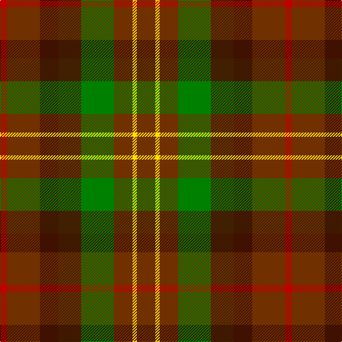

In pattern [RRBBGRYR](/patterns/rrbbgryr/).

This was sourced from weddslist.  It is a [8 stripes tartan](/stripes/stripes8/).

Original link http://www.weddslist.com/cgi-bin/tartans/pg.pl?source=sts

## Thread count
R/10 T46 DRa26 DR32 G46 T26 Y6 T/26

## Palette
Each colour and its ΔE from the base-6 reference it is a variant of.

| Colour | Shade | Base | ΔE (OKLab) |
|---|---|---|---|
| DR | <code style="background-color:#402000;">#402000</code> `#402000` | B <code style="background-color:#2C4084;">#2C4084</code> | 0.21 |
| DRa | <code style="background-color:#401000;">#401000</code> `#401000` | B <code style="background-color:#2C4084;">#2C4084</code> | 0.23 |
| G | <code style="background-color:#008000;">#008000</code> `#008000` | G <code style="background-color:#006400;">#006400</code> | 0.09 |
| R | <code style="background-color:#C00000;">#C00000</code> `#C00000` | R <code style="background-color:#C80000;">#C80000</code> | 0.02 |
| T | <code style="background-color:#703000;">#703000</code> `#703000` | R <code style="background-color:#C80000;">#C80000</code> | 0.18 |
| Y | <code style="background-color:#FFE000;">#FFE000</code> `#FFE000` | Y <code style="background-color:#E8C000;">#E8C000</code> | 0.09 |

# Sample pattern

## Nearest tartans

The nearest existing variants by ΔTartan distance.

1. [Leighton (Personal)](/setts/s8/b20y4b20g36ba20ga16b28r8-b680028-ba441800-g006818-ga603800-r880000-yd09800/) — ΔT 1.35
1. [Leighton (Personal)](/setts/s8/b20y4b20g35ba20ga16b28r8-b680028-ba441800-g006818-ga603800-r880000-yd09800/) — ΔT 1.37
1. [MacDuff Hunting Clan Tartan Tartan Number: 1654. Earliest known date: 1906 STS records (sic) 'Sett may be quite wrong. (S.S. May 86)' See products available Copyright © Blair Urquhart, Comrie, 2015](/setts/s8/g16r2g16ga16k16b16g16r4-b2c2c80-g604000-ga006818-k101010-rc80000/) — ΔT 1.46
1. [Unidentified Printing #3](/setts/s7/g8y4g24r16ra24k4ra8-g004c00-k000000-r8c0000-raa02828-yc89800/) — ΔT 1.55
1. [Wcwm 1243](/setts/s12/g12b4g24r24y4r24ba24b4ba24r8ba24w4-b1c0070-ba5c5c5c-g006818-rc80000-wc0c0c0-yd09800/) — ΔT 1.62
1. [MacDuff Hunting](/setts/s8/b20r4b20g34k24ba18b18r4-b441800-ba2c2c80-g006818-k101010-rc80000/) — ΔT 1.63
1. [Indiana "Cardinal" (District)](/setts/s8/b32y4g48r40ga8r24ga8r16-b1c1c50-g006818-ga8c7038-r880000-yd09800/) — ΔT 1.66
1. [Huntly #3](/setts/s10/g8y4g20k16b20r4b20k16g20y4-b4c3428-g604000-k101010-rb84c00-yb8b8b8/) — ΔT 1.68
1. [Blaylock Hunting](/setts/s12/g8y4g16b16r4b16r32k4b10y4r10ya4-b522720-g23613c-k101010-r894b18-yd6beb4-yad9b152/) — ΔT 1.69
1. [Maple Leaf](/setts/s12/g48r8g8r32ga32r32g8r8g48ra16ga16gb32-g003000-ga008000-gb607030-r900030-ra806050/) — ΔT 1.72

## Neighbour map

Every grey dot is one of 15726 variants placed by the first two principal components of the ΔTartan feature space (44% of its variance). Red is this tartan; blue dots are its nearest — click one to open its page.

<svg viewBox="0 0 640 380" role="img" style="max-width:100%;height:auto;border:1px solid #e0e0e0;border-radius:4px;display:block" xmlns="http://www.w3.org/2000/svg"><image href="/nn/cloud.v1.png" width="640" height="380"/><a href="/setts/s8/b20y4b20g36ba20ga16b28r8-b680028-ba441800-g006818-ga603800-r880000-yd09800/"><circle cx="220.0" cy="233.5" r="4" fill="#3465a4"><title>Leighton (Personal)</title></circle></a><a href="/setts/s8/b20y4b20g35ba20ga16b28r8-b680028-ba441800-g006818-ga603800-r880000-yd09800/"><circle cx="220.1" cy="235.9" r="4" fill="#3465a4"><title>Leighton (Personal)</title></circle></a><a href="/setts/s8/g16r2g16ga16k16b16g16r4-b2c2c80-g604000-ga006818-k101010-rc80000/"><circle cx="213.9" cy="257.7" r="4" fill="#3465a4"><title>MacDuff Hunting Clan Tartan Tartan Number: 1654. Earliest known date: 1906 STS records (sic) 'Sett may be quite wrong. (S.S. May 86)' See products available Copyright © Blair Urquhart, Comrie, 2015</title></circle></a><a href="/setts/s7/g8y4g24r16ra24k4ra8-g004c00-k000000-r8c0000-raa02828-yc89800/"><circle cx="178.9" cy="232.2" r="4" fill="#3465a4"><title>Unidentified Printing #3</title></circle></a><a href="/setts/s12/g12b4g24r24y4r24ba24b4ba24r8ba24w4-b1c0070-ba5c5c5c-g006818-rc80000-wc0c0c0-yd09800/"><circle cx="163.0" cy="198.2" r="4" fill="#3465a4"><title>Wcwm 1243</title></circle></a><a href="/setts/s8/b20r4b20g34k24ba18b18r4-b441800-ba2c2c80-g006818-k101010-rc80000/"><circle cx="188.7" cy="242.9" r="4" fill="#3465a4"><title>MacDuff Hunting</title></circle></a><a href="/setts/s8/b32y4g48r40ga8r24ga8r16-b1c1c50-g006818-ga8c7038-r880000-yd09800/"><circle cx="234.7" cy="201.6" r="4" fill="#3465a4"><title>Indiana &quot;Cardinal&quot; (District)</title></circle></a><a href="/setts/s10/g8y4g20k16b20r4b20k16g20y4-b4c3428-g604000-k101010-rb84c00-yb8b8b8/"><circle cx="164.6" cy="254.0" r="4" fill="#3465a4"><title>Huntly #3</title></circle></a><a href="/setts/s12/g8y4g16b16r4b16r32k4b10y4r10ya4-b522720-g23613c-k101010-r894b18-yd6beb4-yad9b152/"><circle cx="170.7" cy="180.5" r="4" fill="#3465a4"><title>Blaylock Hunting</title></circle></a><a href="/setts/s12/g48r8g8r32ga32r32g8r8g48ra16ga16gb32-g003000-ga008000-gb607030-r900030-ra806050/"><circle cx="155.8" cy="220.1" r="4" fill="#3465a4"><title>Maple Leaf</title></circle></a><circle cx="183.0" cy="227.6" r="5" fill="#c00000"/></svg>

ID: /setts/s8/r26y6r26g46b32ba26r46ra10-b402000-ba401000-g008000-r703000-rac00000-yffe000/
