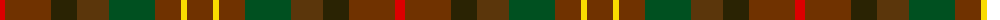

In pattern [RRBGGRYR](/patterns/rrbggryr/).

This was sourced from register-of-tartans.  It is a [8 stripes tartan](/stripes/stripes8/).

Original link https://www.tartanregister.gov.uk/tartanDetails.aspx?ref=4241

## Thread count
R/10 T46 K26 Ta32 G46 T26 Y6 T/26

## Palette
Each colour and its ΔE from the base-6 reference it is a variant of.

| Colour | Shade | Base | ΔE (OKLab) |
|---|---|---|---|
| G | <code style="background-color:#005020;">#005020</code> `#005020` | G <code style="background-color:#006400;">#006400</code> | 0.08 |
| K | <code style="background-color:#2A2303;">#2A2303</code> `#2A2303` | B <code style="background-color:#2C4084;">#2C4084</code> | 0.21 |
| R | <code style="background-color:#DC0000;">#DC0000</code> `#DC0000` | R <code style="background-color:#C80000;">#C80000</code> | 0.04 |
| T | <code style="background-color:#703200;">#703200</code> `#703200` | R <code style="background-color:#C80000;">#C80000</code> | 0.18 |
| Ta | <code style="background-color:#5B360B;">#5B360B</code> `#5B360B` | G <code style="background-color:#006400;">#006400</code> | 0.17 |
| Y | <code style="background-color:#FADC00;">#FADC00</code> `#FADC00` | Y <code style="background-color:#E8C000;">#E8C000</code> | 0.08 |

# Sample pattern

ID: /setts/s8/r26y6r26g46ga32b26r46ra10-b2a2303-g005020-ga5b360b-r703200-radc0000-yfadc00/
