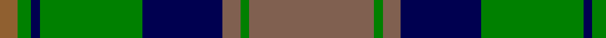

In pattern [RGBGBRGR](/patterns/rgbgbrgr/).

This was sourced from weddslist.  It is a [8 stripes tartan](/stripes/stripes8/).

Original link http://www.weddslist.com/cgi-bin/tartans/pg.pl?source=sts

## Thread count
LT/8 G6 DB4 G46 DB36 LTa8 G4 LTa/56

## Palette
Each colour and its ΔE from the base-6 reference it is a variant of.

| Colour | Shade | Base | ΔE (OKLab) |
|---|---|---|---|
| DB | <code style="background-color:#000050;">#000050</code> `#000050` | B <code style="background-color:#2A418A;">#2A418A</code> | 0.21 |
| G | <code style="background-color:#008000;">#008000</code> `#008000` | G <code style="background-color:#006100;">#006100</code> | 0.10 |
| LT | <code style="background-color:#906030;">#906030</code> `#906030` | R <code style="background-color:#CC0000;">#CC0000</code> | 0.15 |
| LTa | <code style="background-color:#806050;">#806050</code> `#806050` | R <code style="background-color:#CC0000;">#CC0000</code> | 0.17 |

# Sample pattern

## Nearest tartans

The nearest existing variants by ΔTartan distance.

1. [Dunedin Chapter (Corporate)](/setts/s10/b39g3b3g20k3g20k3g3k20r3~b5c8ca8-g006818-k101010-rc80000~x2/) — ΔT 0.73
1. [Maine Acadia](/setts/s9/g5k1y2k1g19k15y2ga20g3~g108070-ga607c6e-k101010-yc4a161~x2/) — ΔT 0.84
1. [Ayrton](/setts/s9/r3b2k1b20k9g20k1g2r3~b3c82af-g005020-k101010-rdc0000~x2/) — ΔT 0.89
1. [Cathcart](/setts/s8/g8y4b21g6r7g1r1g8~b003c64-g006818-ra00000-yb8b8b8~x2/) — ΔT 0.96
1. [MacNeish Htg](/setts/s11/r6g3k3ra24g4k10g4r2g24r6g2~g006818-k101010-r880000-ra888888~x2/) — ΔT 0.98
1. [MacTavish Hunting Clan Tartan Tartan Number: 232. Earliest known date: pre 2003 See Lord Thomson See products available Copyright © Blair Urquhart, Comrie, 2015](/setts/s6/b3g26ga4b13k13b2~b5c8ca8-g604000-ga006818-k101010~x2/) — ΔT 1.02
1. [Durie (Clan)](/setts/s9/b12r1b1r1b1r4g12y1g2~b202060-g006818-r880000-ye8c000~x4/) — ΔT 1.03
1. [Aitchison (Personal)](/setts/s9/b2g25k11ba2k11ba18k2ba3k2~b780078-ba003c64-g288028-k101010~x2/) — ΔT 1.03
1. [McWilliams Wedding (Personal)](/setts/s9/g2b1k1b14y2b1k12g10r2~b506878-g006818-k101010-rd40000-yfccc3c~x2/) — ΔT 1.03
1. [Norwich No.052](/setts/s8/g19w1b12ba2b2ba2b2ba16~b1c1c50-ba5c8ca8-g006818-wfcfcfc~x2/) — ΔT 1.04

## Neighbour map

Every grey dot is one of 15726 variants placed by the first two principal components of the ΔTartan feature space (44% of its variance). Red is this tartan; blue dots are its nearest — click one to open its page.

<svg viewBox="0 0 640 380" role="img" style="max-width:100%;height:auto;border:1px solid #e0e0e0;border-radius:4px;display:block" xmlns="http://www.w3.org/2000/svg"><image href="/nn/cloud.v1.png" width="640" height="380"/><a href="/setts/s10/b39g3b3g20k3g20k3g3k20r3~b5c8ca8-g006818-k101010-rc80000~x2/"><circle cx="228.2" cy="173.3" r="4" fill="#3465a4"><title>Dunedin Chapter (Corporate)</title></circle></a><a href="/setts/s9/g5k1y2k1g19k15y2ga20g3~g108070-ga607c6e-k101010-yc4a161~x2/"><circle cx="249.7" cy="166.9" r="4" fill="#3465a4"><title>Maine Acadia</title></circle></a><a href="/setts/s9/r3b2k1b20k9g20k1g2r3~b3c82af-g005020-k101010-rdc0000~x2/"><circle cx="233.6" cy="155.1" r="4" fill="#3465a4"><title>Ayrton</title></circle></a><a href="/setts/s8/g8y4b21g6r7g1r1g8~b003c64-g006818-ra00000-yb8b8b8~x2/"><circle cx="268.5" cy="187.2" r="4" fill="#3465a4"><title>Cathcart</title></circle></a><a href="/setts/s11/r6g3k3ra24g4k10g4r2g24r6g2~g006818-k101010-r880000-ra888888~x2/"><circle cx="232.5" cy="173.6" r="4" fill="#3465a4"><title>MacNeish Htg</title></circle></a><a href="/setts/s6/b3g26ga4b13k13b2~b5c8ca8-g604000-ga006818-k101010~x2/"><circle cx="249.6" cy="211.4" r="4" fill="#3465a4"><title>MacTavish Hunting Clan Tartan Tartan Number: 232. Earliest known date: pre 2003 See Lord Thomson See products available Copyright © Blair Urquhart, Comrie, 2015</title></circle></a><a href="/setts/s9/b12r1b1r1b1r4g12y1g2~b202060-g006818-r880000-ye8c000~x4/"><circle cx="264.6" cy="178.5" r="4" fill="#3465a4"><title>Durie (Clan)</title></circle></a><a href="/setts/s9/b2g25k11ba2k11ba18k2ba3k2~b780078-ba003c64-g288028-k101010~x2/"><circle cx="218.0" cy="193.3" r="4" fill="#3465a4"><title>Aitchison (Personal)</title></circle></a><a href="/setts/s9/g2b1k1b14y2b1k12g10r2~b506878-g006818-k101010-rd40000-yfccc3c~x2/"><circle cx="188.1" cy="155.9" r="4" fill="#3465a4"><title>McWilliams Wedding (Personal)</title></circle></a><a href="/setts/s8/g19w1b12ba2b2ba2b2ba16~b1c1c50-ba5c8ca8-g006818-wfcfcfc~x2/"><circle cx="232.8" cy="171.4" r="4" fill="#3465a4"><title>Norwich No.052</title></circle></a><circle cx="228.7" cy="184.3" r="5" fill="#c00000"/></svg>

ID: /setts/s8/r28g2r4b18g23b2g3ra4~b000050-g008000-r806050-ra906030~x2/
