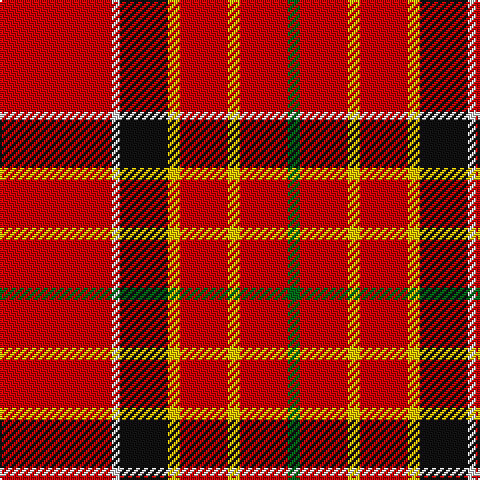

In pattern [GRYRYKWR](/stripes/gryrykwr/).

This was sourced from house-of-tartan.  It is a [8 stripe tartan](/stripes/stripes8/).

Original link http://www.house-of-tartan.scotland.net/house/TartanViewjs.asp?colr=Def&tnam=907

## Thread count
R/56 LN4 K24 Y6 R24 Y6 R24 G/6

## Palette
Each colour and its ΔE from the base-6 reference it is a variant of.

| Colour | Shade | Base | ΔE (OKLab) |
|---|---|---|---|
| G | <code style="background-color:#006818;">#006818</code> `#006818` | G <code style="background-color:#006100;">#006100</code> | 0.02 |
| K | <code style="background-color:#101010;">#101010</code> `#101010` | K <code style="background-color:#000000;">#000000</code> | 0.17 |
| LN | <code style="background-color:#E0E0E0;">#E0E0E0</code> `#E0E0E0` | W <code style="background-color:#F7F7F7;">#F7F7F7</code> | 0.07 |
| R | <code style="background-color:#C80000;">#C80000</code> `#C80000` | R <code style="background-color:#CC0000;">#CC0000</code> | 0.01 |
| Y | <code style="background-color:#E8C000;">#E8C000</code> `#E8C000` | Y <code style="background-color:#F2BF00;">#F2BF00</code> | 0.02 |

# Sample pattern

## Nearest tartans

The nearest existing variants by ΔTartan distance.

1. [Sinclair](/setts/s6/r30g12k5w2t6r30/) — ΔT 0.81
1. [Justerini & Brooks](/setts/s9/r48ly14r9g14k6r11g6r10g3~x2/) — ΔT 1.26
1. [Hoben (Personal)](/setts/s11/k3w1r20db4r4g10r4db4r20k1w3~x2/) — ΔT 1.29
1. [Sinclair](/setts/s6/r30dg12k5lr2b6r30~x2/) — ΔT 1.35
1. [Sinclair](/setts/s6/r30dg12k5lr2b6r30/) — ΔT 1.35
1. [Instakilt, Red (Fashion)](/setts/s7/r8w4r50k12r4k15g5~x2/) — ΔT 1.38
1. [Sinclair](/setts/s6/r28g16k4w1t6r28~x2/) — ΔT 1.47
1. [Loch Lochy (District)](/setts/s8/r6g14r6db12r31lb2r4ly3~x2/) — ΔT 1.50
1. [Loch Lochy](/setts/s8/r6dg14r6db11r31lb2r4ly3~x2/) — ΔT 1.51
1. [Rose](/setts/s9/g4r32db9r6db2r3db2r12w3~x2/) — ΔT 1.52

## Neighbour map

Every grey dot is one of 14299 variants placed by the first two principal components of the ΔTartan feature space (44% of its variance). Red is this tartan; blue dots are its nearest — click one to open its page.

<svg viewBox="0 0 640 380" role="img" style="max-width:100%;height:auto;border:1px solid #e0e0e0;border-radius:4px;display:block" xmlns="http://www.w3.org/2000/svg"><image href="/nn/cloud.v1.png" width="640" height="380"/><a href="/setts/s6/r30g12k5w2t6r30/"><circle cx="400.8" cy="169.2" r="4" fill="#3465a4"><title>Sinclair</title></circle></a><a href="/setts/s9/r48ly14r9g14k6r11g6r10g3~x2/"><circle cx="355.8" cy="138.1" r="4" fill="#3465a4"><title>Justerini &amp; Brooks</title></circle></a><a href="/setts/s11/k3w1r20db4r4g10r4db4r20k1w3~x2/"><circle cx="361.4" cy="115.8" r="4" fill="#3465a4"><title>Hoben (Personal)</title></circle></a><a href="/setts/s6/r30dg12k5lr2b6r30~x2/"><circle cx="419.7" cy="182.6" r="4" fill="#3465a4"><title>Sinclair</title></circle></a><a href="/setts/s6/r30dg12k5lr2b6r30/"><circle cx="419.7" cy="182.6" r="4" fill="#3465a4"><title>Sinclair</title></circle></a><a href="/setts/s7/r8w4r50k12r4k15g5~x2/"><circle cx="366.4" cy="150.1" r="4" fill="#3465a4"><title>Instakilt, Red (Fashion)</title></circle></a><a href="/setts/s6/r28g16k4w1t6r28~x2/"><circle cx="404.0" cy="151.7" r="4" fill="#3465a4"><title>Sinclair</title></circle></a><a href="/setts/s8/r6g14r6db12r31lb2r4ly3~x2/"><circle cx="334.9" cy="149.1" r="4" fill="#3465a4"><title>Loch Lochy (District)</title></circle></a><a href="/setts/s8/r6dg14r6db11r31lb2r4ly3~x2/"><circle cx="332.5" cy="143.3" r="4" fill="#3465a4"><title>Loch Lochy</title></circle></a><a href="/setts/s9/g4r32db9r6db2r3db2r12w3~x2/"><circle cx="463.5" cy="145.3" r="4" fill="#3465a4"><title>Rose</title></circle></a><circle cx="384.4" cy="147.8" r="5" fill="#c00000"/></svg>

ID: /setts/s8/r28w2k12ly3r12ly3r12g3~x2/
