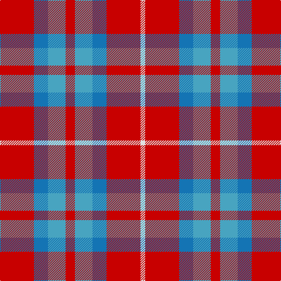

In pattern [RBYRYBRW](/stripes/rbyrybrw/).

This was sourced from register-of-tartans.  It is a [8 stripe tartan](/stripes/stripes8/).

Original link https://www.tartanregister.gov.uk/tartanDetails.aspx?ref=3829

## Register references

External register numbers recorded for this tartan.

- Scottish Register of Tartans: [3829](https://www.tartanregister.gov.uk/tartanDetails.aspx?ref=3829)
- Scottish Tartans Authority (ITI): 6428

## Thread count
R/58 B24 Ba30 R16 Ba30 B24 R58 LN/8

## Palette
Each colour and its ΔE from the base-6 reference it is a variant of.

| Colour | Shade | Base | ΔE (OKLab) |
|---|---|---|---|
| B | <code style="background-color:#1474B4;">#1474B4</code> `#1474B4` | B <code style="background-color:#2A418A;">#2A418A</code> | 0.15 |
| Ba | <code style="background-color:#48A4C0;">#48A4C0</code> `#48A4C0` | Y <code style="background-color:#F2BF00;">#F2BF00</code> | 0.29 |
| Bb | <code style="background-color:#2888C4;">#2888C4</code> `#2888C4` | B <code style="background-color:#2A418A;">#2A418A</code> | 0.21 |
| LN | <code style="background-color:#E0E0E0;">#E0E0E0</code> `#E0E0E0` | W <code style="background-color:#F7F7F7;">#F7F7F7</code> | 0.07 |
| R | <code style="background-color:#C80000;">#C80000</code> `#C80000` | R <code style="background-color:#CC0000;">#CC0000</code> | 0.01 |

# Sample pattern

## Nearest tartans

The nearest existing variants by ΔTartan distance.

1. [Snowbird (Corporate)](/setts/s5/r8lg15b12r29w4~x2/) — ΔT 1.04
1. [Cameron of Lochiel](/setts/s9/r6g3r6db1w1db1r2db8r4~x2/) — ΔT 1.23
1. [Sidney (Nova Scotia) Canadian Tartan Tartan Number: 1291. Earliest known date: 1986 The Falkirk Tartan. An ornamental twill weave check of natural light and dark wool was discovered at Falkirk in the neck of a jar containing Roman coins. The find is thought to have been buried about 260 A.D. The black and white check is woven today as the Shepherd tartan. See products available Copyright © Blair Urquhart, Comrie, 2015](/setts/s8/r16o2r11o6k4w2k4o16~x2/) — ΔT 1.30
1. [Unidentified Lindley](/setts/s6/b6o6w1o6b6ly1~x8/) — ΔT 1.33
1. [Sydney (Nova Scotia) (District)](/setts/s8/o16k4w2k4o6o11o2o16~x2/) — ΔT 1.39
1. [Caledonia No 3](/setts/s9/r13t3r13g12ly2dp9t9r13dp2~x2/) — ΔT 1.47
1. [MacKintosh-Geddes (Personal?)](/setts/s7/dp2r4g12r3dp6r10w2~x2/) — ΔT 1.50
1. [MacDuff #2](/setts/s7/r22t8k9dg14r10t2r10~x2/) — ΔT 1.52
1. [Caledonia No 3](/setts/s9/r13t3r13dg12ly2dp9t9r13dp2~x2/) — ΔT 1.56
1. [MacDuff #5](/setts/s7/r8t3k4dg6r4k1r4~x2/) — ΔT 1.56

## Neighbour map

Every grey dot is one of 14299 variants placed by the first two principal components of the ΔTartan feature space (44% of its variance). Red is this tartan; blue dots are its nearest — click one to open its page.

<svg viewBox="0 0 640 380" role="img" style="max-width:100%;height:auto;border:1px solid #e0e0e0;border-radius:4px;display:block" xmlns="http://www.w3.org/2000/svg"><image href="/nn/cloud.v1.png" width="640" height="380"/><a href="/setts/s5/r8lg15b12r29w4~x2/"><circle cx="268.6" cy="235.0" r="4" fill="#3465a4"><title>Snowbird (Corporate)</title></circle></a><a href="/setts/s9/r6g3r6db1w1db1r2db8r4~x2/"><circle cx="300.7" cy="209.2" r="4" fill="#3465a4"><title>Cameron of Lochiel</title></circle></a><a href="/setts/s8/r16o2r11o6k4w2k4o16~x2/"><circle cx="236.5" cy="202.4" r="4" fill="#3465a4"><title>Sidney (Nova Scotia) Canadian Tartan Tartan Number: 1291. Earliest known date: 1986 The Falkirk Tartan. An ornamental twill weave check of natural light and dark wool was discovered at Falkirk in the neck of a jar containing Roman coins. The find is thought to have been buried about 260 A.D. The black and white check is woven today as the Shepherd tartan. See products available Copyright © Blair Urquhart, Comrie, 2015</title></circle></a><a href="/setts/s6/b6o6w1o6b6ly1~x8/"><circle cx="232.6" cy="247.2" r="4" fill="#3465a4"><title>Unidentified Lindley</title></circle></a><a href="/setts/s8/o16k4w2k4o6o11o2o16~x2/"><circle cx="244.3" cy="213.2" r="4" fill="#3465a4"><title>Sydney (Nova Scotia) (District)</title></circle></a><a href="/setts/s9/r13t3r13g12ly2dp9t9r13dp2~x2/"><circle cx="199.4" cy="209.4" r="4" fill="#3465a4"><title>Caledonia No 3</title></circle></a><a href="/setts/s7/dp2r4g12r3dp6r10w2~x2/"><circle cx="201.3" cy="222.3" r="4" fill="#3465a4"><title>MacKintosh-Geddes (Personal?)</title></circle></a><a href="/setts/s7/r22t8k9dg14r10t2r10~x2/"><circle cx="268.5" cy="215.7" r="4" fill="#3465a4"><title>MacDuff #2</title></circle></a><a href="/setts/s9/r13t3r13dg12ly2dp9t9r13dp2~x2/"><circle cx="192.6" cy="203.6" r="4" fill="#3465a4"><title>Caledonia No 3</title></circle></a><a href="/setts/s7/r8t3k4dg6r4k1r4~x2/"><circle cx="231.8" cy="232.8" r="4" fill="#3465a4"><title>MacDuff #5</title></circle></a><circle cx="250.2" cy="227.7" r="5" fill="#c00000"/></svg>

ID: /setts/s8/r29b12lg15r8lg15b12r29w4~x2/
