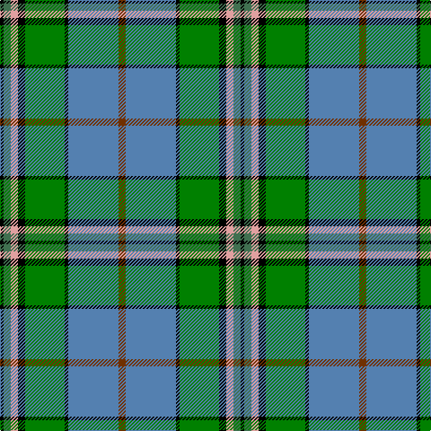

In pattern [KGYKGKBR](/patterns/kgykgkbr/).

This was sourced from weddslist.  It is a [8 stripes tartan](/stripes/stripes8/).

Original link http://www.weddslist.com/cgi-bin/tartans/pg.pl?source=sts

## Thread count
K/4 G8 LR8 K8 Ga44 K4 B56 T/8

## Palette
Each colour and its ΔE from the base-6 reference it is a variant of.

| Colour | Shade | Base | ΔE (OKLab) |
|---|---|---|---|
| B | <code style="background-color:#5480B0;">#5480B0</code> `#5480B0` | B <code style="background-color:#2A418A;">#2A418A</code> | 0.19 |
| G | <code style="background-color:#407050;">#407050</code> `#407050` | G <code style="background-color:#006100;">#006100</code> | 0.11 |
| Ga | <code style="background-color:#008000;">#008000</code> `#008000` | G <code style="background-color:#006100;">#006100</code> | 0.10 |
| K | <code style="background-color:#000000;">#000000</code> `#000000` | K <code style="background-color:#000000;">#000000</code> | 0.00 |
| LR | <code style="background-color:#E0A0A0;">#E0A0A0</code> `#E0A0A0` | Y <code style="background-color:#F2BF00;">#F2BF00</code> | 0.17 |
| T | <code style="background-color:#703000;">#703000</code> `#703000` | R <code style="background-color:#CC0000;">#CC0000</code> | 0.19 |

# Sample pattern

## Nearest tartans

The nearest existing variants by ΔTartan distance.

1. [Mission](/setts/s8/y2b14k1g11k2w2ga2k1~b5c8ca8-g006818-ga408060-k101010-wffe1ff-yffa500~x4/) — ΔT 0.50
1. [Hogg Dress (Name)](/setts/s9/b34r3b8ba4b8k24g34k2w6~b4880a0-ba1c1c50-g006818-k101010-rc80000-we0e0e0/) — ΔT 0.79
1. [Dunedin (USA) (District)](/setts/s9/w3b25k3r3k3r8g21k3k2~b2888c4-g006818-k101010-rc80000-wfcfcfc~x2/) — ΔT 0.79
1. [Kleto, Susan (Personal)](/setts/s9/w1b16y1r3y1g6ga2g6w1~b2c2c80-g006818-ga289c18-ra00000-wfcfcfc-yfccc00~x2/) — ΔT 0.87
1. [Hogg Dress](/setts/s9/b34r3b8ba4b8k24g34k2w6~b2888c4-ba003c64-g006818-k101010-rc80000-wffffff/) — ΔT 0.93
1. [Iroquois Falls Centenary](/setts/s8/g18y6ga3w1ga3w1wa6b6~b000080-g006400-ga603311-wffffff-wa82cffd-y86c67c~x2/) — ΔT 0.93
1. [East Lothian](/setts/s7/b6ba17bb4ba2k11g33y4~b5480b0-ba304080-bb800080-g008000-k000000-yf0c000~x2/) — ΔT 0.94
1. [Ayrton](/setts/s11/r4k2g25k2b10k2g4k2ba25k2y4~b5480b0-ba304080-g008000-k000000-rc00000-yf0c000~x2/) — ΔT 0.98
1. [Federated Women's Institutes of](/setts/s9/r2k1y2g3y4g3b12k1w2~b003478-g007800-k000000-r8c0000-wc8c8c8-yc88c00~x4/) — ΔT 0.99
1. [Royal British Legion, The](/setts/s7/r6b2g20k3ba8ga2b4~b8080d0-ba304080-g008000-ga30a010-k000000-rc00000~x2/) — ΔT 1.01

## Neighbour map

Every grey dot is one of 15726 variants placed by the first two principal components of the ΔTartan feature space (44% of its variance). Red is this tartan; blue dots are its nearest — click one to open its page.

<svg viewBox="0 0 640 380" role="img" style="max-width:100%;height:auto;border:1px solid #e0e0e0;border-radius:4px;display:block" xmlns="http://www.w3.org/2000/svg"><image href="/nn/cloud.v1.png" width="640" height="380"/><a href="/setts/s8/y2b14k1g11k2w2ga2k1~b5c8ca8-g006818-ga408060-k101010-wffe1ff-yffa500~x4/"><circle cx="178.5" cy="133.0" r="4" fill="#3465a4"><title>Mission</title></circle></a><a href="/setts/s9/b34r3b8ba4b8k24g34k2w6~b4880a0-ba1c1c50-g006818-k101010-rc80000-we0e0e0/"><circle cx="178.1" cy="137.7" r="4" fill="#3465a4"><title>Hogg Dress (Name)</title></circle></a><a href="/setts/s9/w3b25k3r3k3r8g21k3k2~b2888c4-g006818-k101010-rc80000-wfcfcfc~x2/"><circle cx="136.9" cy="128.4" r="4" fill="#3465a4"><title>Dunedin (USA) (District)</title></circle></a><a href="/setts/s9/w1b16y1r3y1g6ga2g6w1~b2c2c80-g006818-ga289c18-ra00000-wfcfcfc-yfccc00~x2/"><circle cx="195.4" cy="118.9" r="4" fill="#3465a4"><title>Kleto, Susan (Personal)</title></circle></a><a href="/setts/s9/b34r3b8ba4b8k24g34k2w6~b2888c4-ba003c64-g006818-k101010-rc80000-wffffff/"><circle cx="164.3" cy="133.3" r="4" fill="#3465a4"><title>Hogg Dress</title></circle></a><a href="/setts/s8/g18y6ga3w1ga3w1wa6b6~b000080-g006400-ga603311-wffffff-wa82cffd-y86c67c~x2/"><circle cx="143.3" cy="127.0" r="4" fill="#3465a4"><title>Iroquois Falls Centenary</title></circle></a><a href="/setts/s7/b6ba17bb4ba2k11g33y4~b5480b0-ba304080-bb800080-g008000-k000000-yf0c000~x2/"><circle cx="167.0" cy="142.8" r="4" fill="#3465a4"><title>East Lothian</title></circle></a><a href="/setts/s11/r4k2g25k2b10k2g4k2ba25k2y4~b5480b0-ba304080-g008000-k000000-rc00000-yf0c000~x2/"><circle cx="134.0" cy="116.6" r="4" fill="#3465a4"><title>Ayrton</title></circle></a><a href="/setts/s9/r2k1y2g3y4g3b12k1w2~b003478-g007800-k000000-r8c0000-wc8c8c8-yc88c00~x4/"><circle cx="138.7" cy="135.2" r="4" fill="#3465a4"><title>Federated Women's Institutes of</title></circle></a><a href="/setts/s7/r6b2g20k3ba8ga2b4~b8080d0-ba304080-g008000-ga30a010-k000000-rc00000~x2/"><circle cx="165.7" cy="161.7" r="4" fill="#3465a4"><title>Royal British Legion, The</title></circle></a><circle cx="171.1" cy="132.3" r="5" fill="#c00000"/></svg>

ID: /setts/s8/r2b14k1g11k2y2ga2k1~b5480b0-g008000-ga407050-k000000-r703000-ye0a0a0~x4/
