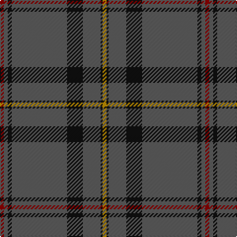

In pattern [RBKBKBKY](/patterns/rbkbkbky/).

This was sourced from tartans-authority.  It is a [8 stripes tartan](/stripes/stripes8/).

Original link http://www.tartansauthority.com/tartan-ferret/display/8694/

## Thread count
DR/4 N4 K4 N56 K16 N18 K2 DY/4

## Palette
Each colour and its ΔE from the base-6 reference it is a variant of.

| Colour | Shade | Base | ΔE (OKLab) |
|---|---|---|---|
| DR | <code style="background-color:#880000;">#880000</code> `#880000` | R <code style="background-color:#CC0000;">#CC0000</code> | 0.15 |
| DY | <code style="background-color:#BC8C00;">#BC8C00</code> `#BC8C00` | Y <code style="background-color:#F2BF00;">#F2BF00</code> | 0.16 |
| K | <code style="background-color:#101010;">#101010</code> `#101010` | K <code style="background-color:#000000;">#000000</code> | 0.17 |
| N | <code style="background-color:#5C5C5C;">#5C5C5C</code> `#5C5C5C` | B <code style="background-color:#2A418A;">#2A418A</code> | 0.15 |

# Sample pattern

## Nearest tartans

The nearest existing variants by ΔTartan distance.

1. [Lochnagar Dress (Fashion)](/setts/s10/g5k1g33b1g9k9b5k1r2k4~b440044-g686868-k101010-r880000~x2/) — ΔT 1.05
1. [Dark Lochnagar](/setts/s10/b6r1b40ba1b12r12ba6r2ra2r4~b343434-ba5c5c5c-r888888-rac80000~x2/) — ΔT 1.09
1. [St. Giles Cathedral (Corporate)](/setts/s6/b2ba2w1ba18w2r2~b202060-ba5c5c5c-r880000-wc0c0c0~x4/) — ΔT 1.15
1. [Kinfauns Castle](/setts/s10/r4b12g2b2g24g2g2g16g2w1~b800080-g004010-rc00000-we0e0e0~x2/) — ΔT 1.15
1. [Norsemen, The](/setts/s6/b65k2b4ka2b10r24~b36648b-k101010-ka000000-r800000~x2/) — ΔT 1.24
1. [Puxty-Dunne](/setts/s7/b18w2k1w4g13b40r2~b3f4441-g052f14-k120a01-r89051b-wddd5af~x2/) — ΔT 1.27
1. [Melrose Newbigging Grey (Name)](/setts/s10/b1k6b35k6b2ba3b1k6b2w1~b5c5c5c-ba440044-k101010-we0e0e0~x2/) — ΔT 1.30
1. [Lochnagar Dark (Fashion)](/setts/s10/b6r1b40ba1b12r12bb6r2ra2r4~b343434-ba5c5c5c-bb780078-r888888-rac80000~x2/) — ΔT 1.33
1. [Puxty-Dunne (Personal)](/setts/s7/b18w2k1w4g13b40r2~b5c5c5c-g006818-k101010-rc80000-we0e0e0~x2/) — ΔT 1.43
1. [VersaCold/Atlas (Corporate)](/setts/s9/b3ba44k9ba10k9ba10k9ba44r3~b2c2c80-ba5c5c5c-k101010-rc80000~x2/) — ΔT 1.45

## Neighbour map

Every grey dot is one of 15726 variants placed by the first two principal components of the ΔTartan feature space (44% of its variance). Red is this tartan; blue dots are its nearest — click one to open its page.

<svg viewBox="0 0 640 380" role="img" style="max-width:100%;height:auto;border:1px solid #e0e0e0;border-radius:4px;display:block" xmlns="http://www.w3.org/2000/svg"><image href="/nn/cloud.v1.png" width="640" height="380"/><a href="/setts/s10/g5k1g33b1g9k9b5k1r2k4~b440044-g686868-k101010-r880000~x2/"><circle cx="466.8" cy="136.0" r="4" fill="#3465a4"><title>Lochnagar Dress (Fashion)</title></circle></a><a href="/setts/s10/b6r1b40ba1b12r12ba6r2ra2r4~b343434-ba5c5c5c-r888888-rac80000~x2/"><circle cx="502.7" cy="142.3" r="4" fill="#3465a4"><title>Dark Lochnagar</title></circle></a><a href="/setts/s6/b2ba2w1ba18w2r2~b202060-ba5c5c5c-r880000-wc0c0c0~x4/"><circle cx="521.0" cy="184.1" r="4" fill="#3465a4"><title>St. Giles Cathedral (Corporate)</title></circle></a><a href="/setts/s10/r4b12g2b2g24g2g2g16g2w1~b800080-g004010-rc00000-we0e0e0~x2/"><circle cx="475.1" cy="163.6" r="4" fill="#3465a4"><title>Kinfauns Castle</title></circle></a><a href="/setts/s6/b65k2b4ka2b10r24~b36648b-k101010-ka000000-r800000~x2/"><circle cx="551.4" cy="174.9" r="4" fill="#3465a4"><title>Norsemen, The</title></circle></a><a href="/setts/s7/b18w2k1w4g13b40r2~b3f4441-g052f14-k120a01-r89051b-wddd5af~x2/"><circle cx="502.9" cy="150.0" r="4" fill="#3465a4"><title>Puxty-Dunne</title></circle></a><a href="/setts/s10/b1k6b35k6b2ba3b1k6b2w1~b5c5c5c-ba440044-k101010-we0e0e0~x2/"><circle cx="474.1" cy="124.6" r="4" fill="#3465a4"><title>Melrose Newbigging Grey (Name)</title></circle></a><a href="/setts/s10/b6r1b40ba1b12r12bb6r2ra2r4~b343434-ba5c5c5c-bb780078-r888888-rac80000~x2/"><circle cx="477.0" cy="121.5" r="4" fill="#3465a4"><title>Lochnagar Dark (Fashion)</title></circle></a><a href="/setts/s7/b18w2k1w4g13b40r2~b5c5c5c-g006818-k101010-rc80000-we0e0e0~x2/"><circle cx="507.4" cy="147.0" r="4" fill="#3465a4"><title>Puxty-Dunne (Personal)</title></circle></a><a href="/setts/s9/b3ba44k9ba10k9ba10k9ba44r3~b2c2c80-ba5c5c5c-k101010-rc80000~x2/"><circle cx="519.2" cy="205.2" r="4" fill="#3465a4"><title>VersaCold/Atlas (Corporate)</title></circle></a><circle cx="517.3" cy="163.1" r="5" fill="#c00000"/></svg>

ID: /setts/s8/r2b2k2b28k8b9k1y2~b5c5c5c-k101010-r880000-ybc8c00~x2/
