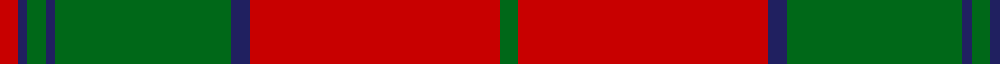
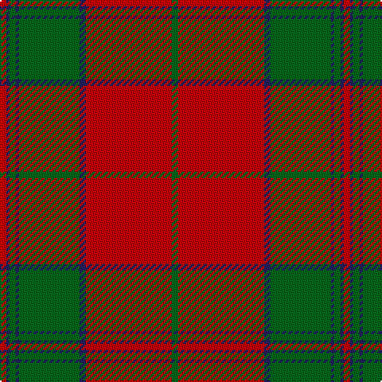

In pattern [GRBGBGBR](/stripes/grbgbgbr/).

This was sourced from register-of-tartans.  It is a [8 stripe tartan](/stripes/stripes8/).

Original link https://www.tartanregister.gov.uk/tartanDetails.aspx?ref=4106

## Also known as

This cloth is also recorded under:

- Thomas of Wales

## Attestations

This cloth appears in 2 source records; the oldest owns this page.

- 01/01/2002 — Thomas of Wales (register-of-tartans, [record](https://www.tartanregister.gov.uk/tartanDetails.aspx?ref=4106))
- 2002 — Thomas (Werlsh Name) (tartans-authority, [record](http://www.tartansauthority.com/tartan-ferret/display/5763/))

## Register references

External register numbers recorded for this tartan.

- Scottish Register of Tartans: [4106](https://www.tartanregister.gov.uk/tartanDetails.aspx?ref=4106)
- Scottish Tartans Authority (ITI): 5763

## Thread count
R/4 DB2 G4 DB2 G38 DB4 R54 G/4

## Palette
Each colour and the base-6 reference it is a variant of.

| Colour | Shade | Base |
|---|---|---|
| DB | <code style="background-color:#202060;">#202060</code> `oklch(28.9% 0.111 276.9)` <small>#202060</small> | B <code style="background-color:#2A418A;">#2A418A</code> |
| DG | <code style="background-color:#003820;">#003820</code> `oklch(30.0% 0.070 158.3)` <small>#003820</small> | G <code style="background-color:#006100;">#006100</code> |
| G | <code style="background-color:#006818;">#006818</code> `oklch(45.0% 0.142 145.0)` <small>#006818</small> | G <code style="background-color:#006100;">#006100</code> |
| LN | <code style="background-color:#E0E0E0;">#E0E0E0</code> `oklch(90.7% 0.000 89.9)` <small>#E0E0E0</small> | W <code style="background-color:#F7F7F7;">#F7F7F7</code> |
| R | <code style="background-color:#C80000;">#C80000</code> `oklch(52.3% 0.215 29.2)` <small>#C80000</small> | R <code style="background-color:#CC0000;">#CC0000</code> |

# Sample pattern

## Nearest tartans

The nearest existing variants by ΔTartan distance, with this tartan at the top so the swatches line up against it.

ΔTartan

Tartan

Sett

—

<a href="/ttd/edit/#slug=r2db1g2db1g19db2r27g2~x2">Thomas of Wales</a> <a class="nn-out" href="/setts/s8/r2db1g2db1g19db2r27g2~x2/" title="open its dictionary page">↗</a>

0.78

<a href="/setts/s8/r44db2g26r3db2/">Unidentified Cant #09</a>

0.94

<a href="/ttd/edit/#slug=dg18r3dg2r2db6r2dg2r24dg1r2dg6~x2">MacDonell of Glengarry #4</a> <a class="nn-out" href="/setts/s11/dg18r3dg2r2db6r2dg2r24dg1r2dg6~x2/" title="open its dictionary page">↗</a>

0.99

<a href="/ttd/edit/#slug=g2r2db1r24db6r3g12r4db1~x2">MacDonald 1</a> <a class="nn-out" href="/setts/s9/g2r2db1r24db6r3g12r4db1~x2/" title="open its dictionary page">↗</a>

0.99

<a href="/ttd/edit/#slug=g18r3g2r2db6r2g2r24g1r2g6~x2">MacDonell of Glengarry</a> <a class="nn-out" href="/setts/s11/g18r3g2r2db6r2g2r24g1r2g6~x2/" title="open its dictionary page">↗</a>

1.00

<a href="/ttd/edit/#slug=dg4r1dg1r28dg8k1dg1k1dg18r1dg1r4~x2">Drummond #3</a> <a class="nn-out" href="/setts/s12/dg4r1dg1r28dg8k1dg1k1dg18r1dg1r4~x2/" title="open its dictionary page">↗</a>

1.09

<a href="/ttd/edit/#slug=r36g18r4g6k1lb2k1g2~x2">Strang (Personal)</a> <a class="nn-out" href="/setts/s8/r36g18r4g6k1lb2k1g2~x2/" title="open its dictionary page">↗</a>

1.15

<a href="/ttd/edit/#slug=r6db1r1g28r4db8w1r32g1r4g2~x2">MacDonell of Keppoch</a> <a class="nn-out" href="/setts/s11/r6db1r1g28r4db8w1r32g1r4g2~x2/" title="open its dictionary page">↗</a>

1.17

<a href="/ttd/edit/#slug=r1g10r1db4r18g1~x4">Robertson 6</a> <a class="nn-out" href="/setts/s6/r1g10r1db4r18g1~x4/" title="open its dictionary page">↗</a>

1.17

<a href="/ttd/edit/#slug=r5g20r5g3r4g5r36g1w4~x2">Fitzgerald/Baluchistan</a> <a class="nn-out" href="/setts/s9/r5g20r5g3r4g5r36g1w4~x2/" title="open its dictionary page">↗</a>

1.26

<a href="/ttd/edit/#slug=r4g1r1g18k1g1k1g8r28g1r1g4~x2">Drummond</a> <a class="nn-out" href="/setts/s12/r4g1r1g18k1g1k1g8r28g1r1g4~x2/" title="open its dictionary page">↗</a>

## Neighbour map

Every grey dot is one of 14299 variants placed by the first two principal components of the ΔTartan feature space (44% of its variance). Red is this tartan; blue dots are its nearest — click one to open its page.

<svg viewBox="0 0 640 380" role="img" style="max-width:100%;height:auto;border:1px solid #e0e0e0;border-radius:4px;display:block" xmlns="http://www.w3.org/2000/svg"><image href="/nn/cloud.v1.png" width="640" height="380"/><a href="/setts/s8/r44db2g26r3db2/"><circle cx="376.6" cy="170.3" r="4" fill="#3465a4"><title>Unidentified Cant #09</title></circle></a><a href="/setts/s11/dg18r3dg2r2db6r2dg2r24dg1r2dg6~x2/"><circle cx="360.9" cy="142.6" r="4" fill="#3465a4"><title>MacDonell of Glengarry #4</title></circle></a><a href="/setts/s9/g2r2db1r24db6r3g12r4db1~x2/"><circle cx="420.4" cy="154.2" r="4" fill="#3465a4"><title>MacDonald 1</title></circle></a><a href="/setts/s11/g18r3g2r2db6r2g2r24g1r2g6~x2/"><circle cx="363.3" cy="147.3" r="4" fill="#3465a4"><title>MacDonell of Glengarry</title></circle></a><a href="/setts/s12/dg4r1dg1r28dg8k1dg1k1dg18r1dg1r4~x2/"><circle cx="396.1" cy="120.3" r="4" fill="#3465a4"><title>Drummond #3</title></circle></a><a href="/setts/s8/r36g18r4g6k1lb2k1g2~x2/"><circle cx="423.0" cy="123.2" r="4" fill="#3465a4"><title>Strang (Personal)</title></circle></a><a href="/setts/s11/r6db1r1g28r4db8w1r32g1r4g2~x2/"><circle cx="378.5" cy="109.6" r="4" fill="#3465a4"><title>MacDonell of Keppoch</title></circle></a><a href="/setts/s6/r1g10r1db4r18g1~x4/"><circle cx="397.7" cy="186.3" r="4" fill="#3465a4"><title>Robertson 6</title></circle></a><a href="/setts/s9/r5g20r5g3r4g5r36g1w4~x2/"><circle cx="434.1" cy="138.0" r="4" fill="#3465a4"><title>Fitzgerald/Baluchistan</title></circle></a><a href="/setts/s12/r4g1r1g18k1g1k1g8r28g1r1g4~x2/"><circle cx="390.3" cy="121.3" r="4" fill="#3465a4"><title>Drummond</title></circle></a><circle cx="404.9" cy="146.8" r="5" fill="#c00000"/></svg>

ID: /setts/s8/r2db1g2db1g19db2r27g2~x2/
