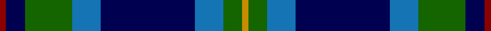
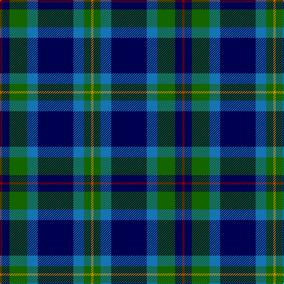

In pattern [RBGBBBGY](/stripes/rbgbbbgy/).

This was sourced from register-of-tartans.  It is a [8 stripe tartan](/stripes/stripes8/).

Original link https://www.tartanregister.gov.uk/tartanDetails.aspx?ref=2951

## Attestations

This cloth appears in 2 source records; the oldest owns this page.

- 01/01/1998 — Miller (register-of-tartans, [record](https://www.tartanregister.gov.uk/tartanDetails.aspx?ref=2951))
- 1998 — Miller (Name) (tartans-authority, [record](http://www.tartansauthority.com/tartan-ferret/display/4177/))

## Register references

External register numbers recorded for this tartan.

- Scottish Register of Tartans: [2951](https://www.tartanregister.gov.uk/tartanDetails.aspx?ref=2951)
- Scottish Tartans Authority (ITI): 4177

## Thread count
DR/4 DB12 G30 B18 DB60 B18 G12 DY/4

## Palette
Each colour and the base-6 reference it is a variant of.

| Colour | Shade | Base |
|---|---|---|
| B | <code style="background-color:#1474B4;">#1474B4</code> `oklch(54.0% 0.129 245.1)` <small>#1474B4</small> | B <code style="background-color:#2A418A;">#2A418A</code> |
| DB | <code style="background-color:#000050;">#000050</code> `oklch(19.5% 0.135 264.1)` <small>#000050</small> | B <code style="background-color:#2A418A;">#2A418A</code> |
| DR | <code style="background-color:#8C0000;">#8C0000</code> `oklch(40.2% 0.165 29.2)` <small>#8C0000</small> | R <code style="background-color:#CC0000;">#CC0000</code> |
| DY | <code style="background-color:#C88C00;">#C88C00</code> `oklch(68.2% 0.142 78.2)` <small>#C88C00</small> | Y <code style="background-color:#F2BF00;">#F2BF00</code> |
| G | <code style="background-color:#146400;">#146400</code> `oklch(43.9% 0.144 140.9)` <small>#146400</small> | G <code style="background-color:#006100;">#006100</code> |

# Sample pattern

## Nearest tartans

The nearest existing variants by ΔTartan distance.

1. [Alexander - 2000 (Name)](/setts/s7/db12k4g4dp1g4k1w1~x4/) — ΔT 0.79
1. [Ebdon-Muir (Personal)](/setts/s9/dp4db40k15g10dp2g10dp2g10w4~x2/) — ΔT 0.95
1. [Wishart Htg (Clan)](/setts/s7/k7db4dg31db3ly2db27lb4~x2/) — ΔT 0.97
1. [Dollar Academy (1999) (Corporate)](/setts/s8/w2db19k4db4k4g9db2k1~x4/) — ΔT 0.99
1. [Alexander](/setts/s7/db24k8g8dp2g8k1w2~x2/) — ΔT 1.01
1. [Dickson (Kirkcudbrightshire) (Name)](/setts/s7/n6db8n8g12dt29w3dt4~x2/) — ΔT 1.02
1. [Grampian](/setts/s8/g26r2g3db15db26r2db3db4~x2/) — ΔT 1.06
1. [Leslie, Hebridean](/setts/s6/k6g15w2db22r2k4~x2/) — ΔT 1.08
1. [MacLaren](/setts/s7/db12k4g4r1g4k1lo1~x4/) — ΔT 1.10
1. [U.S.I. Limited](/setts/s11/k20n2t2n4dg20w2k16n7t2k3t5~x2/) — ΔT 1.11

## Neighbour map

Every grey dot is one of 14299 variants placed by the first two principal components of the ΔTartan feature space (44% of its variance). Red is this tartan; blue dots are its nearest — click one to open its page.

<svg viewBox="0 0 640 380" role="img" style="max-width:100%;height:auto;border:1px solid #e0e0e0;border-radius:4px;display:block" xmlns="http://www.w3.org/2000/svg"><image href="/nn/cloud.v1.png" width="640" height="380"/><a href="/setts/s7/db12k4g4dp1g4k1w1~x4/"><circle cx="223.1" cy="186.0" r="4" fill="#3465a4"><title>Alexander - 2000 (Name)</title></circle></a><a href="/setts/s9/dp4db40k15g10dp2g10dp2g10w4~x2/"><circle cx="213.9" cy="147.0" r="4" fill="#3465a4"><title>Ebdon-Muir (Personal)</title></circle></a><a href="/setts/s7/k7db4dg31db3ly2db27lb4~x2/"><circle cx="246.9" cy="169.1" r="4" fill="#3465a4"><title>Wishart Htg (Clan)</title></circle></a><a href="/setts/s8/w2db19k4db4k4g9db2k1~x4/"><circle cx="284.3" cy="169.8" r="4" fill="#3465a4"><title>Dollar Academy (1999) (Corporate)</title></circle></a><a href="/setts/s7/db24k8g8dp2g8k1w2~x2/"><circle cx="255.0" cy="159.1" r="4" fill="#3465a4"><title>Alexander</title></circle></a><a href="/setts/s7/n6db8n8g12dt29w3dt4~x2/"><circle cx="212.8" cy="202.7" r="4" fill="#3465a4"><title>Dickson (Kirkcudbrightshire) (Name)</title></circle></a><a href="/setts/s8/g26r2g3db15db26r2db3db4~x2/"><circle cx="195.0" cy="174.7" r="4" fill="#3465a4"><title>Grampian</title></circle></a><a href="/setts/s6/k6g15w2db22r2k4~x2/"><circle cx="214.6" cy="197.6" r="4" fill="#3465a4"><title>Leslie, Hebridean</title></circle></a><a href="/setts/s7/db12k4g4r1g4k1lo1~x4/"><circle cx="236.8" cy="186.9" r="4" fill="#3465a4"><title>MacLaren</title></circle></a><a href="/setts/s11/k20n2t2n4dg20w2k16n7t2k3t5~x2/"><circle cx="210.0" cy="173.7" r="4" fill="#3465a4"><title>U.S.I. Limited</title></circle></a><circle cx="230.0" cy="180.7" r="5" fill="#c00000"/></svg>

ID: /setts/s8/r2db6g15b9db30b9g6lo2~x2/
