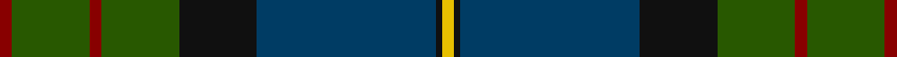

This page is one **sett** — a single exact thread-count. It belongs to the [tartan](/tartans/dr2g13dr2g13k13db30k1y2/)
(the same proportion at any scale), whose colour order is pattern [RGRGKBKY](/stripes/rgrgkbky/).

Sourced from tartans-authority.  It is a [8 stripe tartan](/stripes/stripes8/).

Original link http://www.tartansauthority.com/tartan-ferret/display/6423/

## Thread count
DR/4 G26 DR4 G26 K26 DB60 K2 Y/4

## Palette
Each colour and the base-6 reference it is a variant of.

| Colour | Shade | Base |
|---|---|---|
| DB | <code style="background-color:#003C64;">#003C64</code> `oklch(34.5% 0.089 246.0)` <small>#003C64</small> | B <code style="background-color:#2A418A;">#2A418A</code> |
| DR | <code style="background-color:#880000;">#880000</code> `oklch(39.4% 0.162 29.2)` <small>#880000</small> | R <code style="background-color:#CC0000;">#CC0000</code> |
| G | <code style="background-color:#285800;">#285800</code> `oklch(41.0% 0.122 135.8)` <small>#285800</small> | G <code style="background-color:#006100;">#006100</code> |
| K | <code style="background-color:#101010;">#101010</code> `oklch(17.3% 0.000 89.9)` <small>#101010</small> | K <code style="background-color:#000000;">#000000</code> |
| Y | <code style="background-color:#E8C000;">#E8C000</code> `oklch(81.9% 0.168 93.7)` <small>#E8C000</small> | Y <code style="background-color:#F2BF00;">#F2BF00</code> |

# Sample pattern

## Nearest tartans

The nearest existing variants by ΔTartan distance, with this tartan at the top so the swatches line up against it.

ΔTartan

Tartan

Sett

—

<a href="/ttd/edit/#slug=r2dg13r2dg13k13dt30k1ly2~x2">Chan (Name?)</a> <a class="nn-out" href="/setts/s8/r2dg13r2dg13k13dt30k1ly2~x2/" title="open its dictionary page">↗</a>

0.83

<a href="/ttd/edit/#slug=dg3r1dg18k20r1db18t1dg2~x4">Lochaber #2</a> <a class="nn-out" href="/setts/s8/dg3r1dg18k20r1db18t1dg2~x4/" title="open its dictionary page">↗</a>

0.88

<a href="/ttd/edit/#slug=db4k2db16w1k8dg24r4~x2">Colquhoun</a> <a class="nn-out" href="/setts/s7/db4k2db16w1k8dg24r4~x2/" title="open its dictionary page">↗</a>

0.99

<a href="/ttd/edit/#slug=dp6o2dp1g25db16k2db4~x2">Lawrie Clan Tartan Tartan Number: 3202. Earliest known date: 2000 One of a set of three similar designs for Laurie, Lawrie and Lowry, designed by Peter MacDonald for Iain Laurie. See products available Copyright © Blair Urquhart, Comrie, 2015</a> <a class="nn-out" href="/setts/s7/dp6o2dp1g25db16k2db4~x2/" title="open its dictionary page">↗</a>

1.00

<a href="/ttd/edit/#slug=k3r2dy4r1db25g12dy14db3r1~x2">Mann</a> <a class="nn-out" href="/setts/s9/k3r2dy4r1db25g12dy14db3r1~x2/" title="open its dictionary page">↗</a>

1.03

<a href="/ttd/edit/#slug=r2k4dt23k14dg16ly1k4ly2~x2">Thomas, baron of Craigie, Robert (Personal)</a> <a class="nn-out" href="/setts/s8/r2k4dt23k14dg16ly1k4ly2~x2/" title="open its dictionary page">↗</a>

1.08

<a href="/ttd/edit/#slug=dg30db4dg2k20db18r1db4~x2">MacTaggart</a> <a class="nn-out" href="/setts/s7/dg30db4dg2k20db18r1db4~x2/" title="open its dictionary page">↗</a>

1.11

<a href="/ttd/edit/#slug=dp6r2dp1g25db16k2db4~x2">Laurie Clan Tartan Tartan Number: 3201. Earliest known date: 2000 One of a set of three similar designs for Laurie, Lawrie and Lowry, designed by Peter MacDonald for Iain Laurie. See products available Copyright © Blair Urquhart, Comrie, 2015</a> <a class="nn-out" href="/setts/s7/dp6r2dp1g25db16k2db4~x2/" title="open its dictionary page">↗</a>

1.14

<a href="/ttd/edit/#slug=dp6ly2dp1g25db16k2db4~x2">Lowry</a> <a class="nn-out" href="/setts/s7/dp6ly2dp1g25db16k2db4~x2/" title="open its dictionary page">↗</a>

1.21

<a href="/ttd/edit/#slug=db4b4db1dg24db10r1db2r5b3r2~x2">Rikaco Classic (Fashion)</a> <a class="nn-out" href="/setts/s10/db4b4db1dg24db10r1db2r5b3r2~x2/" title="open its dictionary page">↗</a>

1.21

<a href="/ttd/edit/#slug=w2k2r1dt20k15dg30ly1~x2">Muir-Hill (Personal)</a> <a class="nn-out" href="/setts/s7/w2k2r1dt20k15dg30ly1~x2/" title="open its dictionary page">↗</a>

## Neighbour map

Every grey dot is one of 14299 variants placed by the first two principal components of the ΔTartan feature space (44% of its variance). Red is this tartan; blue dots are its nearest — click one to open its page.

<svg viewBox="0 0 640 380" role="img" style="max-width:100%;height:auto;border:1px solid #e0e0e0;border-radius:4px;display:block" xmlns="http://www.w3.org/2000/svg"><image href="/nn/cloud.v1.png" width="640" height="380"/><a href="/setts/s8/dg3r1dg18k20r1db18t1dg2~x4/"><circle cx="263.4" cy="180.3" r="4" fill="#3465a4"><title>Lochaber #2</title></circle></a><a href="/setts/s7/db4k2db16w1k8dg24r4~x2/"><circle cx="265.5" cy="175.1" r="4" fill="#3465a4"><title>Colquhoun</title></circle></a><a href="/setts/s7/dp6o2dp1g25db16k2db4~x2/"><circle cx="304.7" cy="169.9" r="4" fill="#3465a4"><title>Lawrie Clan Tartan Tartan Number: 3202. Earliest known date: 2000 One of a set of three similar designs for Laurie, Lawrie and Lowry, designed by Peter MacDonald for Iain Laurie. See products available Copyright © Blair Urquhart, Comrie, 2015</title></circle></a><a href="/setts/s9/k3r2dy4r1db25g12dy14db3r1~x2/"><circle cx="295.0" cy="159.8" r="4" fill="#3465a4"><title>Mann</title></circle></a><a href="/setts/s8/r2k4dt23k14dg16ly1k4ly2~x2/"><circle cx="236.4" cy="172.9" r="4" fill="#3465a4"><title>Thomas, baron of Craigie, Robert (Personal)</title></circle></a><a href="/setts/s7/dg30db4dg2k20db18r1db4~x2/"><circle cx="311.3" cy="192.3" r="4" fill="#3465a4"><title>MacTaggart</title></circle></a><a href="/setts/s7/dp6r2dp1g25db16k2db4~x2/"><circle cx="299.7" cy="166.3" r="4" fill="#3465a4"><title>Laurie Clan Tartan Tartan Number: 3201. Earliest known date: 2000 One of a set of three similar designs for Laurie, Lawrie and Lowry, designed by Peter MacDonald for Iain Laurie. See products available Copyright © Blair Urquhart, Comrie, 2015</title></circle></a><a href="/setts/s7/dp6ly2dp1g25db16k2db4~x2/"><circle cx="304.0" cy="169.6" r="4" fill="#3465a4"><title>Lowry</title></circle></a><a href="/setts/s10/db4b4db1dg24db10r1db2r5b3r2~x2/"><circle cx="299.1" cy="153.9" r="4" fill="#3465a4"><title>Rikaco Classic (Fashion)</title></circle></a><a href="/setts/s7/w2k2r1dt20k15dg30ly1~x2/"><circle cx="291.3" cy="161.0" r="4" fill="#3465a4"><title>Muir-Hill (Personal)</title></circle></a><circle cx="284.4" cy="169.2" r="5" fill="#c00000"/></svg>

ID: /setts/s8/r2dg13r2dg13k13dt30k1ly2~x2/
