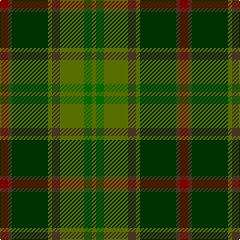

In pattern [GGGGGGGR](/stripes/gggggggr/).

This was sourced from register-of-tartans.  It is a [8 stripe tartan](/stripes/stripes8/).

Original link https://www.tartanregister.gov.uk/tartanDetails.aspx?ref=4135

## Attestations

This cloth appears in 2 source records; the oldest owns this page.

- 01/01/2002 — Tomass (register-of-tartans, [record](https://www.tartanregister.gov.uk/tartanDetails.aspx?ref=4135))
- pre 2002 — Tomass (Name) (tartans-authority, [record](http://www.tartansauthority.com/tartan-ferret/display/5106/))

## Register references

External register numbers recorded for this tartan.

- Scottish Register of Tartans: [4135](https://www.tartanregister.gov.uk/tartanDetails.aspx?ref=4135)
- Scottish Tartans Authority (ITI): 5106

## Thread count
DR/8 T4 G36 Ga4 T8 Ga24 Gb8 Ga/4

## Palette
Each colour and its ΔE from the base-6 reference it is a variant of.

| Colour | Shade | Base | ΔE (OKLab) |
|---|---|---|---|
| DR | <code style="background-color:#8C0000;">#8C0000</code> `#8C0000` | R <code style="background-color:#CC0000;">#CC0000</code> | 0.14 |
| G | <code style="background-color:#003800;">#003800</code> `#003800` | G <code style="background-color:#006100;">#006100</code> | 0.14 |
| Ga | <code style="background-color:#647C00;">#647C00</code> `#647C00` | G <code style="background-color:#006100;">#006100</code> | 0.13 |
| Gb | <code style="background-color:#007800;">#007800</code> `#007800` | G <code style="background-color:#006100;">#006100</code> | 0.07 |
| T | <code style="background-color:#503C28;">#503C28</code> `#503C28` | G <code style="background-color:#006100;">#006100</code> | 0.15 |

# Sample pattern

## Nearest tartans

The nearest existing variants by ΔTartan distance.

1. [MacAart (Personal)](/setts/s10/dy9k2dy2r2g6k1lo1k1g6r3~x4/) — ΔT 1.04
1. [MacAart (Personal)](/setts/s11/r3g6k1lo1k1g6r2dy2k2dy9k2~x4/) — ΔT 1.29
1. [Moncton, City of](/setts/s9/g4r1db2r1g10y5r3y10ly1~x4/) — ΔT 1.30
1. [State Seal of Minnesota (Fashion)](/setts/s8/r4g46r10db10dy33db5dy4lo3~x2/) — ΔT 1.31
1. [MacSween Hunting (Lochs, Isle of Lewis) (Personal)](/setts/s7/dg3r3dg31dg18dg4k22lo3/) — ΔT 1.35
1. [Lawrence's Seven Pillars of Khaki](/setts/s9/r3o23g8g6g8t6g10t12g3~x2/) — ΔT 1.46
1. [Handley (Personal)](/setts/s12/dg12w2k5g24k4dg9k2g13k4dg13k2ly3~x2/) — ΔT 1.46
1. [John Muir Way](/setts/s8/dy35dg19r3y8r3dg8r3t3~x2/) — ΔT 1.47
1. [Ramsay (Green Fashion)](/setts/s7/g1r7g7n2r1dg15lb1~x4/) — ΔT 1.48
1. [Cavan, County](/setts/s10/k3r9k4dy9y3dy9k4g26k2y3~x2/) — ΔT 1.51

## Neighbour map

Every grey dot is one of 14299 variants placed by the first two principal components of the ΔTartan feature space (44% of its variance). Red is this tartan; blue dots are its nearest — click one to open its page.

<svg viewBox="0 0 640 380" role="img" style="max-width:100%;height:auto;border:1px solid #e0e0e0;border-radius:4px;display:block" xmlns="http://www.w3.org/2000/svg"><image href="/nn/cloud.v1.png" width="640" height="380"/><a href="/setts/s10/dy9k2dy2r2g6k1lo1k1g6r3~x4/"><circle cx="217.3" cy="216.0" r="4" fill="#3465a4"><title>MacAart (Personal)</title></circle></a><a href="/setts/s11/r3g6k1lo1k1g6r2dy2k2dy9k2~x4/"><circle cx="195.0" cy="207.6" r="4" fill="#3465a4"><title>MacAart (Personal)</title></circle></a><a href="/setts/s9/g4r1db2r1g10y5r3y10ly1~x4/"><circle cx="257.0" cy="208.6" r="4" fill="#3465a4"><title>Moncton, City of</title></circle></a><a href="/setts/s8/r4g46r10db10dy33db5dy4lo3~x2/"><circle cx="289.3" cy="195.0" r="4" fill="#3465a4"><title>State Seal of Minnesota (Fashion)</title></circle></a><a href="/setts/s7/dg3r3dg31dg18dg4k22lo3/"><circle cx="277.4" cy="229.4" r="4" fill="#3465a4"><title>MacSween Hunting (Lochs, Isle of Lewis) (Personal)</title></circle></a><a href="/setts/s9/r3o23g8g6g8t6g10t12g3~x2/"><circle cx="198.4" cy="236.6" r="4" fill="#3465a4"><title>Lawrence's Seven Pillars of Khaki</title></circle></a><a href="/setts/s12/dg12w2k5g24k4dg9k2g13k4dg13k2ly3~x2/"><circle cx="230.6" cy="197.6" r="4" fill="#3465a4"><title>Handley (Personal)</title></circle></a><a href="/setts/s8/dy35dg19r3y8r3dg8r3t3~x2/"><circle cx="302.0" cy="206.0" r="4" fill="#3465a4"><title>John Muir Way</title></circle></a><a href="/setts/s7/g1r7g7n2r1dg15lb1~x4/"><circle cx="314.2" cy="212.2" r="4" fill="#3465a4"><title>Ramsay (Green Fashion)</title></circle></a><a href="/setts/s10/k3r9k4dy9y3dy9k4g26k2y3~x2/"><circle cx="206.6" cy="176.5" r="4" fill="#3465a4"><title>Cavan, County</title></circle></a><circle cx="234.2" cy="220.5" r="5" fill="#c00000"/></svg>

ID: /setts/s8/r2dy1dg9y1dy2y6g2y1~x4/
