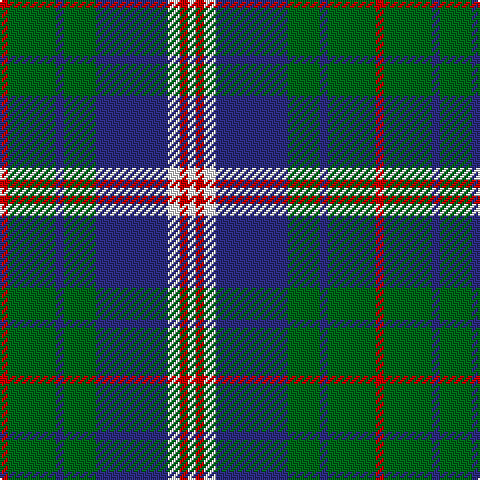

In pattern [RGBGBWRW](/patterns/rgbgbwrw/).

This was sourced from register-of-tartans.  It is a [8 stripes tartan](/stripes/stripes8/).

Original link https://www.tartanregister.gov.uk/tartanDetails.aspx?ref=43

## Attestations

This cloth appears in 2 source records; the oldest owns this page.

- 01/11/2005 — Albuquerque, City of (register-of-tartans, [record](https://www.tartanregister.gov.uk/tartanDetails.aspx?ref=43))
- 2005, Nov. 30th — Albuquerque, City of (District) (tartans-authority, [record](http://www.tartansauthority.com/tartan-ferret/display/6720/))

## Thread count
R/4 G24 DB4 G16 DB36 W6 R4 W/4

## Palette
Each colour and its ΔE from the base-6 reference it is a variant of.

| Colour | Shade | Base | ΔE (OKLab) |
|---|---|---|---|
| DB | <code style="background-color:#2C2C80;">#2C2C80</code> `#2C2C80` | B <code style="background-color:#2A418A;">#2A418A</code> | 0.06 |
| G | <code style="background-color:#006818;">#006818</code> `#006818` | G <code style="background-color:#006100;">#006100</code> | 0.02 |
| R | <code style="background-color:#C80000;">#C80000</code> `#C80000` | R <code style="background-color:#CC0000;">#CC0000</code> | 0.01 |
| W | <code style="background-color:#F8F8F8;">#F8F8F8</code> `#F8F8F8` | W <code style="background-color:#F7F7F7;">#F7F7F7</code> | 0.00 |

# Sample pattern

## Nearest tartans

The nearest existing variants by ΔTartan distance.

1. [MacOrrell](/setts/s9/b10y4b36g28w3g3w3g8y6~b2c2c80-g00781c-we0e0e0-ye8c000/) — ΔT 0.83
1. [Tweedside Hunting District Tartan Tartan Number: 163. Earliest known date: 20th Century A variation of Wilson's design. There is no record of this sett in any of the old collections which points to dating it in this century. It is the most popular of Tweedside district tartans. See products available Copyright © Blair Urquhart, Comrie, 2015](/setts/s9/b21g5k5g15w3g5w3g5k3~b2c2c80-g006818-k101010-we0e0e0~x2/) — ΔT 0.98
1. [Thayer USA (Name)](/setts/s6/r5b25w5b3g25b3~b2c2c80-g006818-rc80000-we0e0e0~x2/) — ΔT 0.98
1. [Ayrshire](/setts/s8/b2r1b10w1g4ga8ga1ga2~b1c0070-g785000-ga30ac38-r880000-we0e0e0~x4/) — ΔT 0.99
1. [New Mexico, State of (Fashion)](/setts/s8/r1g8b1g5b11y2r1y1~b2c2c80-g289c18-rc80000-ye8c000~x4/) — ΔT 1.03
1. [MacTavish / Thom(p)son, hunting](/setts/s6/b4r28g6b12k12b3~b5480b0-g008000-k000000-r806050~x2/) — ΔT 1.04
1. [Children 1st (Corporate)](/setts/s9/y7b32ba4b4ba8b4ba8g32y3~b202060-ba780078-g006818-ye8c000~x2/) — ΔT 1.04
1. [Eglinton District Tartan Tartan Number: 2075. Earliest known date: pre 1847 The Eglinton tartan is the Montgomerie with a narrower ground. D W Stewart in his book, Old and Rare, was of the opinion that the Montgomerie tartan was adopted by the Montgomeries of Ayrshire in 1707. He stated that in 1893 there were historic relics at Eglinton Castle which furnished evidence of the early use of the tartan. See products available Copyright © Blair Urquhart, Comrie, 2015](/setts/s7/k3g3k3b16k3r3k3~b5c8ca8-g006818-k101010-rc80000~x2/) — ΔT 1.06
1. [Riley (Personal)](/setts/s8/b26g6k8g3k8g30w3g3~b9058d8-g289c18-k101010-wfcfcfc~x2/) — ΔT 1.06
1. [Thayer USA](/setts/s6/r5b25w5b3g25b3~b202060-g255210-ra51805-wffffff~x2/) — ΔT 1.11

## Neighbour map

Every grey dot is one of 15726 variants placed by the first two principal components of the ΔTartan feature space (44% of its variance). Red is this tartan; blue dots are its nearest — click one to open its page.

<svg viewBox="0 0 640 380" role="img" style="max-width:100%;height:auto;border:1px solid #e0e0e0;border-radius:4px;display:block" xmlns="http://www.w3.org/2000/svg"><image href="/nn/cloud.v1.png" width="640" height="380"/><a href="/setts/s9/b10y4b36g28w3g3w3g8y6~b2c2c80-g00781c-we0e0e0-ye8c000/"><circle cx="239.6" cy="170.5" r="4" fill="#3465a4"><title>MacOrrell</title></circle></a><a href="/setts/s9/b21g5k5g15w3g5w3g5k3~b2c2c80-g006818-k101010-we0e0e0~x2/"><circle cx="204.9" cy="209.7" r="4" fill="#3465a4"><title>Tweedside Hunting District Tartan Tartan Number: 163. Earliest known date: 20th Century A variation of Wilson's design. There is no record of this sett in any of the old collections which points to dating it in this century. It is the most popular of Tweedside district tartans. See products available Copyright © Blair Urquhart, Comrie, 2015</title></circle></a><a href="/setts/s6/r5b25w5b3g25b3~b2c2c80-g006818-rc80000-we0e0e0~x2/"><circle cx="248.8" cy="215.5" r="4" fill="#3465a4"><title>Thayer USA (Name)</title></circle></a><a href="/setts/s8/b2r1b10w1g4ga8ga1ga2~b1c0070-g785000-ga30ac38-r880000-we0e0e0~x4/"><circle cx="174.0" cy="169.9" r="4" fill="#3465a4"><title>Ayrshire</title></circle></a><a href="/setts/s8/r1g8b1g5b11y2r1y1~b2c2c80-g289c18-rc80000-ye8c000~x4/"><circle cx="222.4" cy="179.0" r="4" fill="#3465a4"><title>New Mexico, State of (Fashion)</title></circle></a><a href="/setts/s6/b4r28g6b12k12b3~b5480b0-g008000-k000000-r806050~x2/"><circle cx="199.7" cy="212.9" r="4" fill="#3465a4"><title>MacTavish / Thom(p)son, hunting</title></circle></a><a href="/setts/s9/y7b32ba4b4ba8b4ba8g32y3~b202060-ba780078-g006818-ye8c000~x2/"><circle cx="204.9" cy="178.4" r="4" fill="#3465a4"><title>Children 1st (Corporate)</title></circle></a><a href="/setts/s7/k3g3k3b16k3r3k3~b5c8ca8-g006818-k101010-rc80000~x2/"><circle cx="217.6" cy="215.5" r="4" fill="#3465a4"><title>Eglinton District Tartan Tartan Number: 2075. Earliest known date: pre 1847 The Eglinton tartan is the Montgomerie with a narrower ground. D W Stewart in his book, Old and Rare, was of the opinion that the Montgomerie tartan was adopted by the Montgomeries of Ayrshire in 1707. He stated that in 1893 there were historic relics at Eglinton Castle which furnished evidence of the early use of the tartan. See products available Copyright © Blair Urquhart, Comrie, 2015</title></circle></a><a href="/setts/s8/b26g6k8g3k8g30w3g3~b9058d8-g289c18-k101010-wfcfcfc~x2/"><circle cx="220.8" cy="180.6" r="4" fill="#3465a4"><title>Riley (Personal)</title></circle></a><a href="/setts/s6/r5b25w5b3g25b3~b202060-g255210-ra51805-wffffff~x2/"><circle cx="247.4" cy="215.6" r="4" fill="#3465a4"><title>Thayer USA</title></circle></a><circle cx="203.5" cy="190.5" r="5" fill="#c00000"/></svg>

ID: /setts/s8/r2g12b2g8b18w3r2w2~b2c2c80-g006818-rc80000-wf8f8f8~x2/
