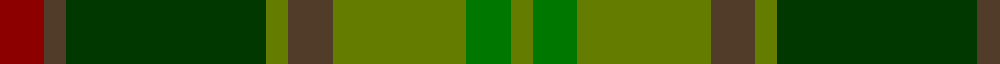

In pattern [GGGGGGGR](/patterns/gggggggr/).

This was sourced from register-of-tartans.  It is a [8 stripes tartan](/stripes/stripes8/).

Original link https://www.tartanregister.gov.uk/tartanDetails.aspx?ref=4135

## Attestations

This cloth appears in 2 source records; the oldest owns this page.

- 01/01/2002 — Tomass (register-of-tartans, [record](https://www.tartanregister.gov.uk/tartanDetails.aspx?ref=4135))
- pre 2002 — Tomass (Name) (tartans-authority, [record](http://www.tartansauthority.com/tartan-ferret/display/5106/))

## Register references

External register numbers recorded for this tartan.

- Scottish Register of Tartans: [4135](https://www.tartanregister.gov.uk/tartanDetails.aspx?ref=4135)
- Scottish Tartans Authority (ITI): 5106

## Thread count
DR/8 T4 G36 Ga4 T8 Ga24 Gb8 Ga/4

## Palette
Each colour and its ΔE from the base-6 reference it is a variant of.

| Colour | Shade | Base | ΔE (OKLab) |
|---|---|---|---|
| DR | <code style="background-color:#8C0000;">#8C0000</code> `#8C0000` | R <code style="background-color:#CC0000;">#CC0000</code> | 0.14 |
| G | <code style="background-color:#003800;">#003800</code> `#003800` | G <code style="background-color:#006100;">#006100</code> | 0.14 |
| Ga | <code style="background-color:#647C00;">#647C00</code> `#647C00` | G <code style="background-color:#006100;">#006100</code> | 0.13 |
| Gb | <code style="background-color:#007800;">#007800</code> `#007800` | G <code style="background-color:#006100;">#006100</code> | 0.07 |
| T | <code style="background-color:#503C28;">#503C28</code> `#503C28` | G <code style="background-color:#006100;">#006100</code> | 0.15 |

# Sample pattern

## Nearest tartans

The nearest existing variants by ΔTartan distance.

1. [MacAart (Personal)](/setts/s10/g9k2g2r2ga6k1y1k1ga6r3~g604000-ga006818-k101010-r880000-yd09800~x4/) — ΔT 1.03
1. [MacAart (Personal)](/setts/s11/r3g6k1y1k1g6r2ga2k2ga9k2~g006818-ga604000-k101010-r880000-yd09800~x4/) — ΔT 1.28
1. [Moncton, City of](/setts/s9/g4r1b2r1g10ga5r3ga10y1~b2c2c80-g006818-ga885c00-rc80000-ye8c000~x4/) — ΔT 1.29
1. [State Seal of Minnesota (Fashion)](/setts/s8/r4g46r10b10ga33b5ga4y3~b2c2c80-g006818-ga604000-r880000-ybc8c00~x2/) — ΔT 1.30
1. [MacSween Hunting (Lochs, Isle of Lewis) (Personal)](/setts/s7/g3r3g31ga18g4k22y3~g004c00-ga003820-k101010-rc80000-ye0a126/) — ΔT 1.35
1. [Lawrence's Seven Pillars of Khaki](/setts/s9/g3b12g10b6g8ga6g8r23ra3~b5c8ca8-g006818-ga289c18-r98481c-rab03000~x2/) — ΔT 1.45
1. [John Muir Way](/setts/s8/g35ga19r3gb8r3ga8r3b3~b5f749c-g604000-ga003c14-gb767e52-rc80000~x2/) — ΔT 1.46
1. [Handley (Personal)](/setts/s12/g12w2k5ga24k4g9k2ga13k4g13k2y3~g285800-ga006818-k101010-we0e0e0-ye8c000~x2/) — ΔT 1.46
1. [Ramsay (Green Fashion)](/setts/s7/g1r7g7b2r1ga15w1~b5c5c5c-g006818-ga285800-r880000-wc0c0c0~x4/) — ΔT 1.48
1. [Cavan, County](/setts/s10/g3k2ga26k4gb9g3gb9k4r9k3~g8c7038-ga006818-gb604000-k101010-rc80000~x2/) — ΔT 1.51

## Neighbour map

Every grey dot is one of 15726 variants placed by the first two principal components of the ΔTartan feature space (44% of its variance). Red is this tartan; blue dots are its nearest — click one to open its page.

<svg viewBox="0 0 640 380" role="img" style="max-width:100%;height:auto;border:1px solid #e0e0e0;border-radius:4px;display:block" xmlns="http://www.w3.org/2000/svg"><image href="/nn/cloud.v1.png" width="640" height="380"/><a href="/setts/s10/g9k2g2r2ga6k1y1k1ga6r3~g604000-ga006818-k101010-r880000-yd09800~x4/"><circle cx="215.7" cy="205.7" r="4" fill="#3465a4"><title>MacAart (Personal)</title></circle></a><a href="/setts/s11/r3g6k1y1k1g6r2ga2k2ga9k2~g006818-ga604000-k101010-r880000-yd09800~x4/"><circle cx="193.1" cy="197.9" r="4" fill="#3465a4"><title>MacAart (Personal)</title></circle></a><a href="/setts/s9/g4r1b2r1g10ga5r3ga10y1~b2c2c80-g006818-ga885c00-rc80000-ye8c000~x4/"><circle cx="256.0" cy="199.8" r="4" fill="#3465a4"><title>Moncton, City of</title></circle></a><a href="/setts/s8/r4g46r10b10ga33b5ga4y3~b2c2c80-g006818-ga604000-r880000-ybc8c00~x2/"><circle cx="287.7" cy="183.4" r="4" fill="#3465a4"><title>State Seal of Minnesota (Fashion)</title></circle></a><a href="/setts/s7/g3r3g31ga18g4k22y3~g004c00-ga003820-k101010-rc80000-ye0a126/"><circle cx="275.1" cy="219.0" r="4" fill="#3465a4"><title>MacSween Hunting (Lochs, Isle of Lewis) (Personal)</title></circle></a><a href="/setts/s9/g3b12g10b6g8ga6g8r23ra3~b5c8ca8-g006818-ga289c18-r98481c-rab03000~x2/"><circle cx="196.8" cy="226.0" r="4" fill="#3465a4"><title>Lawrence's Seven Pillars of Khaki</title></circle></a><a href="/setts/s8/g35ga19r3gb8r3ga8r3b3~b5f749c-g604000-ga003c14-gb767e52-rc80000~x2/"><circle cx="300.9" cy="194.8" r="4" fill="#3465a4"><title>John Muir Way</title></circle></a><a href="/setts/s12/g12w2k5ga24k4g9k2ga13k4g13k2y3~g285800-ga006818-k101010-we0e0e0-ye8c000~x2/"><circle cx="227.9" cy="187.5" r="4" fill="#3465a4"><title>Handley (Personal)</title></circle></a><a href="/setts/s7/g1r7g7b2r1ga15w1~b5c5c5c-g006818-ga285800-r880000-wc0c0c0~x4/"><circle cx="313.0" cy="199.5" r="4" fill="#3465a4"><title>Ramsay (Green Fashion)</title></circle></a><a href="/setts/s10/g3k2ga26k4gb9g3gb9k4r9k3~g8c7038-ga006818-gb604000-k101010-rc80000~x2/"><circle cx="204.6" cy="168.6" r="4" fill="#3465a4"><title>Cavan, County</title></circle></a><circle cx="232.1" cy="209.5" r="5" fill="#c00000"/></svg>

ID: /setts/s8/r2g1ga9gb1g2gb6gc2gb1~g503c28-ga003800-gb647c00-gc007800-r8c0000~x4/
