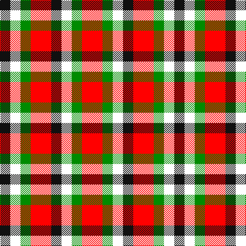

In pattern [KWGRKWGR](/patterns/kwgrkwgr/).

This was sourced from register-of-tartans.  It is a [8 stripes tartan](/stripes/stripes8/).

Original link https://www.tartanregister.gov.uk/tartanDetails.aspx?ref=10249

## Thread count
K/20 W20 G20 R40 K20 W20 G20 R/40

## Palette
Each colour and its ΔE from the base-6 reference it is a variant of.

| Colour | Shade | Base | ΔE (OKLab) |
|---|---|---|---|
| G | <code style="background-color:#008B00;">#008B00</code> `#008B00` | G <code style="background-color:#006100;">#006100</code> | 0.13 |
| K | <code style="background-color:#101010;">#101010</code> `#101010` | K <code style="background-color:#000000;">#000000</code> | 0.17 |
| R | <code style="background-color:#FF0000;">#FF0000</code> `#FF0000` | R <code style="background-color:#CC0000;">#CC0000</code> | 0.11 |
| W | <code style="background-color:#FFFFFF;">#FFFFFF</code> `#FFFFFF` | W <code style="background-color:#F7F7F7;">#F7F7F7</code> | 0.02 |

# Sample pattern

## Nearest tartans

The nearest existing variants by ΔTartan distance.

1. [Harazeen (Personal)](/setts/s8/r2g1w1k1r2g1w1k1~g00801c-k101010-rc80000-we0e0e0~x20/) — ΔT 0.74
1. [Duffus Lord... Portrait Tartan Tartan Number: 1661. Earliest known date: 1705 The hose in the portrait of Lord Duffus (1705). Reconstructed and woven by Scottish Tartans Society. See products available Copyright © Blair Urquhart, Comrie, 2015](/setts/s7/y15r7k12y12k12g12r7~g604000-k101010-rc80000-ye8c000~x2/) — ΔT 1.36
1. [Duffus, Lord](/setts/s7/y15r7k12y12k12ra12r7~k000000-rc00000-ra806050-yf0c000~x2/) — ΔT 1.51
1. [Unidentified Arisaid #2](/setts/s12/r30w24g15ga15w24r30w24ga15g15w24r30w23~g002814-ga309c18-r960028-we0e0e0~x2/) — ΔT 1.61
1. [Unidentified, Arisaid](/setts/s12/r30w24g15ga15w24r30w24ga15g15w24r30w23~g003000-ga30a010-r900030-we0e0e0~x2/) — ΔT 1.64
1. [Havel](/setts/s5/r21k21w10k10w21~k101010-rff0000-wffffff~x2/) — ΔT 1.69
1. [Akins Red Dress](/setts/s9/g6r4g5r13k13w5k13r13y6~g006818-k101010-rc8002c-wffffff-yffd700~x2/) — ΔT 1.81
1. [Havel (Fashion)](/setts/s5/r21k21w10k10w21~k101010-rc80000-we0e0e0~x2/) — ΔT 1.82
1. [Boxer Beauty](/setts/s7/k13g28y13g28k18w18k13~g603800-k101010-wfcfcfc-ydc943c~x2/) — ΔT 1.86
1. [Akins Dress (Clan)](/setts/s9/g6r4g5r13k13w5k13r13y6~g006818-k101010-rc80000-we0e0e0-ye8c000~x2/) — ΔT 1.89

## Neighbour map

Every grey dot is one of 15726 variants placed by the first two principal components of the ΔTartan feature space (44% of its variance). Red is this tartan; blue dots are its nearest — click one to open its page.

<svg viewBox="0 0 640 380" role="img" style="max-width:100%;height:auto;border:1px solid #e0e0e0;border-radius:4px;display:block" xmlns="http://www.w3.org/2000/svg"><image href="/nn/cloud.v1.png" width="640" height="380"/><a href="/setts/s8/r2g1w1k1r2g1w1k1~g00801c-k101010-rc80000-we0e0e0~x20/"><circle cx="53.8" cy="283.9" r="4" fill="#3465a4"><title>Harazeen (Personal)</title></circle></a><a href="/setts/s7/y15r7k12y12k12g12r7~g604000-k101010-rc80000-ye8c000~x2/"><circle cx="22.7" cy="304.6" r="4" fill="#3465a4"><title>Duffus Lord... Portrait Tartan Tartan Number: 1661. Earliest known date: 1705 The hose in the portrait of Lord Duffus (1705). Reconstructed and woven by Scottish Tartans Society. See products available Copyright © Blair Urquhart, Comrie, 2015</title></circle></a><a href="/setts/s7/y15r7k12y12k12ra12r7~k000000-rc00000-ra806050-yf0c000~x2/"><circle cx="14.0" cy="302.1" r="4" fill="#3465a4"><title>Duffus, Lord</title></circle></a><a href="/setts/s12/r30w24g15ga15w24r30w24ga15g15w24r30w23~g002814-ga309c18-r960028-we0e0e0~x2/"><circle cx="54.4" cy="278.5" r="4" fill="#3465a4"><title>Unidentified Arisaid #2</title></circle></a><a href="/setts/s12/r30w24g15ga15w24r30w24ga15g15w24r30w23~g003000-ga30a010-r900030-we0e0e0~x2/"><circle cx="54.0" cy="278.8" r="4" fill="#3465a4"><title>Unidentified, Arisaid</title></circle></a><a href="/setts/s5/r21k21w10k10w21~k101010-rff0000-wffffff~x2/"><circle cx="74.2" cy="313.7" r="4" fill="#3465a4"><title>Havel</title></circle></a><a href="/setts/s9/g6r4g5r13k13w5k13r13y6~g006818-k101010-rc8002c-wffffff-yffd700~x2/"><circle cx="67.3" cy="233.7" r="4" fill="#3465a4"><title>Akins Red Dress</title></circle></a><a href="/setts/s5/r21k21w10k10w21~k101010-rc80000-we0e0e0~x2/"><circle cx="79.9" cy="320.2" r="4" fill="#3465a4"><title>Havel (Fashion)</title></circle></a><a href="/setts/s7/k13g28y13g28k18w18k13~g603800-k101010-wfcfcfc-ydc943c~x2/"><circle cx="80.3" cy="300.3" r="4" fill="#3465a4"><title>Boxer Beauty</title></circle></a><a href="/setts/s9/g6r4g5r13k13w5k13r13y6~g006818-k101010-rc80000-we0e0e0-ye8c000~x2/"><circle cx="73.3" cy="236.7" r="4" fill="#3465a4"><title>Akins Dress (Clan)</title></circle></a><circle cx="44.5" cy="274.9" r="5" fill="#c00000"/></svg>

ID: /setts/s8/r2g1w1k1r2g1w1k1~g008b00-k101010-rff0000-wffffff~x20/
