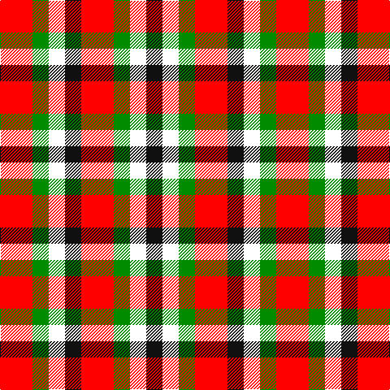

This page is one **sett** — a single exact thread-count. It belongs to the [tartan](/tartans/r2g1w1k1/)
(the same proportion at any scale), whose colour order is pattern [KWGRKWGR](/stripes/kwgrkwgr/).

Sourced from register-of-tartans.  It is a [8 stripe tartan](/stripes/stripes8/).

Original link https://www.tartanregister.gov.uk/tartanDetails.aspx?ref=10249

2 attestations — the source records this cloth was collapsed from (oldest owns this page)

<ul>
<li>24/06/2010 — Harazeen (register-of-tartans, <a href="https://www.tartanregister.gov.uk/tartanDetails.aspx?ref=10249">record</a>)</li>
<li>pre 2010 — Harazeen (Personal) (tartans-authority, <a href="http://www.tartansauthority.com/tartan-ferret/display/10249/">record</a>)</li>
</ul>

## Register references

External register numbers recorded for this tartan.

- Scottish Register of Tartans: [10249](https://www.tartanregister.gov.uk/tartanDetails.aspx?ref=10249)

## Thread count
R/40 G20 W20 K20 R40 G20 W20 K/20

## Palette
Each colour and the base-6 reference it is a variant of.

| Colour | Shade | Base |
|---|---|---|
| G | <code style="background-color:#008B00;">#008B00</code> `oklch(55.2% 0.188 142.5)` <small>#008B00</small> | G <code style="background-color:#006100;">#006100</code> |
| K | <code style="background-color:#101010;">#101010</code> `oklch(17.3% 0.000 89.9)` <small>#101010</small> | K <code style="background-color:#000000;">#000000</code> |
| R | <code style="background-color:#FF0000;">#FF0000</code> `oklch(62.8% 0.258 29.2)` <small>#FF0000</small> | R <code style="background-color:#CC0000;">#CC0000</code> |
| W | <code style="background-color:#FFFFFF;">#FFFFFF</code> `oklch(100.0% 0.000 89.9)` <small>#FFFFFF</small> | W <code style="background-color:#F7F7F7;">#F7F7F7</code> |

# Sample pattern

## Nearest tartans

The nearest existing variants by ΔTartan distance, with this tartan at the top so the swatches line up against it.

ΔTartan

Tartan

Sett

—

<a href="/ttd/edit/#slug=r2g1w1k1~x20">Harazeen</a> <a class="nn-out" href="/setts/s8/r2g1w1k1~x20/" title="open its dictionary page">↗</a>

1.37

<a href="/ttd/edit/#slug=ly15r7k12ly12k12dy12r7~x2">Duffus Lord... Portrait Tartan Tartan Number: 1661. Earliest known date: 1705 The hose in the portrait of Lord Duffus (1705). Reconstructed and woven by Scottish Tartans Society. See products available Copyright © Blair Urquhart, Comrie, 2015</a> <a class="nn-out" href="/setts/s7/ly15r7k12ly12k12dy12r7~x2/" title="open its dictionary page">↗</a>

1.51

<a href="/ttd/edit/#slug=ly15r7k12ly12k12o12r7~x2">Duffus, Lord</a> <a class="nn-out" href="/setts/s7/ly15r7k12ly12k12o12r7~x2/" title="open its dictionary page">↗</a>

1.61

<a href="/ttd/edit/#slug=r30w24dg15g15w24r30w24g15dg15w24r30w23~x2">Unidentified Arisaid #2</a> <a class="nn-out" href="/setts/s12/r30w24dg15g15w24r30w24g15dg15w24r30w23~x2/" title="open its dictionary page">↗</a>

1.69

<a href="/ttd/edit/#slug=r21k21w10k10w21~x2">Havel</a> <a class="nn-out" href="/setts/s5/r21k21w10k10w21~x2/" title="open its dictionary page">↗</a>

1.81

<a href="/ttd/edit/#slug=g6r4g5r13k13w5k13r13ly6~x2">Akins Red Dress</a> <a class="nn-out" href="/setts/s9/g6r4g5r13k13w5k13r13ly6~x2/" title="open its dictionary page">↗</a>

1.89

<a href="/ttd/edit/#slug=k13dy28lo13dy28k18w18k13~x2">Boxer Beauty</a> <a class="nn-out" href="/setts/s7/k13dy28lo13dy28k18w18k13~x2/" title="open its dictionary page">↗</a>

1.92

<a href="/ttd/edit/#slug=w3r2w1dt2r2~x4">Oakland Centre</a> <a class="nn-out" href="/setts/s5/w3r2w1dt2r2~x4/" title="open its dictionary page">↗</a>

1.95

<a href="/ttd/edit/#slug=r10db6k8g10r6g3r6~x2">MacDuff</a> <a class="nn-out" href="/setts/s7/r10db6k8g10r6g3r6~x2/" title="open its dictionary page">↗</a>

1.95

<a href="/ttd/edit/#slug=g23r23w9r23g23w9~x2">Omani Regiment 2nd Pipe Sqn.</a> <a class="nn-out" href="/setts/s6/g23r23w9r23g23w9~x2/" title="open its dictionary page">↗</a>

1.96

<a href="/ttd/edit/#slug=r3k1dg1k1lb3~x4">Clark</a> <a class="nn-out" href="/setts/s5/r3k1dg1k1lb3~x4/" title="open its dictionary page">↗</a>

## Neighbour map

Every grey dot is one of 14299 variants placed by the first two principal components of the ΔTartan feature space (44% of its variance). Red is this tartan; blue dots are its nearest — click one to open its page.

<svg viewBox="0 0 640 380" role="img" style="max-width:100%;height:auto;border:1px solid #e0e0e0;border-radius:4px;display:block" xmlns="http://www.w3.org/2000/svg"><image href="/nn/cloud.v1.png" width="640" height="380"/><a href="/setts/s7/ly15r7k12ly12k12dy12r7~x2/"><circle cx="24.2" cy="300.6" r="4" fill="#3465a4"><title>Duffus Lord... Portrait Tartan Tartan Number: 1661. Earliest known date: 1705 The hose in the portrait of Lord Duffus (1705). Reconstructed and woven by Scottish Tartans Society. See products available Copyright © Blair Urquhart, Comrie, 2015</title></circle></a><a href="/setts/s7/ly15r7k12ly12k12o12r7~x2/"><circle cx="14.7" cy="297.0" r="4" fill="#3465a4"><title>Duffus, Lord</title></circle></a><a href="/setts/s12/r30w24dg15g15w24r30w24g15dg15w24r30w23~x2/"><circle cx="55.9" cy="274.1" r="4" fill="#3465a4"><title>Unidentified Arisaid #2</title></circle></a><a href="/setts/s5/r21k21w10k10w21~x2/"><circle cx="75.6" cy="305.9" r="4" fill="#3465a4"><title>Havel</title></circle></a><a href="/setts/s9/g6r4g5r13k13w5k13r13ly6~x2/"><circle cx="68.9" cy="230.5" r="4" fill="#3465a4"><title>Akins Red Dress</title></circle></a><a href="/setts/s7/k13dy28lo13dy28k18w18k13~x2/"><circle cx="83.8" cy="297.5" r="4" fill="#3465a4"><title>Boxer Beauty</title></circle></a><a href="/setts/s5/w3r2w1dt2r2~x4/"><circle cx="109.9" cy="292.5" r="4" fill="#3465a4"><title>Oakland Centre</title></circle></a><a href="/setts/s7/r10db6k8g10r6g3r6~x2/"><circle cx="115.7" cy="283.1" r="4" fill="#3465a4"><title>MacDuff</title></circle></a><a href="/setts/s6/g23r23w9r23g23w9~x2/"><circle cx="137.5" cy="302.8" r="4" fill="#3465a4"><title>Omani Regiment 2nd Pipe Sqn.</title></circle></a><a href="/setts/s5/r3k1dg1k1lb3~x4/"><circle cx="74.4" cy="254.3" r="4" fill="#3465a4"><title>Clark</title></circle></a><circle cx="45.5" cy="269.2" r="5" fill="#c00000"/></svg>

ID: /setts/s8/r2g1w1k1~x20/
