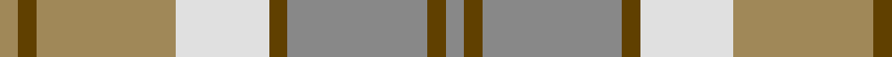

In pattern [RGRGWYGY](/patterns/rgrgwygy/).

This was sourced from register-of-tartans.  It is a [8 stripes tartan](/stripes/stripes8/).

Original link https://www.tartanregister.gov.uk/tartanDetails.aspx?ref=199

## Thread count
LT/4 T4 LT30 LN20 T4 N30 T4 N/4

## Palette
Each colour and its ΔE from the base-6 reference it is a variant of.

| Colour | Shade | Base | ΔE (OKLab) |
|---|---|---|---|
| LN | <code style="background-color:#E0E0E0;">#E0E0E0</code> `#E0E0E0` | W <code style="background-color:#F7F7F7;">#F7F7F7</code> | 0.07 |
| LT | <code style="background-color:#A08858;">#A08858</code> `#A08858` | Y <code style="background-color:#F2BF00;">#F2BF00</code> | 0.21 |
| N | <code style="background-color:#888888;">#888888</code> `#888888` | R <code style="background-color:#CC0000;">#CC0000</code> | 0.24 |
| T | <code style="background-color:#604000;">#604000</code> `#604000` | G <code style="background-color:#006100;">#006100</code> | 0.14 |

# Sample pattern

## Nearest tartans

The nearest existing variants by ΔTartan distance.

1. [Bannockbane, Grey](/setts/s8/g2r2g15r2w10ra15r2ra2~g808080-r806050-ra906030-we0e0e0~x2/) — ΔT 0.44
1. [Clyde Trade Tartan Tartan Number: 1296. Earliest known date: pre 1992 See Strathclyde District See products available Copyright © Blair Urquhart, Comrie, 2015](/setts/s10/w4b2w18r2b5ra16r2ra2r2ra2~b5c5c5c-rc80000-ra888888-wc0c0c0~x2/) — ΔT 1.13
1. [Clyde](/setts/s10/w4b2w18r2b5g16r2g2r2g2~b505050-g808080-rc00000-wc0c0c0~x2/) — ΔT 1.27
1. [MacPherson Gathering 1996](/setts/s9/b3r2g16r2b3r2ra16r2b3~b1870a4-g00643c-rc80000-ra888888~x4/) — ΔT 1.37
1. [O'Monaghan (Personal)](/setts/s10/g25w2b4y7b4w2ya25w2b4y7~b2888c4-g789484-wfcfcfc-yd87c00-yabc8c00~x2/) — ΔT 1.67
1. [Cairngorm Trade Tartan Tartan Number: 1314. Earliest known date: 1985 A sample of this tartan was recorded by the Scottish Tartans Society during the period 1970 to 1990. See products available Copyright © Blair Urquhart, Comrie, 2015](/setts/s6/b2w2y7wa14b2w2~b5c5c5c-we0e0e0-wac0c0c0-ye8c000~x2/) — ΔT 1.69
1. [Llama (Fashion)](/setts/s10/g2w19y2w2g3w3g3y6ya25w2~g745000-wf0e0d0-yfc8070-yab8a880~x2/) — ΔT 1.71
1. [Buchanhaven Heritage](/setts/s7/b24r27g20y6g20r2w3~b5c8ca8-g408060-rc82828-we0e0e0-ye0a126~x2/) — ΔT 1.72
1. [North American Sheep Breeders Association](/setts/s7/r2w1y17r14w15r2w2~r888888-wf8e8d8-ya08858~x2/) — ΔT 1.74
1. [Cairngorm](/setts/s6/b2w2y7wa14b2w2~b505050-we0e0e0-wac0c0c0-yf0c000~x2/) — ΔT 1.75

## Neighbour map

Every grey dot is one of 15726 variants placed by the first two principal components of the ΔTartan feature space (44% of its variance). Red is this tartan; blue dots are its nearest — click one to open its page.

<svg viewBox="0 0 640 380" role="img" style="max-width:100%;height:auto;border:1px solid #e0e0e0;border-radius:4px;display:block" xmlns="http://www.w3.org/2000/svg"><image href="/nn/cloud.v1.png" width="640" height="380"/><a href="/setts/s8/g2r2g15r2w10ra15r2ra2~g808080-r806050-ra906030-we0e0e0~x2/"><circle cx="219.7" cy="209.8" r="4" fill="#3465a4"><title>Bannockbane, Grey</title></circle></a><a href="/setts/s10/w4b2w18r2b5ra16r2ra2r2ra2~b5c5c5c-rc80000-ra888888-wc0c0c0~x2/"><circle cx="262.5" cy="180.6" r="4" fill="#3465a4"><title>Clyde Trade Tartan Tartan Number: 1296. Earliest known date: pre 1992 See Strathclyde District See products available Copyright © Blair Urquhart, Comrie, 2015</title></circle></a><a href="/setts/s10/w4b2w18r2b5g16r2g2r2g2~b505050-g808080-rc00000-wc0c0c0~x2/"><circle cx="248.8" cy="175.7" r="4" fill="#3465a4"><title>Clyde</title></circle></a><a href="/setts/s9/b3r2g16r2b3r2ra16r2b3~b1870a4-g00643c-rc80000-ra888888~x4/"><circle cx="225.2" cy="202.8" r="4" fill="#3465a4"><title>MacPherson Gathering 1996</title></circle></a><a href="/setts/s10/g25w2b4y7b4w2ya25w2b4y7~b2888c4-g789484-wfcfcfc-yd87c00-yabc8c00~x2/"><circle cx="211.5" cy="160.1" r="4" fill="#3465a4"><title>O'Monaghan (Personal)</title></circle></a><a href="/setts/s6/b2w2y7wa14b2w2~b5c5c5c-we0e0e0-wac0c0c0-ye8c000~x2/"><circle cx="276.2" cy="216.8" r="4" fill="#3465a4"><title>Cairngorm Trade Tartan Tartan Number: 1314. Earliest known date: 1985 A sample of this tartan was recorded by the Scottish Tartans Society during the period 1970 to 1990. See products available Copyright © Blair Urquhart, Comrie, 2015</title></circle></a><a href="/setts/s10/g2w19y2w2g3w3g3y6ya25w2~g745000-wf0e0d0-yfc8070-yab8a880~x2/"><circle cx="265.4" cy="151.3" r="4" fill="#3465a4"><title>Llama (Fashion)</title></circle></a><a href="/setts/s7/b24r27g20y6g20r2w3~b5c8ca8-g408060-rc82828-we0e0e0-ye0a126~x2/"><circle cx="224.5" cy="201.4" r="4" fill="#3465a4"><title>Buchanhaven Heritage</title></circle></a><a href="/setts/s7/r2w1y17r14w15r2w2~r888888-wf8e8d8-ya08858~x2/"><circle cx="274.0" cy="196.9" r="4" fill="#3465a4"><title>North American Sheep Breeders Association</title></circle></a><a href="/setts/s6/b2w2y7wa14b2w2~b505050-we0e0e0-wac0c0c0-yf0c000~x2/"><circle cx="262.2" cy="210.9" r="4" fill="#3465a4"><title>Cairngorm</title></circle></a><circle cx="213.2" cy="207.3" r="5" fill="#c00000"/></svg>

ID: /setts/s8/r2g2r15g2w10y15g2y2~g604000-r888888-we0e0e0-ya08858~x2/
