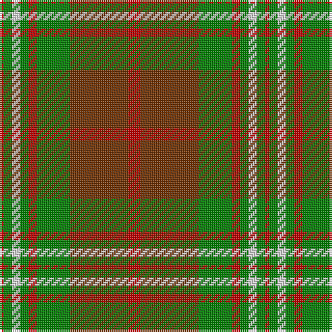

In pattern [RGWGRGRR](/patterns/rgwgrgrr/).

This was sourced from weddslist.  It is a [8 stripes tartan](/stripes/stripes8/).

Original link http://www.weddslist.com/cgi-bin/tartans/pg.pl?source=sts

## Thread count
R/2 G4 LN4 G4 R4 G16 T28 R/6

## Palette
Each colour and its ΔE from the base-6 reference it is a variant of.

| Colour | Shade | Base | ΔE (OKLab) |
|---|---|---|---|
| G | <code style="background-color:#008000;">#008000</code> `#008000` | G <code style="background-color:#006400;">#006400</code> | 0.09 |
| LN | <code style="background-color:#E0E0E0;">#E0E0E0</code> `#E0E0E0` | W <code style="background-color:#F4F4F0;">#F4F4F0</code> | 0.06 |
| R | <code style="background-color:#C00000;">#C00000</code> `#C00000` | R <code style="background-color:#C80000;">#C80000</code> | 0.02 |
| T | <code style="background-color:#703000;">#703000</code> `#703000` | R <code style="background-color:#C80000;">#C80000</code> | 0.18 |

# Sample pattern

ID: /setts/s8/r2g4w4g4r4g16ra28r6-g008000-rc00000-ra703000-we0e0e0/
