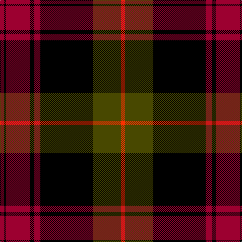

In pattern [RGKRKRKR](/patterns/rgkrkrkr/).

This was sourced from tartans-authority.  It is a [8 stripes tartan](/stripes/stripes8/).

Original link http://www.tartansauthority.com/tartan-ferret/display/3713/

## Attestations

This cloth appears in 2 source records; the oldest owns this page.

- 1983 (March) — Booth (Fashion) (tartans-authority, [record](http://www.tartansauthority.com/tartan-ferret/display/3713/))
- undated — Booth (register-of-tartans, [record](https://www.tartanregister.gov.uk/tartanDetails.aspx?ref=5331))

## Thread count
DR/8 K4 DR48 K8 DR12 K104 T56 R/8

## Palette
Each colour and its ΔE from the base-6 reference it is a variant of.

| Colour | Shade | Base | ΔE (OKLab) |
|---|---|---|---|
| DR | <code style="background-color:#9C0030;">#9C0030</code> `#9C0030` | R <code style="background-color:#CC0000;">#CC0000</code> | 0.11 |
| K | <code style="background-color:#000000;">#000000</code> `#000000` | K <code style="background-color:#000000;">#000000</code> | 0.00 |
| R | <code style="background-color:#FC3000;">#FC3000</code> `#FC3000` | R <code style="background-color:#CC0000;">#CC0000</code> | 0.11 |
| T | <code style="background-color:#484800;">#484800</code> `#484800` | G <code style="background-color:#006100;">#006100</code> | 0.09 |

# Sample pattern

## Nearest tartans

The nearest existing variants by ΔTartan distance.

1. [Brown (Clan)](/setts/s8/b6r1b2r1b2k18r8g2~b1c1c50-g004800-k000000-rc80000~x4/) — ΔT 0.84
1. [Brown](/setts/s8/b6r1b2r1b2k18r8g2~b304080-g008000-k000000-rc00000~x2/) — ΔT 0.95
1. [Brown](/setts/s8/b6r1b2r1b2k18r8g2~b2c2c80-g004800-k000000-rc80000~x4/) — ΔT 1.03
1. [Southdown Tartan Tartan Number: 1194. Earliest known date: pre 2003 Designed for the Glasgow conference in 2002 See products available Copyright © Blair Urquhart, Comrie, 2015](/setts/s9/k8r1k3w5k5w3k5b23r3~b480800-k101010-rc80000-we0e0e0~x2/) — ΔT 1.13
1. [Alyssa's Theme](/setts/s13/b2k13b8k2r1g1r21k1r1g2k8r13k2~b38558f-g7d7d7d-k000000-r800300~x2/) — ΔT 1.22
1. [Wcwm 1684](/setts/s10/r48k10b12k2r3k2b12k10r2y3~b14283c-k000000-r8c0000-yc89800~x2/) — ΔT 1.22
1. [Cunningham](/setts/s7/k3r1k30r28b1r1y3~b000052-k000000-raa0000-yaaaaaa~x2/) — ΔT 1.34
1. [Carson Red (Personal)](/setts/s8/b19r2b3r2b3k43r22g3~b446c84-g006818-k101010-rc80000~x2/) — ΔT 1.38
1. [Kerr](/setts/s10/g20k1g2k1g3k14r28k1r2k4~g11450d-k000000-raa0000~x2/) — ΔT 1.40
1. [Grady, Highlands](/setts/s9/k36r3b3r3k8b23r18g3r3~b304080-g008000-k000000-rc00000~x2/) — ΔT 1.44

## Neighbour map

Every grey dot is one of 15726 variants placed by the first two principal components of the ΔTartan feature space (44% of its variance). Red is this tartan; blue dots are its nearest — click one to open its page.

<svg viewBox="0 0 640 380" role="img" style="max-width:100%;height:auto;border:1px solid #e0e0e0;border-radius:4px;display:block" xmlns="http://www.w3.org/2000/svg"><image href="/nn/cloud.v1.png" width="640" height="380"/><a href="/setts/s8/b6r1b2r1b2k18r8g2~b1c1c50-g004800-k000000-rc80000~x4/"><circle cx="261.6" cy="159.0" r="4" fill="#3465a4"><title>Brown (Clan)</title></circle></a><a href="/setts/s8/b6r1b2r1b2k18r8g2~b304080-g008000-k000000-rc00000~x2/"><circle cx="252.2" cy="154.9" r="4" fill="#3465a4"><title>Brown</title></circle></a><a href="/setts/s8/b6r1b2r1b2k18r8g2~b2c2c80-g004800-k000000-rc80000~x4/"><circle cx="255.6" cy="156.0" r="4" fill="#3465a4"><title>Brown</title></circle></a><a href="/setts/s9/k8r1k3w5k5w3k5b23r3~b480800-k101010-rc80000-we0e0e0~x2/"><circle cx="245.8" cy="143.5" r="4" fill="#3465a4"><title>Southdown Tartan Tartan Number: 1194. Earliest known date: pre 2003 Designed for the Glasgow conference in 2002 See products available Copyright © Blair Urquhart, Comrie, 2015</title></circle></a><a href="/setts/s13/b2k13b8k2r1g1r21k1r1g2k8r13k2~b38558f-g7d7d7d-k000000-r800300~x2/"><circle cx="290.6" cy="134.3" r="4" fill="#3465a4"><title>Alyssa's Theme</title></circle></a><a href="/setts/s10/r48k10b12k2r3k2b12k10r2y3~b14283c-k000000-r8c0000-yc89800~x2/"><circle cx="332.8" cy="131.0" r="4" fill="#3465a4"><title>Wcwm 1684</title></circle></a><a href="/setts/s7/k3r1k30r28b1r1y3~b000052-k000000-raa0000-yaaaaaa~x2/"><circle cx="346.7" cy="131.5" r="4" fill="#3465a4"><title>Cunningham</title></circle></a><a href="/setts/s8/b19r2b3r2b3k43r22g3~b446c84-g006818-k101010-rc80000~x2/"><circle cx="282.8" cy="147.8" r="4" fill="#3465a4"><title>Carson Red (Personal)</title></circle></a><a href="/setts/s10/g20k1g2k1g3k14r28k1r2k4~g11450d-k000000-raa0000~x2/"><circle cx="289.2" cy="140.6" r="4" fill="#3465a4"><title>Kerr</title></circle></a><a href="/setts/s9/k36r3b3r3k8b23r18g3r3~b304080-g008000-k000000-rc00000~x2/"><circle cx="229.9" cy="168.5" r="4" fill="#3465a4"><title>Grady, Highlands</title></circle></a><circle cx="287.7" cy="146.5" r="5" fill="#c00000"/></svg>

ID: /setts/s8/r2k1r12k2r3k26g14ra2~g484800-k000000-r9c0030-rafc3000~x4/
