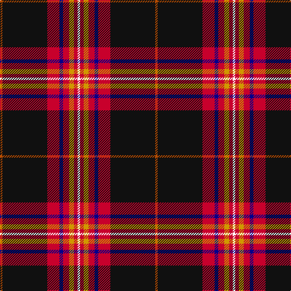

In pattern [RKRBRYRW](/patterns/rkrbryrw/).

This was sourced from register-of-tartans.  It is a [8 stripes tartan](/stripes/stripes8/).

Original link https://www.tartanregister.gov.uk/tartanDetails.aspx?ref=11059

## Thread count
DO/4 K74 R20 DB6 R10 DY8 R6 W/4

## Palette
Each colour and its ΔE from the base-6 reference it is a variant of.

| Colour | Shade | Base | ΔE (OKLab) |
|---|---|---|---|
| DB | <code style="background-color:#00008C;">#00008C</code> `#00008C` | B <code style="background-color:#2A418A;">#2A418A</code> | 0.13 |
| DO | <code style="background-color:#B84C00;">#B84C00</code> `#B84C00` | R <code style="background-color:#CC0000;">#CC0000</code> | 0.08 |
| DY | <code style="background-color:#D09800;">#D09800</code> `#D09800` | Y <code style="background-color:#F2BF00;">#F2BF00</code> | 0.12 |
| K | <code style="background-color:#101010;">#101010</code> `#101010` | K <code style="background-color:#000000;">#000000</code> | 0.17 |
| R | <code style="background-color:#C8002C;">#C8002C</code> `#C8002C` | R <code style="background-color:#CC0000;">#CC0000</code> | 0.03 |
| W | <code style="background-color:#FFFFFF;">#FFFFFF</code> `#FFFFFF` | W <code style="background-color:#F7F7F7;">#F7F7F7</code> | 0.02 |

# Sample pattern

## Nearest tartans

The nearest existing variants by ΔTartan distance.

1. [Westin Kierland](/setts/s8/r2k37ra10b3ra5y4ra3w2x2~b2c2c80-k101010-rb84c00-rac80000-wfcfcfc-ye8c000/) — ΔT 0.26
1. [Westin Kierland (Corporate)](/setts/s8/w2r3y4r5b3r10k38ya2x2~b2c2c80-k101010-r880000-we8ccb8-yfccc00-yabc8c00/) — ΔT 0.55
1. [Legion of Frontiersmen](/setts/s8/b62y7g7r3w3ba13w3r5x2~b501400-ba2c2c80-g006818-rc80000-wfcfcfc-yfccc00/) — ΔT 0.83
1. [Legion of Frontiersmen](/setts/s8/b62y7g7r3w3ba13w3r5x2~b441800-ba000048-g008b00-rc80000-wffffff-yffd700/) — ΔT 0.87
1. [Norwegian Night](/setts/s11/b6w3r14k3y2k2w2k38w2k2y2x2~b271b86-k120a01-rdd1212-wf7f1e8-yef8f06/) — ΔT 1.24
1. [Hyland Evening (Personal)](/setts/s8/b3y2r19ra4ba6k36ba2y3x2~b440044-ba780078-k101010-rc8002c-rab03000-ydc943c/) — ΔT 1.30
1. [MacNiven](/setts/s9/g18ga2b5r45ba3b18ba3r5w2~b000050-ba304080-g008000-ga30a010-rc00000-we0e0e0/) — ΔT 1.31
1. [Iberia Dress, Black (Fashion)](/setts/s7/k60w2r10g6w4r15y10x2~g003820-k101010-rc80000-we0e0e0-ye8c000/) — ΔT 1.32
1. [Sreijsener (Name)](/setts/s8/r8ra12k6ra33k72rb6k8w6~k101010-rc8002c-ra980044-rb888888-we0e0e0/) — ΔT 1.36
1. [MacNiven](/setts/s9/g18ga2b5r45w3b18w3r8wa2x2~b1c0070-g006818-ga289c18-r880000-wa8ace8-wac0c0c0/) — ΔT 1.40

## Neighbour map

Every grey dot is one of 15726 variants placed by the first two principal components of the ΔTartan feature space (44% of its variance). Red is this tartan; blue dots are its nearest — click one to open its page.

<svg viewBox="0 0 640 380" role="img" style="max-width:100%;height:auto;border:1px solid #e0e0e0;border-radius:4px;display:block" xmlns="http://www.w3.org/2000/svg"><image href="/nn/cloud.v1.png" width="640" height="380"/><a href="/setts/s8/r2k37ra10b3ra5y4ra3w2x2~b2c2c80-k101010-rb84c00-rac80000-wfcfcfc-ye8c000/"><circle cx="295.7" cy="103.4" r="4" fill="#3465a4"><title>Westin Kierland</title></circle></a><a href="/setts/s8/w2r3y4r5b3r10k38ya2x2~b2c2c80-k101010-r880000-we8ccb8-yfccc00-yabc8c00/"><circle cx="311.5" cy="109.9" r="4" fill="#3465a4"><title>Westin Kierland (Corporate)</title></circle></a><a href="/setts/s8/b62y7g7r3w3ba13w3r5x2~b501400-ba2c2c80-g006818-rc80000-wfcfcfc-yfccc00/"><circle cx="325.6" cy="94.6" r="4" fill="#3465a4"><title>Legion of Frontiersmen</title></circle></a><a href="/setts/s8/b62y7g7r3w3ba13w3r5x2~b441800-ba000048-g008b00-rc80000-wffffff-yffd700/"><circle cx="314.3" cy="94.2" r="4" fill="#3465a4"><title>Legion of Frontiersmen</title></circle></a><a href="/setts/s11/b6w3r14k3y2k2w2k38w2k2y2x2~b271b86-k120a01-rdd1212-wf7f1e8-yef8f06/"><circle cx="315.6" cy="95.0" r="4" fill="#3465a4"><title>Norwegian Night</title></circle></a><a href="/setts/s8/b3y2r19ra4ba6k36ba2y3x2~b440044-ba780078-k101010-rc8002c-rab03000-ydc943c/"><circle cx="253.1" cy="113.1" r="4" fill="#3465a4"><title>Hyland Evening (Personal)</title></circle></a><a href="/setts/s9/g18ga2b5r45ba3b18ba3r5w2~b000050-ba304080-g008000-ga30a010-rc00000-we0e0e0/"><circle cx="255.9" cy="95.4" r="4" fill="#3465a4"><title>MacNiven</title></circle></a><a href="/setts/s7/k60w2r10g6w4r15y10x2~g003820-k101010-rc80000-we0e0e0-ye8c000/"><circle cx="314.7" cy="113.3" r="4" fill="#3465a4"><title>Iberia Dress, Black (Fashion)</title></circle></a><a href="/setts/s8/r8ra12k6ra33k72rb6k8w6~k101010-rc8002c-ra980044-rb888888-we0e0e0/"><circle cx="318.0" cy="155.4" r="4" fill="#3465a4"><title>Sreijsener (Name)</title></circle></a><a href="/setts/s9/g18ga2b5r45w3b18w3r8wa2x2~b1c0070-g006818-ga289c18-r880000-wa8ace8-wac0c0c0/"><circle cx="279.5" cy="108.7" r="4" fill="#3465a4"><title>MacNiven</title></circle></a><circle cx="298.6" cy="104.8" r="5" fill="#c00000"/></svg>

ID: /setts/s8/r2k37ra10b3ra5y4ra3w2x2~b00008c-k101010-rb84c00-rac8002c-wffffff-yd09800/
