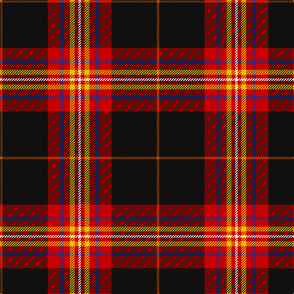

In pattern [RKRBRYRW](/patterns/rkrbryrw/).

This was sourced from tartans-authority.  It is a [8 stripes tartan](/stripes/stripes8/).

Original link http://www.tartansauthority.com/tartan-ferret/display/11059/

## Thread count
DO/4 K74 R20 DB6 R10 Y8 R6 W/4

## Palette
Each colour and its ΔE from the base-6 reference it is a variant of.

| Colour | Shade | Base | ΔE (OKLab) |
|---|---|---|---|
| DB | <code style="background-color:#2C2C80;">#2C2C80</code> `#2C2C80` | B <code style="background-color:#2A418A;">#2A418A</code> | 0.06 |
| DO | <code style="background-color:#B84C00;">#B84C00</code> `#B84C00` | R <code style="background-color:#CC0000;">#CC0000</code> | 0.08 |
| K | <code style="background-color:#101010;">#101010</code> `#101010` | K <code style="background-color:#000000;">#000000</code> | 0.17 |
| R | <code style="background-color:#C80000;">#C80000</code> `#C80000` | R <code style="background-color:#CC0000;">#CC0000</code> | 0.01 |
| W | <code style="background-color:#FCFCFC;">#FCFCFC</code> `#FCFCFC` | W <code style="background-color:#F7F7F7;">#F7F7F7</code> | 0.01 |
| Y | <code style="background-color:#E8C000;">#E8C000</code> `#E8C000` | Y <code style="background-color:#F2BF00;">#F2BF00</code> | 0.02 |

# Sample pattern

## Nearest tartans

The nearest existing variants by ΔTartan distance.

1. [Westin Kierland](/setts/s8/r2k37ra10b3ra5y4ra3w2x2~b00008c-k101010-rb84c00-rac8002c-wffffff-yd09800/) — ΔT 0.26
1. [Westin Kierland (Corporate)](/setts/s8/w2r3y4r5b3r10k38ya2x2~b2c2c80-k101010-r880000-we8ccb8-yfccc00-yabc8c00/) — ΔT 0.59
1. [Legion of Frontiersmen](/setts/s8/b62y7g7r3w3ba13w3r5x2~b441800-ba000048-g008b00-rc80000-wffffff-yffd700/) — ΔT 0.71
1. [Legion of Frontiersmen](/setts/s8/b62y7g7r3w3ba13w3r5x2~b501400-ba2c2c80-g006818-rc80000-wfcfcfc-yfccc00/) — ΔT 0.73
1. [Norwegian Night](/setts/s11/b6w3r14k3y2k2w2k38w2k2y2x2~b271b86-k120a01-rdd1212-wf7f1e8-yef8f06/) — ΔT 1.20
1. [Iberia Dress, Black (Fashion)](/setts/s7/k60w2r10g6w4r15y10x2~g003820-k101010-rc80000-we0e0e0-ye8c000/) — ΔT 1.25
1. [MacNiven](/setts/s9/g18ga2b5r45ba3b18ba3r5w2~b000050-ba304080-g008000-ga30a010-rc00000-we0e0e0/) — ΔT 1.27
1. [Hyland Evening (Personal)](/setts/s8/b3y2r19ra4ba6k36ba2y3x2~b440044-ba780078-k101010-rc8002c-rab03000-ydc943c/) — ΔT 1.40
1. [Kaptain Family (Personal)](/setts/s8/k1w1y2g1k10b1r2w1x10~b2c2c80-g285800-k101010-rdc0000-wf8f8f8-yfccc00/) — ΔT 1.42
1. [Stewart of Galloway](/setts/s12/k3r24k4y1k2w1b4g6r3k1r2w1x2~b304080-g008000-k000000-rc00000-we0e0e0-yf0c000/) — ΔT 1.44

## Neighbour map

Every grey dot is one of 15726 variants placed by the first two principal components of the ΔTartan feature space (44% of its variance). Red is this tartan; blue dots are its nearest — click one to open its page.

<svg viewBox="0 0 640 380" role="img" style="max-width:100%;height:auto;border:1px solid #e0e0e0;border-radius:4px;display:block" xmlns="http://www.w3.org/2000/svg"><image href="/nn/cloud.v1.png" width="640" height="380"/><a href="/setts/s8/r2k37ra10b3ra5y4ra3w2x2~b00008c-k101010-rb84c00-rac8002c-wffffff-yd09800/"><circle cx="298.6" cy="104.8" r="4" fill="#3465a4"><title>Westin Kierland</title></circle></a><a href="/setts/s8/w2r3y4r5b3r10k38ya2x2~b2c2c80-k101010-r880000-we8ccb8-yfccc00-yabc8c00/"><circle cx="311.5" cy="109.9" r="4" fill="#3465a4"><title>Westin Kierland (Corporate)</title></circle></a><a href="/setts/s8/b62y7g7r3w3ba13w3r5x2~b441800-ba000048-g008b00-rc80000-wffffff-yffd700/"><circle cx="314.3" cy="94.2" r="4" fill="#3465a4"><title>Legion of Frontiersmen</title></circle></a><a href="/setts/s8/b62y7g7r3w3ba13w3r5x2~b501400-ba2c2c80-g006818-rc80000-wfcfcfc-yfccc00/"><circle cx="325.6" cy="94.6" r="4" fill="#3465a4"><title>Legion of Frontiersmen</title></circle></a><a href="/setts/s11/b6w3r14k3y2k2w2k38w2k2y2x2~b271b86-k120a01-rdd1212-wf7f1e8-yef8f06/"><circle cx="315.6" cy="95.0" r="4" fill="#3465a4"><title>Norwegian Night</title></circle></a><a href="/setts/s7/k60w2r10g6w4r15y10x2~g003820-k101010-rc80000-we0e0e0-ye8c000/"><circle cx="314.7" cy="113.3" r="4" fill="#3465a4"><title>Iberia Dress, Black (Fashion)</title></circle></a><a href="/setts/s9/g18ga2b5r45ba3b18ba3r5w2~b000050-ba304080-g008000-ga30a010-rc00000-we0e0e0/"><circle cx="255.9" cy="95.4" r="4" fill="#3465a4"><title>MacNiven</title></circle></a><a href="/setts/s8/b3y2r19ra4ba6k36ba2y3x2~b440044-ba780078-k101010-rc8002c-rab03000-ydc943c/"><circle cx="253.1" cy="113.1" r="4" fill="#3465a4"><title>Hyland Evening (Personal)</title></circle></a><a href="/setts/s8/k1w1y2g1k10b1r2w1x10~b2c2c80-g285800-k101010-rdc0000-wf8f8f8-yfccc00/"><circle cx="242.0" cy="126.7" r="4" fill="#3465a4"><title>Kaptain Family (Personal)</title></circle></a><a href="/setts/s12/k3r24k4y1k2w1b4g6r3k1r2w1x2~b304080-g008000-k000000-rc00000-we0e0e0-yf0c000/"><circle cx="288.4" cy="63.2" r="4" fill="#3465a4"><title>Stewart of Galloway</title></circle></a><circle cx="295.7" cy="103.4" r="5" fill="#c00000"/></svg>

ID: /setts/s8/r2k37ra10b3ra5y4ra3w2x2~b2c2c80-k101010-rb84c00-rac80000-wfcfcfc-ye8c000/
