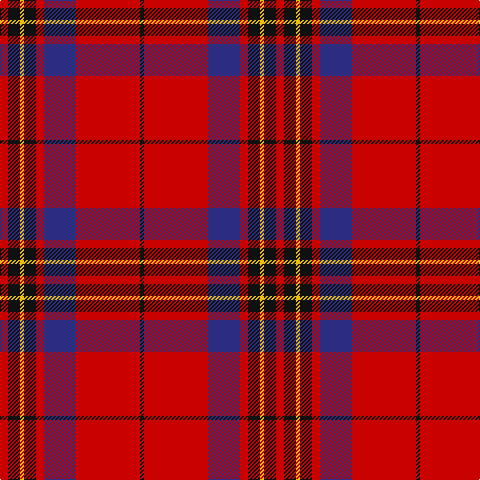

This page is one **sett** — a single exact thread-count. It belongs to the [tartan](/tartans/r2k3ly1k3r2db8r16k1/)
(the same proportion at any scale), whose colour order is pattern [KRBRKYKR](/stripes/krbrkykr/).

Sourced from tartans-authority.  It is a [8 stripe tartan](/stripes/stripes8/).

Original link http://www.tartansauthority.com/tartan-ferret/display/1142/

## Register references

External register numbers recorded for this tartan.

- Scottish Tartans Authority (ITI): 1142

## Thread count
R/8 K12 Y4 K12 R8 DB32 R64 K/4

## Palette

Palette: <strong>Tartan Register</strong>
<table><thead><tr><th>Colour</th><th>Threads</th><th>Shade</th><th>Base</th><th>OKLCh</th></tr></thead><tbody><tr><td>R/</td><td style="text-align:right;font-variant-numeric:tabular-nums">8</td><td><code style="background-color:#C80000;">#C80000</code> <small style="color:#888">#C80000</small></td><td>R <code style="background-color:#CC0000;">#CC0000</code></td><td><small style="color:#888">oklch(52.3% 0.215 29.2)</small></td></tr><tr><td>K</td><td style="text-align:right;font-variant-numeric:tabular-nums">12</td><td><code style="background-color:#101010;">#101010</code> <small style="color:#888">#101010</small></td><td>K <code style="background-color:#000000;">#000000</code></td><td><small style="color:#888">oklch(17.3% 0.000 89.9)</small></td></tr><tr><td>Y</td><td style="text-align:right;font-variant-numeric:tabular-nums">4</td><td><code style="background-color:#E8C000;">#E8C000</code> <small style="color:#888">#E8C000</small></td><td>Y <code style="background-color:#F2BF00;">#F2BF00</code></td><td><small style="color:#888">oklch(81.9% 0.168 93.7)</small></td></tr><tr><td>K</td><td style="text-align:right;font-variant-numeric:tabular-nums">12</td><td><code style="background-color:#101010;">#101010</code> <small style="color:#888">#101010</small></td><td>K <code style="background-color:#000000;">#000000</code></td><td><small style="color:#888">oklch(17.3% 0.000 89.9)</small></td></tr><tr><td>R</td><td style="text-align:right;font-variant-numeric:tabular-nums">8</td><td><code style="background-color:#C80000;">#C80000</code> <small style="color:#888">#C80000</small></td><td>R <code style="background-color:#CC0000;">#CC0000</code></td><td><small style="color:#888">oklch(52.3% 0.215 29.2)</small></td></tr><tr><td>DB</td><td style="text-align:right;font-variant-numeric:tabular-nums">32</td><td><code style="background-color:#2C2C80;">#2C2C80</code> <small style="color:#888">#2C2C80</small></td><td>B <code style="background-color:#2A418A;">#2A418A</code></td><td><small style="color:#888">oklch(35.0% 0.138 276.6)</small></td></tr><tr><td>R</td><td style="text-align:right;font-variant-numeric:tabular-nums">64</td><td><code style="background-color:#C80000;">#C80000</code> <small style="color:#888">#C80000</small></td><td>R <code style="background-color:#CC0000;">#CC0000</code></td><td><small style="color:#888">oklch(52.3% 0.215 29.2)</small></td></tr><tr><td>K/</td><td style="text-align:right;font-variant-numeric:tabular-nums">4</td><td><code style="background-color:#101010;">#101010</code> <small style="color:#888">#101010</small></td><td>K <code style="background-color:#000000;">#000000</code></td><td><small style="color:#888">oklch(17.3% 0.000 89.9)</small></td></tr></tbody></table>

# Sample pattern

## Nearest tartans

The nearest existing variants by ΔTartan distance, with this tartan at the top so the swatches line up against it.

ΔTartan

Tartan

Sett

—

<a href="/ttd/edit/#slug=r2k3ly1k3r2db8r16k1~x4">Leslie Red (VS) (Clan)</a> <a class="nn-out" href="/setts/s8/r2k3ly1k3r2db8r16k1~x4/" title="open its dictionary page">↗</a>

0.92

<a href="/ttd/edit/#slug=r7w2r36db6dg3db3dg3db3dg12r4~x2">Chisholm of Strathglass</a> <a class="nn-out" href="/setts/s10/r7w2r36db6dg3db3dg3db3dg12r4~x2/" title="open its dictionary page">↗</a>

0.93

<a href="/ttd/edit/#slug=db2r30g8r3g8r6db4r3db12w2~x2">Jenkins (Name)</a> <a class="nn-out" href="/setts/s10/db2r30g8r3g8r6db4r3db12w2~x2/" title="open its dictionary page">↗</a>

1.01

<a href="/ttd/edit/#slug=r107k9r5dp41r5g51r14">Buccleuch</a> <a class="nn-out" href="/setts/s7/r107k9r5dp41r5g51r14/" title="open its dictionary page">↗</a>

1.03

<a href="/ttd/edit/#slug=r50db14w6db9lo3db4r4~x2">Texas Lone Star (Fashion)</a> <a class="nn-out" href="/setts/s7/r50db14w6db9lo3db4r4~x2/" title="open its dictionary page">↗</a>

1.09

<a href="/ttd/edit/#slug=r1db6r1dg6r12w1~x2">Fraser Red Clan Tartan Tartan Number: 1424. Earliest known date: 1842 Early references include Wilson's of Bannockburn, but Wilson did not name the sett. D W Stewart contends that this is in fact an early Grant tartan which he traced to a portrait of Robert Grant of Lurg (1678-1771), hanging at Troup House before it was closed around 1894. It is undoubtedly the most popular Fraser pattern today. See products available Copyright © Blair Urquhart, Comrie, 2015</a> <a class="nn-out" href="/setts/s6/r1db6r1dg6r12w1~x2/" title="open its dictionary page">↗</a>

1.11

<a href="/ttd/edit/#slug=r2db12r2g11r4db5g2r24w2~x2">Fraser Gathering, Red (1997)</a> <a class="nn-out" href="/setts/s9/r2db12r2g11r4db5g2r24w2~x2/" title="open its dictionary page">↗</a>

1.11

<a href="/ttd/edit/#slug=r12dp2lb1dp2r3dg8r3dp1">Chisholm</a> <a class="nn-out" href="/setts/s8/r12dp2lb1dp2r3dg8r3dp1/" title="open its dictionary page">↗</a>

1.11

<a href="/ttd/edit/#slug=r2db10r2g10r25w2~x2">Grant of Lurg</a> <a class="nn-out" href="/setts/s6/r2db10r2g10r25w2~x2/" title="open its dictionary page">↗</a>

1.12

<a href="/ttd/edit/#slug=dp4dg8db6dp8r6dg2r2dg2r24dg1r3">MacDougall VS</a> <a class="nn-out" href="/setts/s11/dp4dg8db6dp8r6dg2r2dg2r24dg1r3/" title="open its dictionary page">↗</a>

1.12

<a href="/ttd/edit/#slug=r28db12r3dg20t2dg2r7~x2">Carrick (Strathmore) District Tartan Tartan Number: 3216. Earliest known date: c.1999 Sales help Princess Diana Memorial Trust See products available Copyright © Blair Urquhart, Comrie, 2015</a> <a class="nn-out" href="/setts/s7/r28db12r3dg20t2dg2r7~x2/" title="open its dictionary page">↗</a>

## Neighbour map

Every grey dot is one of 14359 variants placed by the first two principal components of the ΔTartan feature space (44% of its variance). Red is this tartan; blue dots are its nearest — click one to open its page.

<svg viewBox="0 0 640 380" role="img" style="max-width:100%;height:auto;border:1px solid #e0e0e0;border-radius:4px;display:block" xmlns="http://www.w3.org/2000/svg"><image href="/nn/cloud.v1.png" width="640" height="380"/><a href="/setts/s10/r7w2r36db6dg3db3dg3db3dg12r4~x2/"><circle cx="371.6" cy="130.9" r="4" fill="#3465a4"><title>Chisholm of Strathglass</title></circle></a><a href="/setts/s10/db2r30g8r3g8r6db4r3db12w2~x2/"><circle cx="314.4" cy="150.7" r="4" fill="#3465a4"><title>Jenkins (Name)</title></circle></a><a href="/setts/s7/r107k9r5dp41r5g51r14/"><circle cx="362.8" cy="153.5" r="4" fill="#3465a4"><title>Buccleuch</title></circle></a><a href="/setts/s7/r50db14w6db9lo3db4r4~x2/"><circle cx="371.1" cy="139.5" r="4" fill="#3465a4"><title>Texas Lone Star (Fashion)</title></circle></a><a href="/setts/s6/r1db6r1dg6r12w1~x2/"><circle cx="292.6" cy="189.0" r="4" fill="#3465a4"><title>Fraser Red Clan Tartan Tartan Number: 1424. Earliest known date: 1842 Early references include Wilson's of Bannockburn, but Wilson did not name the sett. D W Stewart contends that this is in fact an early Grant tartan which he traced to a portrait of Robert Grant of Lurg (1678-1771), hanging at Troup House before it was closed around 1894. It is undoubtedly the most popular Fraser pattern today. See products available Copyright © Blair Urquhart, Comrie, 2015</title></circle></a><a href="/setts/s9/r2db12r2g11r4db5g2r24w2~x2/"><circle cx="277.3" cy="163.2" r="4" fill="#3465a4"><title>Fraser Gathering, Red (1997)</title></circle></a><a href="/setts/s8/r12dp2lb1dp2r3dg8r3dp1/"><circle cx="329.1" cy="178.8" r="4" fill="#3465a4"><title>Chisholm</title></circle></a><a href="/setts/s6/r2db10r2g10r25w2~x2/"><circle cx="327.2" cy="179.8" r="4" fill="#3465a4"><title>Grant of Lurg</title></circle></a><a href="/setts/s11/dp4dg8db6dp8r6dg2r2dg2r24dg1r3/"><circle cx="325.6" cy="132.7" r="4" fill="#3465a4"><title>MacDougall VS</title></circle></a><a href="/setts/s7/r28db12r3dg20t2dg2r7~x2/"><circle cx="308.1" cy="186.0" r="4" fill="#3465a4"><title>Carrick (Strathmore) District Tartan Tartan Number: 3216. Earliest known date: c.1999 Sales help Princess Diana Memorial Trust See products available Copyright © Blair Urquhart, Comrie, 2015</title></circle></a><circle cx="332.2" cy="151.7" r="5" fill="#c00000"/></svg>

ID: /setts/s8/r2k3ly1k3r2db8r16k1~x4/
