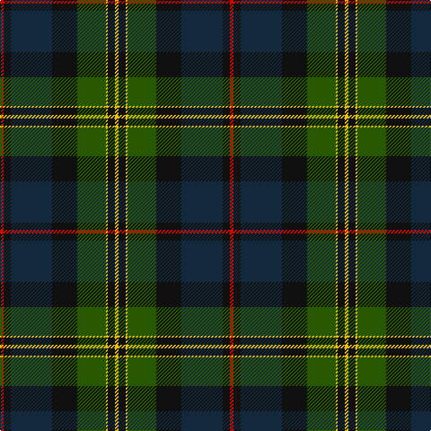

In pattern [RKBKGYKY](/stripes/rkbkgyky/).

This was sourced from register-of-tartans.  It is a [8 stripe tartan](/stripes/stripes8/).

Original link https://www.tartanregister.gov.uk/tartanDetails.aspx?ref=10959

## Register references

External register numbers recorded for this tartan.

- Scottish Register of Tartans: [10959](https://www.tartanregister.gov.uk/tartanDetails.aspx?ref=10959)

## Thread count
R/4 K8 DN46 K28 G32 Y2 K8 Y/4

## Palette
Each colour and its ΔE from the base-6 reference it is a variant of.

| Colour | Shade | Base | ΔE (OKLab) |
|---|---|---|---|
| DN | <code style="background-color:#14283C;">#14283C</code> `#14283C` | B <code style="background-color:#2A418A;">#2A418A</code> | 0.15 |
| G | <code style="background-color:#285800;">#285800</code> `#285800` | G <code style="background-color:#006100;">#006100</code> | 0.03 |
| K | <code style="background-color:#101010;">#101010</code> `#101010` | K <code style="background-color:#000000;">#000000</code> | 0.17 |
| R | <code style="background-color:#DC0000;">#DC0000</code> `#DC0000` | R <code style="background-color:#CC0000;">#CC0000</code> | 0.03 |
| Y | <code style="background-color:#E8C000;">#E8C000</code> `#E8C000` | Y <code style="background-color:#F2BF00;">#F2BF00</code> | 0.02 |

# Sample pattern

## Nearest tartans

The nearest existing variants by ΔTartan distance.

1. [Thomas of Craigie (Personal)](/setts/s8/ly2k4ly1dg16k14db23k4r1~x2/) — ΔT 0.69
1. [79th Regiment (Military)](/setts/s11/dg22r2dg2r6dg42k46r2k42r6k12lo3/) — ΔT 0.84
1. [Wcwm 1873-5](/setts/s9/k1db8r1dy3r1dy8k4dg14r1~x4/) — ΔT 0.93
1. [Lochaber #2](/setts/s8/dg3r1dg18k20r1db18t1dg2~x4/) — ΔT 1.01
1. [Colquhoun](/setts/s7/db4k2db16w1k8dg24r4~x2/) — ΔT 1.01
1. [Chan (Name?)](/setts/s8/r2dg13r2dg13k13dt30k1ly2~x2/) — ΔT 1.03
1. [MacCaskill (Personal)](/setts/s7/k2r1dg15k15db15ly1k2~x2/) — ΔT 1.03
1. [Ogilvie of Inverarity - 1842 (V.S.)](/setts/s8/db28ly1db2k26g24k1g2r3~x2/) — ΔT 1.11
1. [Livingstone Aus. Dress (Personal)](/setts/s8/db24g4k2ly1k2g4r25g15~x2/) — ΔT 1.13
1. [Black Gold (Corporate)](/setts/s9/dy3k3dy3k18n28lb1dg22k2dy2~x2/) — ΔT 1.16

## Neighbour map

Every grey dot is one of 14299 variants placed by the first two principal components of the ΔTartan feature space (44% of its variance). Red is this tartan; blue dots are its nearest — click one to open its page.

<svg viewBox="0 0 640 380" role="img" style="max-width:100%;height:auto;border:1px solid #e0e0e0;border-radius:4px;display:block" xmlns="http://www.w3.org/2000/svg"><image href="/nn/cloud.v1.png" width="640" height="380"/><a href="/setts/s8/ly2k4ly1dg16k14db23k4r1~x2/"><circle cx="235.2" cy="165.9" r="4" fill="#3465a4"><title>Thomas of Craigie (Personal)</title></circle></a><a href="/setts/s11/dg22r2dg2r6dg42k46r2k42r6k12lo3/"><circle cx="231.0" cy="151.9" r="4" fill="#3465a4"><title>79th Regiment (Military)</title></circle></a><a href="/setts/s9/k1db8r1dy3r1dy8k4dg14r1~x4/"><circle cx="197.4" cy="184.1" r="4" fill="#3465a4"><title>Wcwm 1873-5</title></circle></a><a href="/setts/s8/dg3r1dg18k20r1db18t1dg2~x4/"><circle cx="263.4" cy="180.3" r="4" fill="#3465a4"><title>Lochaber #2</title></circle></a><a href="/setts/s7/db4k2db16w1k8dg24r4~x2/"><circle cx="265.5" cy="175.1" r="4" fill="#3465a4"><title>Colquhoun</title></circle></a><a href="/setts/s8/r2dg13r2dg13k13dt30k1ly2~x2/"><circle cx="284.4" cy="169.2" r="4" fill="#3465a4"><title>Chan (Name?)</title></circle></a><a href="/setts/s7/k2r1dg15k15db15ly1k2~x2/"><circle cx="234.1" cy="192.7" r="4" fill="#3465a4"><title>MacCaskill (Personal)</title></circle></a><a href="/setts/s8/db28ly1db2k26g24k1g2r3~x2/"><circle cx="245.7" cy="149.3" r="4" fill="#3465a4"><title>Ogilvie of Inverarity - 1842 (V.S.)</title></circle></a><a href="/setts/s8/db24g4k2ly1k2g4r25g15~x2/"><circle cx="243.1" cy="158.1" r="4" fill="#3465a4"><title>Livingstone Aus. Dress (Personal)</title></circle></a><a href="/setts/s9/dy3k3dy3k18n28lb1dg22k2dy2~x2/"><circle cx="222.3" cy="140.2" r="4" fill="#3465a4"><title>Black Gold (Corporate)</title></circle></a><circle cx="236.4" cy="172.9" r="5" fill="#c00000"/></svg>

ID: /setts/s8/r2k4dt23k14dg16ly1k4ly2~x2/
