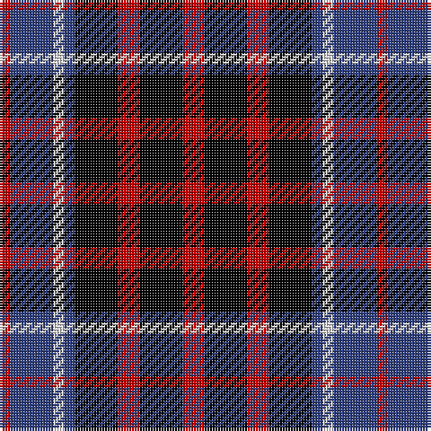

In pattern [RBWBKRKR](/stripes/rbwbkrkr/).

This was sourced from weddslist.  It is a [8 stripe tartan](/stripes/stripes8/).

Original link http://www.weddslist.com/cgi-bin/tartans/pg.pl?source=sts

## Thread count
R/8 K16 R8 K16 B4 LN4 B16 R/4

## Palette
Each colour and the base-6 reference it is a variant of.

| Colour | Shade | Base |
|---|---|---|
| B | <code style="background-color:#304080;">#304080</code> `oklch(39.4% 0.109 270.2)` <small>#304080</small> | B <code style="background-color:#2A418A;">#2A418A</code> |
| K | <code style="background-color:#000000;">#000000</code> `oklch(0.0% 0.000 0.0)` <small>#000000</small> | K <code style="background-color:#000000;">#000000</code> |
| LN | <code style="background-color:#E0E0E0;">#E0E0E0</code> `oklch(90.7% 0.000 89.9)` <small>#E0E0E0</small> | W <code style="background-color:#F7F7F7;">#F7F7F7</code> |
| R | <code style="background-color:#C00000;">#C00000</code> `oklch(50.7% 0.208 29.2)` <small>#C00000</small> | R <code style="background-color:#CC0000;">#CC0000</code> |

# Sample pattern

## Nearest tartans

The nearest existing variants by ΔTartan distance.

1. [MacKean Red (Personal)](/setts/s8/r2k4r2k4db1lb1db4r1~x4/) — ΔT 1.03
1. [Campbell, Sir Walter Scott](/setts/s6/k2g8db2k9p7k2~x2/) — ΔT 1.24
1. [Scott, Sir Walter](/setts/s6/k3g9t2k11p9k3~x2/) — ΔT 1.28
1. [Clerk](/setts/s6/db5k1g1k1r3k1~x4/) — ΔT 1.34
1. [Gipsy](/setts/s9/k1r1k5r1w1r1db5r1k1~x2/) — ΔT 1.36
1. [MacNeil 2](/setts/s6/w2p10k10g9k3w2~x2/) — ΔT 1.36
1. [MacNaughton (Logan)](/setts/s7/db5r17dg16k10db10r17db5~x2/) — ΔT 1.48
1. [Little of Morton Rig Family/Clan Tartan Tartan Number: 2349. Earliest known date: 1991 Designed in 1991 by Dr. J.C.(Pat) Little of Morton Rigg, Dumfries, for the newly organized Clan Little Society. Registered with TECA 12 June1992. Incorporates elements of the Wallace and Shepherd setts. from Pat Little via JCT. Sample in STA's Johnston Collection. See products available Copyright © Blair Urquhart, Comrie, 2015](/setts/s10/k4lb4k4lb4k4dr8k2dr8k8lo1~x4/) — ΔT 1.51
1. [Gipsy](/setts/s9/k2r2k8r2w1r2db8r2k2~x2/) — ΔT 1.54
1. [Gipsy (Fashion)](/setts/s9/k2r2k8r2w1r2db8r2k2~x4/) — ΔT 1.56

## Neighbour map

Every grey dot is one of 14299 variants placed by the first two principal components of the ΔTartan feature space (44% of its variance). Red is this tartan; blue dots are its nearest — click one to open its page.

<svg viewBox="0 0 640 380" role="img" style="max-width:100%;height:auto;border:1px solid #e0e0e0;border-radius:4px;display:block" xmlns="http://www.w3.org/2000/svg"><image href="/nn/cloud.v1.png" width="640" height="380"/><a href="/setts/s8/r2k4r2k4db1lb1db4r1~x4/"><circle cx="156.7" cy="253.4" r="4" fill="#3465a4"><title>MacKean Red (Personal)</title></circle></a><a href="/setts/s6/k2g8db2k9p7k2~x2/"><circle cx="152.2" cy="255.5" r="4" fill="#3465a4"><title>Campbell, Sir Walter Scott</title></circle></a><a href="/setts/s6/k3g9t2k11p9k3~x2/"><circle cx="168.4" cy="251.1" r="4" fill="#3465a4"><title>Scott, Sir Walter</title></circle></a><a href="/setts/s6/db5k1g1k1r3k1~x4/"><circle cx="172.4" cy="233.1" r="4" fill="#3465a4"><title>Clerk</title></circle></a><a href="/setts/s9/k1r1k5r1w1r1db5r1k1~x2/"><circle cx="164.5" cy="201.2" r="4" fill="#3465a4"><title>Gipsy</title></circle></a><a href="/setts/s6/w2p10k10g9k3w2~x2/"><circle cx="107.0" cy="238.0" r="4" fill="#3465a4"><title>MacNeil 2</title></circle></a><a href="/setts/s7/db5r17dg16k10db10r17db5~x2/"><circle cx="131.3" cy="273.2" r="4" fill="#3465a4"><title>MacNaughton (Logan)</title></circle></a><a href="/setts/s10/k4lb4k4lb4k4dr8k2dr8k8lo1~x4/"><circle cx="193.0" cy="222.9" r="4" fill="#3465a4"><title>Little of Morton Rig Family/Clan Tartan Tartan Number: 2349. Earliest known date: 1991 Designed in 1991 by Dr. J.C.(Pat) Little of Morton Rigg, Dumfries, for the newly organized Clan Little Society. Registered with TECA 12 June1992. Incorporates elements of the Wallace and Shepherd setts. from Pat Little via JCT. Sample in STA's Johnston Collection. See products available Copyright © Blair Urquhart, Comrie, 2015</title></circle></a><a href="/setts/s9/k2r2k8r2w1r2db8r2k2~x2/"><circle cx="184.2" cy="196.0" r="4" fill="#3465a4"><title>Gipsy</title></circle></a><a href="/setts/s9/k2r2k8r2w1r2db8r2k2~x4/"><circle cx="179.6" cy="193.7" r="4" fill="#3465a4"><title>Gipsy (Fashion)</title></circle></a><circle cx="133.3" cy="244.8" r="5" fill="#c00000"/></svg>

ID: /setts/s8/r2k4r2k4db1w1db4r1~x4/
