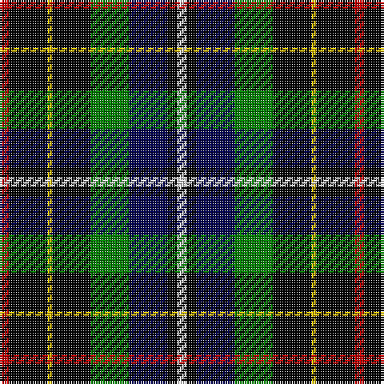

This page is one **sett** — a single exact thread-count. It belongs to the [tartan](/tartans/r2k8ly1k8g8db8k2w2/)
(the same proportion at any scale), whose colour order is pattern [RKYKGBKW](/stripes/rkykgbkw/).

Sourced from weddslist.  It is a [8 stripe tartan](/stripes/stripes8/).

Original link http://www.weddslist.com/cgi-bin/tartans/pg.pl?source=sts

## Also known as

This cloth is also recorded under:

- Hislop hunting

2 attestations — the source records this cloth was collapsed from (oldest owns this page)

<ul>
<li>undated — Hislop hunting (weddslist, <a href="http://www.weddslist.com/cgi-bin/tartans/pg.pl?source=sts">record</a>)</li>
<li>undated — Hislop Family Tartan Tartan Number: 2135. Earliest known date: 1992 Based on the Brodie tartan which Mr Hislop, who commissioned the design, remembered being worn by his grandfather. Other elements in the sett come from the tartans of the families in the district around Hawick which is associated with the Hislop name. The Hyslop spelling is known further west in Galloway and SW Scotland. See products available Copyright © Blair Urquhart, Comrie, 2015 (house-of-tartan, <a href="http://www.house-of-tartan.scotland.net/house/TartanViewjs.asp?colr=Def&tnam=2135">record</a>)</li>
</ul>

## Thread count
R/4 K16 Y2 K16 G16 DB16 K4 LN/4

## Palette

Palette: <strong>Tartan Register</strong> <small style="color:#888">(2 of 6 colours)</small>
<table><thead><tr><th>Colour</th><th>Threads</th><th>Shade</th><th>Base</th><th>OKLCh</th></tr></thead><tbody><tr><td>R/</td><td style="text-align:right;font-variant-numeric:tabular-nums">4</td><td><code style="background-color:#C00000;">#C00000</code> <small style="color:#888">#C00000</small></td><td>R <code style="background-color:#CC0000;">#CC0000</code></td><td><small style="color:#888">oklch(50.7% 0.208 29.2)</small></td></tr><tr><td>K</td><td style="text-align:right;font-variant-numeric:tabular-nums">16</td><td><code style="background-color:#000000;">#000000</code> <small style="color:#888">#000000</small></td><td>K <code style="background-color:#000000;">#000000</code></td><td><small style="color:#888">oklch(0.0% 0.000 0.0)</small></td></tr><tr><td>Y</td><td style="text-align:right;font-variant-numeric:tabular-nums">2</td><td><code style="background-color:#F0C000;">#F0C000</code> <small style="color:#888">#F0C000</small></td><td>Y <code style="background-color:#F2BF00;">#F2BF00</code></td><td><small style="color:#888">oklch(82.7% 0.169 90.5)</small></td></tr><tr><td>K</td><td style="text-align:right;font-variant-numeric:tabular-nums">16</td><td><code style="background-color:#000000;">#000000</code> <small style="color:#888">#000000</small></td><td>K <code style="background-color:#000000;">#000000</code></td><td><small style="color:#888">oklch(0.0% 0.000 0.0)</small></td></tr><tr><td>G</td><td style="text-align:right;font-variant-numeric:tabular-nums">16</td><td><code style="background-color:#008000;">#008000</code> <small style="color:#888">#008000</small></td><td>G <code style="background-color:#006100;">#006100</code></td><td><small style="color:#888">oklch(52.0% 0.177 142.5)</small></td></tr><tr><td>DB</td><td style="text-align:right;font-variant-numeric:tabular-nums">16</td><td><code style="background-color:#000050;">#000050</code> <small style="color:#888">#000050</small></td><td>B <code style="background-color:#2A418A;">#2A418A</code></td><td><small style="color:#888">oklch(19.5% 0.135 264.1)</small></td></tr><tr><td>K</td><td style="text-align:right;font-variant-numeric:tabular-nums">4</td><td><code style="background-color:#000000;">#000000</code> <small style="color:#888">#000000</small></td><td>K <code style="background-color:#000000;">#000000</code></td><td><small style="color:#888">oklch(0.0% 0.000 0.0)</small></td></tr><tr><td>LN/</td><td style="text-align:right;font-variant-numeric:tabular-nums">4</td><td><code style="background-color:#E0E0E0;">#E0E0E0</code> <small style="color:#888">#E0E0E0</small></td><td>W <code style="background-color:#F7F7F7;">#F7F7F7</code></td><td><small style="color:#888">oklch(90.7% 0.000 89.9)</small></td></tr></tbody></table>

# Sample pattern

## Nearest tartans

The nearest existing variants by ΔTartan distance, with this tartan at the top so the swatches line up against it.

ΔTartan

Tartan

Sett

—

<a href="/ttd/edit/#slug=r2k8ly1k8g8db8k2w2~x2">Hislop hunting</a> <a class="nn-out" href="/setts/s8/r2k8ly1k8g8db8k2w2~x2/" title="open its dictionary page">↗</a>

1.06

<a href="/ttd/edit/#slug=r2k8ly1k8g8db8r2~x2">Brodie hunting</a> <a class="nn-out" href="/setts/s7/r2k8ly1k8g8db8r2~x2/" title="open its dictionary page">↗</a>

1.25

<a href="/ttd/edit/#slug=k14t2db6g7r2k14db6t2db2t4~x2">Unidentified 13</a> <a class="nn-out" href="/setts/s10/k14t2db6g7r2k14db6t2db2t4~x2/" title="open its dictionary page">↗</a>

1.27

<a href="/ttd/edit/#slug=db25k12ly4k9r6k9ly4k12g25~x2">Vosko</a> <a class="nn-out" href="/setts/s9/db25k12ly4k9r6k9ly4k12g25~x2/" title="open its dictionary page">↗</a>

1.28

<a href="/ttd/edit/#slug=w8r4k8k20k6k3k5~x2">BlackRock (Asymmetrical)</a> <a class="nn-out" href="/setts/s7/w8r4k8k20k6k3k5~x2/" title="open its dictionary page">↗</a>

1.30

<a href="/ttd/edit/#slug=r2dg8ly1k8dg8db8r2">Brodie Hunting</a> <a class="nn-out" href="/setts/s7/r2dg8ly1k8dg8db8r2/" title="open its dictionary page">↗</a>

1.32

<a href="/ttd/edit/#slug=lb7k11lt3db9g19lo3k22db9lt3k3db6~x2">Veere</a> <a class="nn-out" href="/setts/s11/lb7k11lt3db9g19lo3k22db9lt3k3db6~x2/" title="open its dictionary page">↗</a>

1.35

<a href="/ttd/edit/#slug=db10r7db31k25g23k8db7k8ly5~x2">MacCallum, of Berwick</a> <a class="nn-out" href="/setts/s9/db10r7db31k25g23k8db7k8ly5~x2/" title="open its dictionary page">↗</a>

1.35

<a href="/ttd/edit/#slug=w5k26ly2dg24db8k4r3~x2">Cornish Htg (District)</a> <a class="nn-out" href="/setts/s7/w5k26ly2dg24db8k4r3~x2/" title="open its dictionary page">↗</a>

1.42

<a href="/ttd/edit/#slug=k16db2t2db4g16ly2k15db6t2k3t4~x2">Wilson's, No 30</a> <a class="nn-out" href="/setts/s11/k16db2t2db4g16ly2k15db6t2k3t4~x2/" title="open its dictionary page">↗</a>

1.44

<a href="/ttd/edit/#slug=db18k10g9k2r2k2g9k10db9w2~x2">Robertson, hunting</a> <a class="nn-out" href="/setts/s10/db18k10g9k2r2k2g9k10db9w2~x2/" title="open its dictionary page">↗</a>

## Neighbour map

Every grey dot is one of 14299 variants placed by the first two principal components of the ΔTartan feature space (44% of its variance). Red is this tartan; blue dots are its nearest — click one to open its page.

<svg viewBox="0 0 640 380" role="img" style="max-width:100%;height:auto;border:1px solid #e0e0e0;border-radius:4px;display:block" xmlns="http://www.w3.org/2000/svg"><image href="/nn/cloud.v1.png" width="640" height="380"/><a href="/setts/s7/r2k8ly1k8g8db8r2~x2/"><circle cx="138.4" cy="213.8" r="4" fill="#3465a4"><title>Brodie hunting</title></circle></a><a href="/setts/s10/k14t2db6g7r2k14db6t2db2t4~x2/"><circle cx="166.9" cy="193.8" r="4" fill="#3465a4"><title>Unidentified 13</title></circle></a><a href="/setts/s9/db25k12ly4k9r6k9ly4k12g25~x2/"><circle cx="105.6" cy="203.8" r="4" fill="#3465a4"><title>Vosko</title></circle></a><a href="/setts/s7/w8r4k8k20k6k3k5~x2/"><circle cx="132.2" cy="209.7" r="4" fill="#3465a4"><title>BlackRock (Asymmetrical)</title></circle></a><a href="/setts/s7/r2dg8ly1k8dg8db8r2/"><circle cx="154.1" cy="224.2" r="4" fill="#3465a4"><title>Brodie Hunting</title></circle></a><a href="/setts/s11/lb7k11lt3db9g19lo3k22db9lt3k3db6~x2/"><circle cx="82.9" cy="166.5" r="4" fill="#3465a4"><title>Veere</title></circle></a><a href="/setts/s9/db10r7db31k25g23k8db7k8ly5~x2/"><circle cx="120.2" cy="206.3" r="4" fill="#3465a4"><title>MacCallum, of Berwick</title></circle></a><a href="/setts/s7/w5k26ly2dg24db8k4r3~x2/"><circle cx="165.9" cy="155.6" r="4" fill="#3465a4"><title>Cornish Htg (District)</title></circle></a><a href="/setts/s11/k16db2t2db4g16ly2k15db6t2k3t4~x2/"><circle cx="170.6" cy="172.8" r="4" fill="#3465a4"><title>Wilson's, No 30</title></circle></a><a href="/setts/s10/db18k10g9k2r2k2g9k10db9w2~x2/"><circle cx="130.2" cy="189.3" r="4" fill="#3465a4"><title>Robertson, hunting</title></circle></a><circle cx="131.8" cy="190.1" r="5" fill="#c00000"/></svg>

ID: /setts/s8/r2k8ly1k8g8db8k2w2~x2/
