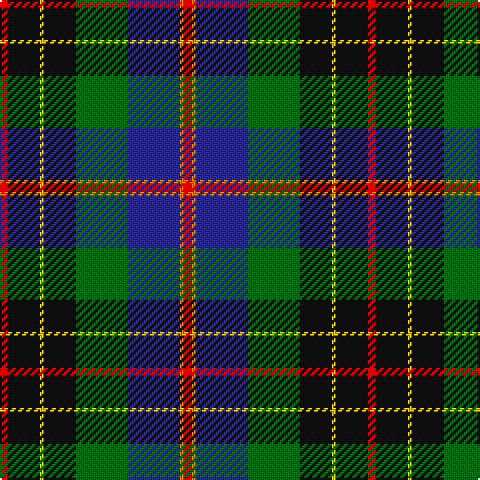

In pattern [RKYKGBYR](/patterns/rkykgbyr/).

This was sourced from tartans-authority.  It is a [8 stripes tartan](/stripes/stripes8/).

Original link http://www.tartansauthority.com/tartan-ferret/display/3103/

## Thread count
R/4 K16 Y2 K16 G26 DB26 O2 R/4

## Palette
Each colour and its ΔE from the base-6 reference it is a variant of.

| Colour | Shade | Base | ΔE (OKLab) |
|---|---|---|---|
| DB | <code style="background-color:#2C2C80;">#2C2C80</code> `#2C2C80` | B <code style="background-color:#2A418A;">#2A418A</code> | 0.06 |
| G | <code style="background-color:#006818;">#006818</code> `#006818` | G <code style="background-color:#006100;">#006100</code> | 0.02 |
| K | <code style="background-color:#101010;">#101010</code> `#101010` | K <code style="background-color:#000000;">#000000</code> | 0.17 |
| O | <code style="background-color:#D87C00;">#D87C00</code> `#D87C00` | Y <code style="background-color:#F2BF00;">#F2BF00</code> | 0.17 |
| R | <code style="background-color:#C80000;">#C80000</code> `#C80000` | R <code style="background-color:#CC0000;">#CC0000</code> | 0.01 |
| Y | <code style="background-color:#E8C000;">#E8C000</code> `#E8C000` | Y <code style="background-color:#F2BF00;">#F2BF00</code> | 0.02 |

# Sample pattern

## Nearest tartans

The nearest existing variants by ΔTartan distance.

1. [Christian Hunting (Personal)](/setts/s7/r3g2b27k19g27ba2y3~b2c2c80-ba780078-g006818-k101010-rc80000-ye8c000~x2/) — ΔT 0.69
1. [James (Personal)](/setts/s7/r2k6y1g12y1b6ya2~b242470-g004828-k101010-rc80000-yb0b430-yab4bcc0~x4/) — ΔT 0.74
1. [MacNeil - 1840 (Chief's sett)](/setts/s7/w2r3b33k33g33k6y2~b2c2c80-g006818-k101010-rc80000-wfcfcfc-ye8c000~x2/) — ΔT 0.77
1. [Loch Awe](/setts/s9/w3k2r3g20k24b20r3k2y3~b2c2c80-g006818-k101010-rc80000-wc0c0c0-yfccc00~x2/) — ΔT 0.82
1. [George Brown Family Tartan Tartan Number: 1853. Earliest known date: 1983 Design copyright is owned by Thomas Kempsill Gemmell and Davina Creighton Gemmell. Designed in traditional tartan colours. See products available Copyright © Blair Urquhart, Comrie, 2015](/setts/s9/y3b29k15r4g25r8k4r3w2~b2c2c80-g006818-k101010-rc80000-we0e0e0-ye8c000~x2/) — ΔT 0.85
1. [Ayre (Personal)](/setts/s8/y3g14k9r2k9b18k3w1~b1c0070-g5c6428-k101010-rc80000-wf8f8f8-ye8c000~x2/) — ΔT 0.88
1. [Harvey of Cornwall (Personal)](/setts/s7/w10k52b52g24y10g5r5~b2c4084-g003c14-k101010-rdc0000-we0e0e0-ye8c000/) — ΔT 0.88
1. [Grandfather Mountain Games (District](/setts/s7/r3g20k2b11k2ba20y2~b606060-ba000048-g044028-k000000-rc80000-yb0b0b0~x2/) — ΔT 0.95
1. [Yates (Personal)](/setts/s8/k29r3b24ba6k8w4ba8ra6~b003c64-ba5c5c5c-k101010-rc80000-ra888888-we0e0e0~x2/) — ΔT 0.95
1. [Royal Burgh of Peebles (District)](/setts/s7/r3g3b4g17k13ba26w3~b2c2c80-ba14283c-g006818-k101010-rc80000-wf8f8f8~x2/) — ΔT 0.95

## Neighbour map

Every grey dot is one of 15726 variants placed by the first two principal components of the ΔTartan feature space (44% of its variance). Red is this tartan; blue dots are its nearest — click one to open its page.

<svg viewBox="0 0 640 380" role="img" style="max-width:100%;height:auto;border:1px solid #e0e0e0;border-radius:4px;display:block" xmlns="http://www.w3.org/2000/svg"><image href="/nn/cloud.v1.png" width="640" height="380"/><a href="/setts/s7/r3g2b27k19g27ba2y3~b2c2c80-ba780078-g006818-k101010-rc80000-ye8c000~x2/"><circle cx="171.6" cy="161.6" r="4" fill="#3465a4"><title>Christian Hunting (Personal)</title></circle></a><a href="/setts/s7/r2k6y1g12y1b6ya2~b242470-g004828-k101010-rc80000-yb0b430-yab4bcc0~x4/"><circle cx="160.4" cy="165.6" r="4" fill="#3465a4"><title>James (Personal)</title></circle></a><a href="/setts/s7/w2r3b33k33g33k6y2~b2c2c80-g006818-k101010-rc80000-wfcfcfc-ye8c000~x2/"><circle cx="178.9" cy="155.8" r="4" fill="#3465a4"><title>MacNeil - 1840 (Chief's sett)</title></circle></a><a href="/setts/s9/w3k2r3g20k24b20r3k2y3~b2c2c80-g006818-k101010-rc80000-wc0c0c0-yfccc00~x2/"><circle cx="141.7" cy="140.9" r="4" fill="#3465a4"><title>Loch Awe</title></circle></a><a href="/setts/s9/y3b29k15r4g25r8k4r3w2~b2c2c80-g006818-k101010-rc80000-we0e0e0-ye8c000~x2/"><circle cx="129.4" cy="135.1" r="4" fill="#3465a4"><title>George Brown Family Tartan Tartan Number: 1853. Earliest known date: 1983 Design copyright is owned by Thomas Kempsill Gemmell and Davina Creighton Gemmell. Designed in traditional tartan colours. See products available Copyright © Blair Urquhart, Comrie, 2015</title></circle></a><a href="/setts/s8/y3g14k9r2k9b18k3w1~b1c0070-g5c6428-k101010-rc80000-wf8f8f8-ye8c000~x2/"><circle cx="156.2" cy="150.4" r="4" fill="#3465a4"><title>Ayre (Personal)</title></circle></a><a href="/setts/s7/w10k52b52g24y10g5r5~b2c4084-g003c14-k101010-rdc0000-we0e0e0-ye8c000/"><circle cx="120.0" cy="164.6" r="4" fill="#3465a4"><title>Harvey of Cornwall (Personal)</title></circle></a><a href="/setts/s7/r3g20k2b11k2ba20y2~b606060-ba000048-g044028-k000000-rc80000-yb0b0b0~x2/"><circle cx="151.5" cy="177.4" r="4" fill="#3465a4"><title>Grandfather Mountain Games (District</title></circle></a><a href="/setts/s8/k29r3b24ba6k8w4ba8ra6~b003c64-ba5c5c5c-k101010-rc80000-ra888888-we0e0e0~x2/"><circle cx="171.6" cy="174.3" r="4" fill="#3465a4"><title>Yates (Personal)</title></circle></a><a href="/setts/s7/r3g3b4g17k13ba26w3~b2c2c80-ba14283c-g006818-k101010-rc80000-wf8f8f8~x2/"><circle cx="152.2" cy="184.8" r="4" fill="#3465a4"><title>Royal Burgh of Peebles (District)</title></circle></a><circle cx="144.7" cy="164.3" r="5" fill="#c00000"/></svg>

ID: /setts/s8/r2k8y1k8g13b13ya1r2~b2c2c80-g006818-k101010-rc80000-ye8c000-yad87c00~x2/
